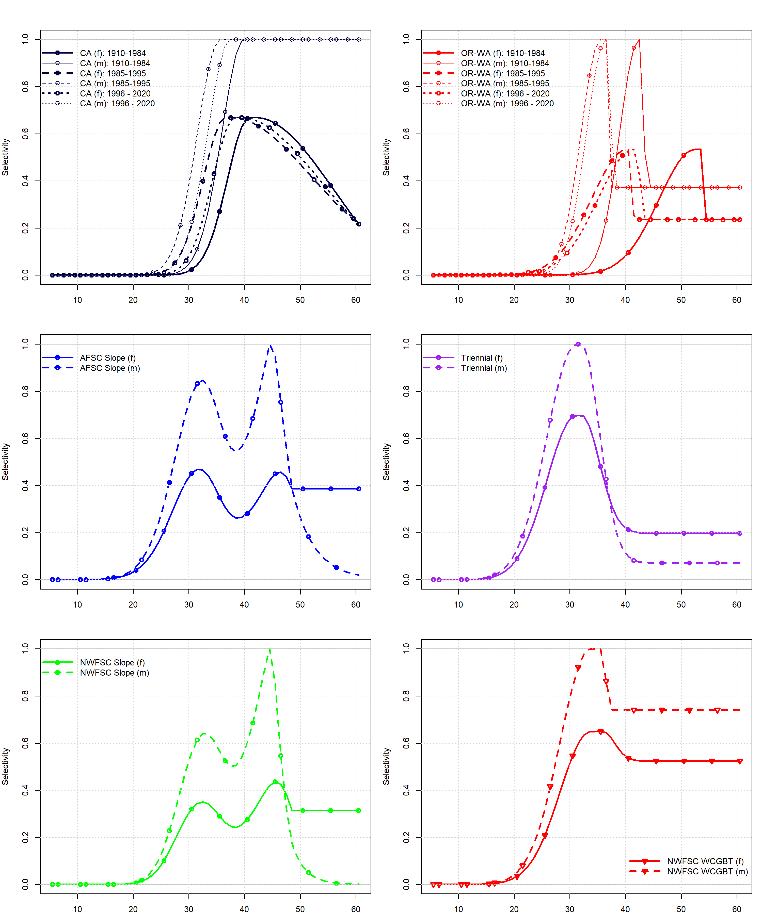
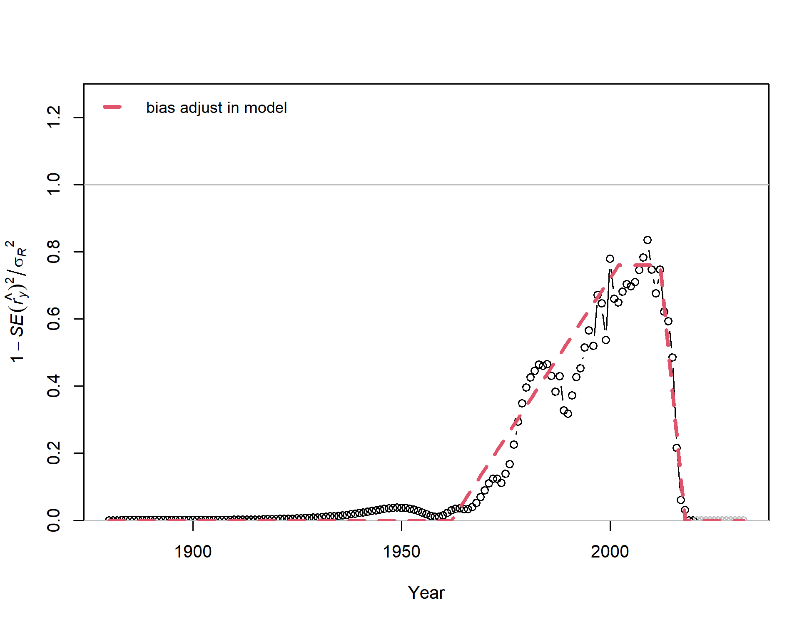
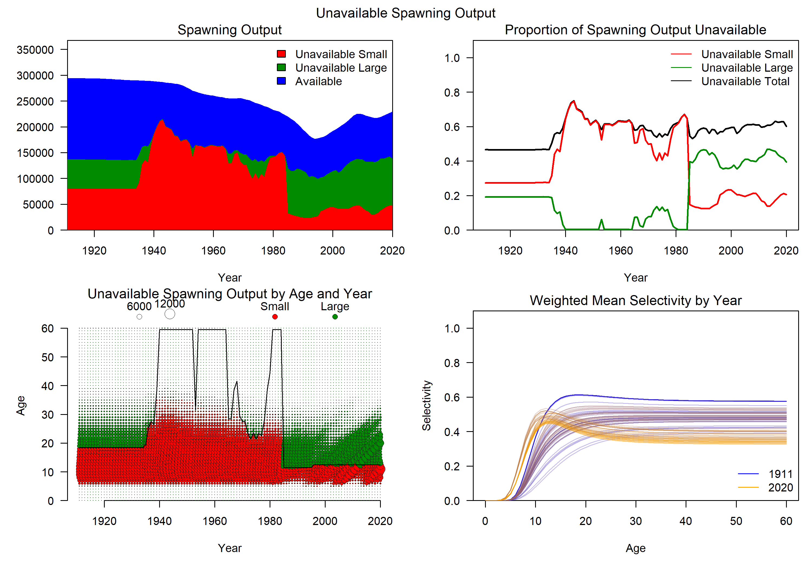

<!--chapter:end:00a.Rmd-->

---
author:
  - name: Chantel R. Wetzel
    code: 1
    first: C
    middle: R
    family: Wetzel
  - name: Aaron M. Berger
    code: 2
    first: A
    middle: M
    family: Berger
author_list: Wetzel, C.R., A.M. Berger
affiliation:
  - code: 1
    address: Northwest Fisheries Science Center, U.S. Department of Commerce, National
      Oceanic and Atmospheric Administration, National Marine Fisheries Service, 2725
      Montlake Boulevard East, Seattle, Washington 98112
  - code: 2
    address: Northwest Fisheries Science Center, U.S. Department of Commerce, National
      Oceanic and Atmospheric Administration, National Marine Fisheries Service, 2032
      Southeast OSU Drive, Newport, Oregon 97365
address:
  - ^1^Northwest Fisheries Science Center, U.S. Department of Commerce, National Oceanic
    and Atmospheric Administration, National Marine Fisheries Service, 2725 Montlake
    Boulevard East, Seattle, Washington 98112
  - ^2^Northwest Fisheries Science Center, U.S. Department of Commerce, National Oceanic
    and Atmospheric Administration, National Marine Fisheries Service, 2032 Southeast
    OSU Drive, Newport, Oregon 97365
---

<!--chapter:end:00authors.Rmd-->

---
title: Status of Dover sole (_Microstomus pacificus_) along the U.S. West Coast in
  2021
---

<!--chapter:end:00title.Rmd-->

\vspace{20cm}

_These materials do not constitute a formal publication and are for information only. They are in a pre-review, pre-decisional state and should not be formally cited (or reproduced). They are to be considered provisional and do not represent any determination or policy of NOAA or the Department of Commerce._

\pagebreak
\pagenumbering{roman}
\setcounter{page}{1}

\renewcommand{\thetable}{\roman{table}}
\renewcommand{\thefigure}{\roman{figure}}

\setlength\parskip{0.5em plus 0.1em minus 0.2em}

<!--chapter:end:01a.Rmd-->

# Executive Summary{-}
## Stock{-}
This assessment reports the status of Dover sole (_Microstomus pacificus_) off the U.S. West coast using data through 2020. Dover sole are also harvested from the waters off British Columbia and in the Gulf of Alaska, and although those catches were not included in this assessment, it is not certain if those populations contribute to the biomass of Dover sole off of the U.S. West Coast.

## Landings{-}
Dover sole were first landed in California in the early part of the 20th century and the fishery began increasing landings in Oregon and Washington in the 1940's.  Landings remained relatively constant throughout the 1950's and 1960's before increasing rapidly into the early 1990's.  Subsequently, the landings declined (mostly in California) until 2007 when harvest guidelines increased the allowable catch.  Groundfish trawl fisheries land the majority of Dover sole while fixed gears, shrimp trawls, and recreational fisheries make up a very small amount of fishing mortality.  Some discarding of Dover sole occured in the fisheries, primarily prior to the implementation of the Catch Shares Program in 2011.  Discards were estimated in the model and total catches are reported, as opposed to landings.

{width=75% height=100% alt="Landings by fleet used in the base model."}

\input{tex_tables/a_Catches_ES.tex}

## Data and Assessment{-}

Dover sole off the west coast of the U.S. was assessed here using the length- and age-structured model Stock Synthesis (version 3.30.16).  The last assessment was done in 2011 and showed the stock to be increasing with a 2011 depletion level at 84 percent of virgin spawning biomass. In this assessment, aspects of the model including fleet structure, landings, data, and modelling assumptions were re-evaluated. The coastwide population was modeled allowing separate growth and mortality parameters for each sex (i.e., a two-sex model) from 1911 to 2020 and forecasted beyond 2020.

All of the data sources included in the base model for Dover sole have re-evaluated for 2020. Changes in varying degress have occurred in the data from those used in the previous assessments. The historical landings has been updated for California and Oregon relative to those used in 2011. Survey data from the Alaska and Northwest Fisheries Science Centers have been used to construct indices of abundance analyzed using a spatio-temporal delta-model (e.g., VAST). 

The definition of fishing fleets have changed from those in the 2011 assessment. The new assessment assumed two fishing fleets in the model: 1) a combined gear California fleet and 2) a combined gear Oregon/Washington fleet. The update in fleet grouping for Oregon and Washington was suggested by state representative during the pre-assessment data meeting. Separating data between Oregon and Washington can be challenging due to fishing and landing across state boundaries. 

The assessment uses landings data and discard estimates; survey indices of abundance, length- or age-composition data for each year and fishery or survey (with conditional age-at-length data used for the \Gls{s-wcgbt} survey); information on weight-at-length, maurity-at-length, and fecundity-at-length; information on natural mortality and the steepness of the Beverton-Holt stock-recruitment relationship; and estiamtes of ageing error. Recruitment at "equilibrium spawning output", length-based selectivity of the fisheries and surveys, retention of the fishery, catchability of the surveys, growth, the time series of spawning output, age and size structure, and current and project future stock status are outputs of the model. 

A number of sources of uncertainty are explicitly included in this assessment. 

A base model was selected that best captures the central tendency for those sources of uncertainty considered in the model.

## Stock Biomass{-}

The estimated spawning output from the base model generally shows...

\input{tex_tables/b_SSB_ES.tex}

_with_95_asymptotic_intervals_intervals.png){width=100% height=75% alt="Estimated time series of spawning output (circles and line: median; light broken lines: 95 percent intervals) for the base model."}

{width=100% height=75% alt="Estimated time series of fraction of unfished spawning output (circles and line: median; light broken lines: 95 percent intervals) for the base model."}

## Recruitment{-}
Replace text.

\input{tex_tables/c_Recr_ES.tex}

_with_95_asymptotic_intervals.png){width=100% height=100% alt="Estimated time series of age-0 recruits (1000s) for the base model with 95 percent intervals."}

## Exploitation Status{-}
Replace text.

\input{tex_tables/d_SPR_ES.tex}

{width=100% height=100% alt="Estimated 1 - relative spawning ratio (SPR) by year for the base model. The management target is plotted as a red horizontal line and values above this reflect harvest in excess of the proxy harvest rate."}

{width=100% height=75% alt="Phase plot of estimated 1-SPR versus fraction unfished for the base model."}

## Reference Points{-}
Replace text.

\input{tex_tables/e_ReferencePoints_ES.tex}

## Management Performance{-}

Exploitation on Dover sole slowly increased starting around 1940 and reached a high the early 1990s. After peaking exploitation rates declined steadily through 2006, increased in 2007, but have steadily declined since. In the last ten years the annual catch limit (ACL) has been set well below the overfishing limit (OFL) and acceptable biological catch (ABC).  Total mortality has ranged between 10 - 15 percent of the ACL in the most recent five years.

\begingroup\fontsize{10}{12}\selectfont
\begingroup\fontsize{10}{12}\selectfont

\begin{longtable}[t]{l>{\raggedright\arraybackslash}p{1.83cm}>{\raggedright\arraybackslash}p{1.83cm}>{\raggedright\arraybackslash}p{1.83cm}>{\raggedright\arraybackslash}p{1.83cm}>{\raggedright\arraybackslash}p{1.83cm}}
\caption{(\#tab:ofl-es)The OFL, ABC, ACL, landings, and the estimated total mortality in metric tons.}\\
\toprule
Year & OFL & ABC & ACL & Landings & Est. Total mortality\\
\midrule
\endfirsthead
\caption[]{(\#tab:ofl-es)The OFL, ABC, ACL, landings, and the estimated total mortality in metric tons. \textit{(continued)}}\\
\toprule
Year & OFL & ABC & ACL & Landings & Est. Total mortality\\
\midrule
\endhead

\endfoot
\bottomrule
\endlastfoot
2011 & 44400 & 42436 & 25000 & 7782 & 7894\\
2012 & 44826 & 42843 & 25000 & 7328 & 7430\\
2013 & 92955 & 88865 & 25000 & 7970 & 8078\\
2014 & 77774 & 74352 & 25000 & 6449 & 6543\\
2015 & 66871 & 63929 & 50000 & 6327 & 6355\\
2016 & 59221 & 56615 & 50000 & 7318 & 7350\\
2017 & 89702 & 85755 & 50000 & 7892 & 7925\\
2018 & 90282 & 86310 & 50000 & 6421 & 6448\\
2019 & 91102 & 87094 & 50000 & 5767 & 5790\\
2020 & 92048 & 87998 & 50000 & 4688 & 4707\\*
\end{longtable}
\endgroup{}
\endgroup{}

## Unresolved Problems and Major Uncertainties{-}

The base case model was developed with the goal of balancing parsimony with realism and fitting the data.  There were, however, some pieces of data that were fit poorly.  Specifically, the commercial length and age data for the combined Washington/Oregon fleet showed some unsatisfactory patterns in the early years of data. It is uncertain if these patterns are related to a lack of fit due to retention curves, selectivity curves, issues with historic data collection, or growth.  It is possible that Dover sole exhibit different life-history patterns in the north and the model is unable to capture these differences without introducing additional complexity.

Add other uncertainties - natural mortality

Dover sole life-history parameters exhibit strong relationships with depth that indicate the stock is more complex than the model assumes.  Small fish are found in shallow water, while mid-sized and larger fish are found in middle and deeper depths.  There is not a trend of larger fish being found deeper, but there is a trend of fewer smaller fish found deeper.  In addition, there is a pattern of sex ratio by depth with more males found in middle depths and more females found in shallow and deeper depths.  These patterns are apparent in the summer fisheries and surveys.  It is uncertain how the patterns affect the data (they may be a cause of the bimodal length distributions seen in the slope surveys) and if these patterns can be effectively modeled to produce better fits to the data and better predictions of biomass.

## Decision Table{-}

The axis of uncertainty chosen for this assessment was ...

The estimated uncertainty in the base model around the 2021 spawning output is $\sigma$ = 0.11 and the uncertainty in the base model around the 2021 OFL is $\sigma$ = 0.11. The estimated model uncertainty was less than the category 1 groundfish data moderate assessment default value of  $\sigma$ = 0.50. 

\input{tex_tables/g_Projections_ES.tex}

## Research and Data Needs{-}

<!--chapter:end:01executive.Rmd-->

\pagebreak
\setlength{\parskip}{5mm plus1mm minus1mm}
\pagenumbering{arabic}
\setcounter{page}{1}
\renewcommand{\thefigure}{\arabic{figure}}
\renewcommand{\thetable}{\arabic{table}}

\setcounter{table}{0}
\setcounter{figure}{0}

\setlength\parskip{0.5em plus 0.1em minus 0.2em}

<!--chapter:end:10a.Rmd-->

# Introduction

The Dover sole, _Microstomus pacificus_ is a flatfish belonging to the family Pleuronectidae and is called a sole although it is a flounder.  Dover sole has also been known by several different common names including slippery sole, lemon sole, smear dab, rubber sole, short finned sole, slime sole, and tongue sole.  Although there was little interest in Dover sole when the U.S. west coast trawl fishery first began, the species is now commonly landed.

This is an assessment of the Dover sole population off of the U.S. West, including coastal waters of California, Oregon, and Washington from the U.S./Mexico border to the U.S./Canadian border (Figure \ref{fig:map}).  It does not include Canadian or Alaskan populations and assumes that these northern populations do not contribute to the stock being assessed here.

## Life History

This assessment reports the status of Dover sole (_Microstomus pacificus_) off the U.S. West coast using data through 2020. Dover sole range from Baja California to the Bering Sea and eastern Aleutian Islands [@kramer_guide_1995]. Dover sole are generally found on mud or mud-sand bottom deeper than 20 fathoms (37 m) and out to deeper than 1,500 m [@jacobson_bathymetric_1993]. They feed on polychaete worms, pink shrimp, brittle stars, gammarid amphipods, and small bivalves [@pearcy_feeding_1978; @gabriel_feeding_1981].  Dover sole exhibit dimorphic growth by sex with females off the West Coast reaching a maximum length around 48 cm, approximately 5 cm greater than the males. Dover sole are estimated to live up to a maximum age of approximately 50 years.

Based on samples from the commercial fishery in northern California, Hagerman [-@hagerman_biology_1952] concluded that the spawning period for Dover sole is during November to March or April with heavy spawning during December to February.  Spawning occurs in relatively deep water [@hagerman_biology_1952] and prior to 1954 few Dover sole were caught during winter months because the fish are generally unavailable on the shelf during winter.  Dover sole eggs and larvae are buoyant [@hagerman_biology_1952] and this species has an extended larval phase lasting at least one year [@pearcy_distribution_1977; @markle_metamorphosis_1992; @butler_growth_1996].  Markle et al. [-@markle_metamorphosis_1992] postulate that Dover sole larvae may extend settlement by delaying metamorphosis to avoid unfavorable oceanographic conditions.  

Based on research survey tows, Jacobson and Hunter [-@jacobson_bathymetric_1993] found that the catches of Dover sole in a given area and depth zone were not randomly distributed by sex, with males and females tending to occur in separate patches. Furthermore, Dover sole appear to undergo ontogenetic shifts in their distribution with fish gradually moving to deeper water as they grow [@jacobson_depth_2001].  Westrheim et al. [-@westrheim_stock_1992] summerized the results from multiple tagging studies between 1948 - 1979 indicated seasonal movements of Dover sole onto the continental shelf in the summer and off the shelf in the winter, but little evidence of north-south movement or appreciable mixing between Pacific Marine Fisheries Commission (PMFC) statistical areas. A few tagged fish moved long distances, however. For example, Westrheim and Morgan [-@westrheim_results_1963] reported that a fish caught and tagged in the Willapa Deep area off Washington was subsequently recaptured off Humboldt Bay, CA, 360 nautical miles south.  Barss et al. [-@barss_marine_1977] reported having records for 13 tagged fish that were recaptured after 10 or more years at liberty. The longest time a fish was at liberty was 22 years and was recaptured within 1 nautical mile of its original release location. Westrheim et al. [-@westrheim_stock_1992] noted the limited observed movemement between PMFC areas (movement north and south) however, noted that a majority of the tagging work was done prior to the development of the deepwater trawl fishery for Dover sole (except PFMC area 1C).  Additionally, Dover sole larvae have an extensive pelagic period, greater than one year, which may allow larvae movement across the West Coast [@hagerman_biology_1952].

Ono et al. [-@ono_space-time_2016] examined movement patterns of Dover sole using \gls{s-wcgbt} data collected off the West Coast in early summer and early fall. They found that Dover sole displayed ontogentic movemement, moving to shallower and deeper water during summer months. Additionally, Dover sole appeared to move from areas southwest areas of San Fransisco and northwest of Eureka to the northern or southern edges of the U.S. Coast in late summer, aggregating along the Washington coast and south of Point Conception [@ono_space-time_2016]. This movement pattern identified by Ono et al. [-@ono_space-time_2016] differs from the limited latitudal movement identified by early tagging studies of Dover sole [@westrheim_stock_1992].

Stock structure is not well understood and Westeheim et al. [-@westrheim_stock_1992] reports that conventional stock-recruitment assessments of Dover sole may be  unsuccessful due to non-intermingling adult stocks, but larvae probably intermingle during their long pelagic life.  Stepien [-@stepien_phylogeographical_1999] used sequences of mitochondrial DNA extracted from Dover sole sampled at six sites ranging from southern California to the Gulf of Alaska and found phylogeographical structure in west coast Dover sole with spatial clustering of genetically similar individuals. However, there were several unusual clusters of specimens having apparently similar genetic make-up although they were geographically separated (e.g., fish from Alaska with similar genetics as fish from San Diego).

Based on research survey tows, Jacobson and Hunter [-@jacobson_bathymetric_1993] found that the catches of Dover sole in a given area and depth zone were not randomly distributed by sex, with males and females tending to occur in separate patches. Furthermore, Dover sole appear to undergo ontogenetic shifts in their distribution with fish gradually moving to deeper water as they grow [@jacobson_depth_2001].  

## Ecosystem Considerations

Ecosytem factors have not been explicitly modeled in this assessment but ther are several aspects of the California current ecosystem that may impact Dover sole population dynamics and warrant further research. Survival of Dover sole eggs and pelagic larvae that have a protracted pelagic phase are linked to water circulation patterns [@king_climate_2011]. The timing of settlement occurs typically between January and March and is correlated with Ekman transport, positive vertical velocity and relatively warm bottom temperatures [@toole_settlement_1997].  Markle et al. [-@markle_metamorphosis_1992] hypothesized that juvenile Dover sole move inshore to nursery habitat by making vertical ascents during the night off bottom until they encounter suitable habitat.  Tolimieri et al. [-@tolimieri_spatio-temporal_2020] identified multiple areas off the coast of southern California that had high densities of young Dover sole. This is consitent with the finding of Toole et al. [-@toole_seasonal_2011] that juvenile Dover sole 10 - 22 cm tended to move inshore during summer months. As Dover sole age they generally move offshore into deep waters. Changing water temperature due to climate change may alter the winter onshore Ekman transport which could have impacts on juvenile survival, result in distributional shifts of favorable spawning grounds, or nursery habitats of Dover sole.  

## Historical and Current Fishery Information

Trawl fishing with boats powered by sail began in California waters in 1876 and caught many flatfishes, including Dover sole [@hagerman_biology_1952].  Even though there are reports of Dover sole being sold in summer markets in San Francisco as early as 1878 (Lockington [-@lockington_report_1880] as referenced by Hagerman [-@hagerman_biology_1952]), it was not until the early part of the 20th century that landings of Dover sole were recorded.  Fisheries for Dover sole didn’t begin in Oregon and Washington until the 1930's  (Table \ref{tab:allcatches} and Figure \ref{fig:catch}). 

Dover sole was considered a "repulsive" fish by some [@smith_report_1936] and was likely discarded as bycatch when pursuing other more desirable species such as petrale sole (_Eopseta jordani_) and English sole (_Parophrys vetulus_).  However, markets were eventually developed and landings began steadily increasing in the 1940's.  Landings remained relatively constant throughout the 1950’s and 1960’s before increasing rapidly into the early 1990’s.  Subsequently, the landings declined (mostly in California) until 2007 when harvest guidelines increased the allowable catch based on the 2005 assessment results [@sampson_status_2005].  In 2015 the  Annual Catch Limit (ACL) of Dover sole increased from 25,000 to 50,000 mt for Dover sole with 95 pecent of the ACL allocated to the trawl fishery. However, attainment of Dover sole has been low (less than 15 percent). The reasons for low attainment of Dover sole are complex. Dover sole co-occur with sablefish (_Anoplopoma fimbria_). Sablefish has been  a constraining species for Dover sole landings due to the lower ACLs of sablefish and allocation challenges among sablefish fishing sectors. Additionally, in recent years there has been an increased competition in the whitefish markets with other inexpensive fish options (e.g. tilapia and catfish) which may have displaced U.S. wild caught species such as Dover sole [@norma-lopez_is_2009].  

Groundfish trawl fisheries land the majority of Dover sole (greater than 99 percent total landings) while fixed gears, shrimp trawls, and recreational fisheries make up a very small amount of fishing mortality.  Shrimp trawls have been using excluders which have reduced bycatch of many species including Dover sole.  The trawl fisheries typically catch Dover sole while targeting the depwater complex consisting of Dover sole, sablefish, shortspine thornyhead (_Sebastolobus alascanus_), and longspine thornyhead (_Sebastolobus altivelis_, DTS deepwater complex). Discarding occured in these fisheries due to small size, but also possibly due to trip limits or less desirable large Dover sole in a "jellied" or soft state [@sampson_status_2005]. The introduction of individual fishery quotas (IFQ) in 2011 has reduced discarding of quota species including Dover sole. 

## Summary of Management History and Performance

Management restrictions for Dover sole came largely into place in the early 1980's with the implementation of trip limits and quotas on DTS species, which mostly limited catches of Dover sole because of more restrictive trip limits on the higher priced sablefish and thornyheads. Trip limits specific for Dover sole were implement for portions of 1994, 1996, the start of 1997, and for years thereafter. The introduction of the IFQ fishery in 2011 created an allocation system of quota pounds to vessels participating in the catch share program for species in the groundfish Fishery Management Plan. Attainment of Dover sole in recent years has been low due to constraining ACLs and allocations for sablefish but also market competition with other whitefish products (i.e., tilapia).  Overall, Dover sole removals have well below the annual catch limits (ACLs) for Dover sole (Table \ref{tab:ofl}).

## Foreign Fisheries

Dover sole in Canadian waters are treated as two distinct stocks; a northern stock and a southern stock.  The fishery in the north began in the 1970's while the fishery off of the West Coast of Vancouver Island started in the late 1980's.  Area quotas were used to manage the two stocks until the introduction of individual based quotas in 1996.  A 1999 assessment reported that the stocks were being exploited at levels near the maximum sustainable yield [@department_of_fisheries_and_ocean_dover_1999].  The stock has not been assessed since, however, was slated for assessment in 2020. For the two areas combined (3C/D), the total allowable catch in recent years has been set at 1,375 mt [@department_of_fisheries_and_ocean_pacific_2019].

In the Gulf of Alaska the flatfish fishery has caught substantial quantities of Dover sole, with the peak of 9,740 mt in 1991 [@stockhausen_gulf_2006]. Gulf of Alaska catches or Dover sole have been well below the Total Allowable Catch (TAC) which was set at 9,501 in 2019 [@the_plan_team_for_the_groundfish_fisheries_of_the_gulf_of_alaska_stock_2019]. In 2020 the spawning biomass for Dover sole was estimated to be 27,935 mt, well above the biomass target for the Gulf of Alaska of 7,613 mt [@the_plan_team_for_the_groundfish_fisheries_of_the_gulf_of_alaska_stock_2019].  

<!--chapter:end:11introduction.Rmd-->

# Data
A description of each data source is provided below (Figure \ref{fig:data-plot}).

<!--chapter:end:20data.Rmd-->

## Fishery-Dependent Data

Dover sole have been targeted by fisheries since the early part of the 20th century, even though a 1936 biological report from the State of Washington Department of Fisheries stated that Dover sole "is very slimy and is repulsive to handle" and "[i]t has no value as a commercial fish" [@smith_report_1936].  It was not long after 1936 that Dover sole were being landed in significant quantities up and down the U.S. west coast.  Discarding practices in the early 1900's are uncertain, but catches of Dover sole on the outer coast are likely small during this time.

### Commercial Fishery Landings

The commercial removals were extracted from the PacFIN database for 1981 - 2020 for California and Washington and 1987 - 2020 for Oregon on Januray 28, 2021. The majority of removals for Dover sole arise from trawl gear (e.g., greater than 99 percent). Commercial removals for all gear types were combined into two area specific fleets: a California fleet and a combined Oregon-Washington fleet. This fleet structure was decided based on feedback received during the pre-assessment data webinar where combining Oregon and Washington was suggested due to cross state fishing and landing practices that make separating by state challenging.

#### Washington Prior to 1981

Historical commercial landings of non-shrimp trawl gear were reconstructed for Dover sole landed in Washington for use in the 2011 assessment by Greg Lippert (Washington Department Fish and Wildlife - WDFW).  Shrimp trawl, fixed gear, and recreational landings constitute a negligible amount of the total mortality for Dover sole.  Historical landings of Dover sole landed in the state of Washington were determined from various data sources using era specific understanding of fishing behavior.  For details please see Hicks and Wetzel [-@hicks_status_2011]. The historical landings for Washington were not revised for this assessment. 

#### Oregon Prior to 1986

Historical commercial fishery landings of Dover sole in Oregon for the years 1911 -1986 were obtained from Alison Whitman (Oregon Department of Fish and Wildlife, ODFW). A description of the methods can be found in Karnowski et al. [-@karnowski_historical_2014]. The California catch reconstruction (discussed below, Ralston et al. [-@ralston_documentation_2010]) excluded fish that were caught in Oregon or Washington waters and landed at a California port. In contrast, the Oregon's historical catch reconstruction was based on port the port of landing. This disconnect between methods applied by California and Oregon was brought to light during the [2016 Catch Reconstruction workshop](https://www.pcouncil.org/documents/2017/03/i2_att1_catch_reconstruction_workshop_report_mar2017bb.pdf/).  Landings estimates between 1948-1968 for Dover sole that were identified to have occurred in Oregon or Washington waters and excluded from the California reconstruction were provided by John Field (SWFSC, NOAA).  These landings of Dover sole were added to the Oregon-Washington fleet within the model. 

#### California Prior to 1981

Historical commercial fishery landings of Dover sole from 1948-1980 were obtained directly from E.J. Dick (SWFSC, NOAA) who retreived the data from the California Cooperative Groundfish Survey data system (CALCOM). The method of reconstructing California historical landings are described by Ralston et al. [-@ralston_documentation_2010]. 

At present, no landing for Dover sole before 1948 are available in CALCOM.  For years prior to 1948, the landings from the 2005 assessment [@sampson_status_2005] were used (as was done in the 2011 assessment). The data from Sampson [-@sampson_status_2005] for the years of 1911 - 1947 include assumed discards of Dover sole from other fisheries operating at the time in California and represent total removals (e.g., in comparison to the data from CALCOM account for only landed Dover sole). To account for this difference in the input catches for California a retention block was applied for 1911 - 1947 that assumed 100 percent retention (e.g., no additional discarding would be assumed since the removals during this period represent landings + discards). 

### Commercial Discards

Data on discards of Dover sole are available from a few different data sources.  Multiple historical discard studies were used in the model: estimates for the California trawl fishery discarding rate in 1992 (Humbolt State Study), Oregon at-sea and landing length compositions between 1959 - 1961 [@hermann_results_1963], Pikitch discard study in Oregon and Washington between 1985 - 1987, 1990 discard rate analysis in Oregon (Methot et al. [-@methot_jr_assessment_1990] based on TenEyck and Demory [-@teneyck_utilization_1975]), and discard observations from the West Coast Groundfish Observer Program (WCGOP). 

Brodziak et al. [-@brodziak_assessment_1997] described a discard study during 1989 - 1996 by researchers from Humboldt State University. During 28 observed trips a total of 21,950 pounds of Dover sole were discarded from a total catch of 172,737 pounds. The authors did not specify what portions of the discards were due to the small size of the fish versus due to trip limits. 

Hermann and Harry [-@hermann_results_1963] conducted a discard study in Oregon examining landed and at-sea length composition data for multiple years between 1950 - 1961 (6 sampled years). The data consisted of length frequency measurements taken at-sea and comparable measurements taken at the docks, after sorting and discarding of small unmarketable fish. Retained and discarded fish were estimated by converting observations to pounds using average weights. Estimates of the total length distribution measured at-sea and landed fish were used in previous assessments of Dover sole [@sampson_status_2005; @hicks_status_2011], however, these data were not available for evaluation in this assessment and were only included as 'ghost' observations (allows to see the implied data fits without being incorporated in the model likelihood estimation). The observed discard data were available and retained for use in this assessment. 

Based on sampling at sea during summer 1974, TenEyck and Demory [-@teneyck_utilization_1975] estimated agespecific retention rates (retained catch in numbers / total catch) and reported ages at 50 percent retention of 7.4 years for male Dover sole and 6.9 years for females, equivalent to lengths at 50 percent retention of about 33 cm. Based on data from the 1974 study Methot et al. [-@methot_jr_assessment_1990] reported that the fraction discarded on a weight basis was 16.7 percent.

A trawl discard study conducted in 1985 - 1987, referred to as the Pikitch study, organized by Ellen Pikitch resulted in discard rates and length observations for various groundfish species including Dover sole [@pikitch_evaluation_1988]. The northern and southern boundaries of the study were $48^\circ 42^\prime$ N latitude and $42^\circ 60^\prime$ N latitude respectively, which is primarily within the Columbia INPFC area [@pikitch_evaluation_1988; @rogers_numerical_1992].  Participation in the study was voluntary and included vessels using bottom, midwater, and shrimp trawl gears.  Observers of normal fishing operations on commercial vessels collected the data, estimated the total weight of the catch by tow, and recorded the weight of species retained and discarded in the sample.  Results of the Pikitch data were obtained from John Wallace (personal communication, NWFSC, NOAA) in the form of ratios of discard weight to retained weight of Dover sole and sex-specific length frequencies.   

The final data for discard rate and length observations is from the WCGOP.  This program is part of the NWFSC and has been recording discard observations since 2003. Since 2011, when the trawl rationalization program was implemented, observer coverage rates increased to nearly 100% for all the limited entry trawl vessels in the program and discard rates declined compared to pre-2011 rates. Discard rates were obtained for both the catch-share (observed and electronic monitored vessels) and the non-catch share sector for Dover sole. A single discard rate was calculated by weighting discard rates based on the commercial landings by each sector.  Coefficient of variations were calculated for the non-catch shares sector and pre-catch share years by bootstrapping vessels within ports because the observer program randomly chooses vessels within ports to be observed. Post trawl rationalization, all catch-share vessels have 100% observer coverage and discarding is assumed to be known. 

The discard rates for the California and the Oregon/Washington fleets are shown in Table \ref{tab:disc-rates} and Figures \ref{fig:ca-disc-ob} and \ref{fig:orwa-disc-ob}. The mean weights of discards from WCGCOP data are shown in Figures \ref{fig:ca-disc-wght-ob} and \ref{fig:orwa-disc-wght-ob}. The discard length observations from the Pikitch study (OR/WA only) and WCGOP are shown in Figures \ref{fig:ca-disc-len-ob} and \ref{fig:orwa-disc-len-ob}. The observed discard length observations by year and sex for Dover sole from the Pikitch study resulted were limited resulting in spikey discard length distributions. In order to reduce the noise in these data sex-specific observation were combined based on the assumption that discarding of small fish was not sex specific (there was no indication of this in the data) and the data available across three consecutive years were used as a "super-period" in the model. A super-period combines data across consecutive time-steps in the model and are fit based upon internally calculated expected values.    

### Commercial Fishery Length and Age Data

The PacFIN Biological Data System (BDS) contains data for Dover sole from ODFW (1987-present) and Washington Department of Fish and Wildlife (WDFW; 1967- present), but only 1989 - present data from California Department of Fish and Game (CDFG). In contrast for California, the CALCOM database contains earlier length (1969 - 1988) and age samples (1981 - 1989) that are not curently available in PacFIN. Expanded length and age data from CALCOM for all years available were provided by E.J. Dick (personal communication, SWFSC, NOAA). Since there were early year samples that were available in CALCOM and not PacFIN, the CALCOM expanded length and ages were used in this assessment. Early model sensitivities were conducted reflected little difference in model estimates for Dover sole, a well sampled species with large landings, for years where PacFIN or CALCOM data were available 

Commercial length-frequency distributions based on the fishing year were developed for each state for which observations were available. For each fleet, the raw observations (compiled from the PacFIN and CalCOM databases) were expanded to the sample level, to allow for any fish that were not measured, then to the trip level to account for the relative size of the landing from which the sample was obtained. The expanded length observations were then expanded by the landings in each state for the combined Washington and Oregon fleet. Age frequencies were computed in the same manner.

Length and age data collected from commercial landings for each fleet are summarized by the number of trips and fish sampled by year (Tables \ref{tab:com-len-samps} and \ref{tab:com-age-samps}). Length observations in California generally range between 30 - 50 cm with females consisting of a higher proportion of the larger sizes due to dimorphic growth (Figure \ref{fig:ca-len-data}). Observed average size had high large variance prior to 1988, due to lower input sample sizes, with the variance of observations in recent year being low (Figure \ref{fig:mean-ca-len-data}). The mean age of sampled fish fluctuated between 11 - 17 years of age across years with available age data from California (Figures \ref{fig:ca-age-data} and \ref{fig:mean-ca-age-data}).

The observed range of lengths by sex (and unsexed) combined between Oregon and Washington are shown in Figure \ref{fig:orwa-len-data} where the bulk of lengths observed prior to 1985 generally ranged between 35 - 45 cm with a slight shift to a larger range of selected fish 1985 - present.  The mean lengths observed across available data years also show the increased variance in early year samples and the lower mean size observed, around 35 cm in recent years (Figure \ref{fig:mean-orwa-len-data}). The mean age of sampled fish across all years ranged between 11-14 years of age in Oregon and Washington (Figures \ref{fig:orwa-age-data} and \ref{fig:mean-orwa-age-data}.  

The input sample sizes were calculated via the Stewart method (Ian Stewart, personal communication):

\begin{centering}

Input effN = $N_{\text{trips}} + 0.138 * N_{\text{fish}}$ if $N_{\text{fish}}/N_{\text{trips}}$ is $<$ 44

Input effN = $7.06 * N_{\text{trips}}$ if $N_{\text{fish}}/N_{\text{trips}}$ is $\geq$ 44

\end{centering}

To avoid double use of the length and age data from individual fish, the length and age data sources were each given 0.50 weight in the likelihood calculations when model fitting.  

<!--chapter:end:21f-.Rmd-->

## Fishery-Independent Data

Data from four research surveys have been used in this assessment to provide fishery-independent information about the abundance, distribution, and biological characteristics of Dover sole.  The longest time series of fishery independent data arises from the \gls{s-wcgbt} which began in 2003. This survey samples the shelf and slope off the U.S. West Coast covering depths from 30 - 700 fathoms (55 - 1,280 meters) on an annual basis (excluding 2020 due to COVID-19). This assessment also used data from three additional fishery-independent surveys. The \gls{s-tri} began in 1980 and repeated every three years through 2004.  Two slope surveys have been conducted off the West Coast. The \gls{s-aslope} conducted tows on the U.S. West Coast slope area using the research vessel R/V _Miller Freeman_, starting in 1996 for a subset of the coastline with full coverage between 1997 - 2001. The final survey, \gls{s-nwslope}, was a cooperative survey using commercial fishing vessels which began in 1998 as a survey for deep water species (Dover sole, longspine thornyhead, shortspine thornyhead, and sablefish) survey and was expanded to other groundfish in 1999. 

### \acrlong{s-wcgbt}

The \gls{s-wcgbt} is based on a random-grid design; covering the coastal waters from a depth of 55 - 1,280 m [@bradburn_2003_2011]. This design generally uses four industry-chartered vessels per year assigned to a roughly equal number of randomly selected grid cells and divided into two 'passes' of the coast. Two vessels fish from north to south during each pass between late May to early October. This design therefore incorporates both vessel-to-vessel differences in catchability, as well as variance associated with selecting a relatively small number (approximately 700) of possible cells from a very large set of possible cells spread from the Mexican to the Canadian borders.

Dover sole are observered across a wide depth range with the largest and oldest individuals often being found in deeper depths (Figures \ref{fig:data-len-depth}, \ref{fig:data-age-depth}, and \ref{fig:cpue-len}). The majority of tows between 100 - 700 m observed Dover sole (Figure \ref{fig:pos-tows-sex-ratio}).  The sex ratio across depths varied with greater than 50 percent of the fish sampled between 200 - 800 m being male Dover sole, with observations of females dominating deeper depths. 

The data from the \gls{s-wcgbt} was analyzed using a spatio-temporal delta-model [@thorson_geostatistical_2015], implemented as an R package, VAST [@thorson_comparing_2017], which is publicly available [online](https://github.com/James-Thorson/VAST).  Spatial and spatio-temporal variation is specifically included in both encounter probability and positive catch rates, a logit-link for encounter probability and a log-link for positive catch rates.  Vessel-year effects were included for each unique combination of vessel and year in the data to account for the random selection of commercial vessels used during sampling [@helser_generalized_2004; @thorson_accounting_2014]. Spatial variation was approximated using 500 knots, and the model used the bias-correction algorithm [@thorson_implementing_2016] in Template Model Builder [@kristensen_tmb:_2016]. The stratification and modeling configuration are provided in Table \ref{tab:wcgbts-strata}.

Data collected by the \gls{s-wcgbt} were used to generate an index of abundance from 2003 - 2019. The estimated index of abundance is shown in Table \ref{tab:indices} and Figure \ref{fig:wcgbt-index}.   The gamma distribution with random strata-year, pass, and vessel effects had the lowest AIC and was chosen as the final model. The Q-Q plot does not show any departures from the assumed distribution (Figure \ref{fig:wcgbt-qq}) with no clear pattern in residuals (Figure \ref{fig:wcgbt-resid}).  The indices for the \gls{s-wcgbt} show a generally flat trend with a possible slight dip around 2010.  A comparison between the VAST and design based indices of abundance are shown in Figure \ref{fig:db-vs-vast}. The area stratification used in the design-based index calculation is shown in Table \ref{tab:wcgbts-strata}.

Length compositions were expanded based upon the stratification and the age data were used as conditional age-at-length data.  The number of tows that collected length measurements of Dover sole ranged between 400 - 600 tows per year (Table \ref{tab:wcgbt-len-samps}) with ages collected for Dover sole in nearly every tow length data were collected (Table \ref{tab:wcgbt-age-samps}). The reduced number of tows with lengths or age data collected in 2019 was due to a reduction in survey effort in that year alone (2 vessels vs. 4 vessels used for all other years).  

The expanded length frequencies by sex are shown in Figure \ref{fig:wcgbt-len-data}.  The mean length by year decreased between 2003-2005, increased until approximately 2012, and has been stable at a lower mean size from 2013-2019 (Figure \ref{fig:mean-wcgbt-len-data}). The age frequencies by sex are shown in Figure \ref{fig:wcgbt-age-data} and the mean age across years are shown in Figure \ref{fig:mean-wcgbt-age-data}.

Fish with ages also have an associated length and each type of data have been used in the model. Age data from the \gls{s-wcgbt} were used as conditional-age-at-length data within the model, which avoids double of the length and age data by explicitly stating the length associated with each aged fish.  Hence, the length and conditional-age-at-length data from the \gls{s-wcgbt} were given full weight in likelihood calculations when model fitting. 

The input sample sizes for length and marginal age-composition data for all fishery-independent surveys were calculated according to Stewart and Hamel [-@stewart_bootstrapping_2014], which determined that the approximate realized sample size for flatfish species was $3.09*N_{\text{tow}}$. The effective sample size of conditional-age-at-length data was set at the number of fish at each length by sex and by year. The conditional-age-at-length data were not expanded and were binned by according to length, age, sex, and year.

### \acrlong{s-tri}

The \gls{s-tri} was first conducted by the \gls{afsc} in 1977, and the survey continued until 2004 [@weinberg_2001_2002]. Its basic design was a series of equally-spaced east-to-west transects across the continential shelf from which searches for tows in a specific depth range were initiated. The survey design changed slightly over time. In general, all of the surveys were conducted in the mid summer through early fall. The 1977 survey was conducted from early July through late September. The surveys from 1980 through 1989 were conducted from mid-July to late September. The 1992 survey was conducted from mid July through early October. The 1995 survey was conducted from early June through late August. The 1998 survey was conducted from early June through early August. Finally, the 2001 and 2004 surveys were conducted from May to July.

Haul depths ranged from 91 - 457 m during the 1977 survey with no hauls shallower than 91 m. Due to haul performance issues and truncated sampling with respect to depth, the data from 1977 were omitted from this analysis. The surveys in 1980, 1983, and 1986 covered the U.S. West Coast south to 36.8\textdegree N. latitude and a depth range of 55 - 366 m. The surveys in 1989 and 1992 covered the same depth range but extended the southern range to 34.5\textdegree N (near Point Conception). From 1995 through 2004, the surveys covered the depth range 55 - 500 m and surveyed south to 34.5\textdegree N. In 2004, the final year of the \gls{s-tri} series, the \gls{nwfsc} \gls{fram} conducted the survey following similar protocols to earlier years. Due to changes in survey timing, the \gls{s-tri} data have been split into independent early (1980 - 1992) and late (1995 - 2004) survey time series. The split of the time series was done in the base model via a shift in catchability (Q) between the 1992 and 1995 survey years.

Data collected by the \gls{s-tri} were used to generate an indices of abundance using VAST, described above in [\gls{s-wcgbt}](#nwfsc-west-coast-groundfish-bottom-trawl-survey). Spatial variation was approximated using 500 knots and the model used the bias-correction algorithm [@thorson_implementing_2016] in Template Model Builder [@kristensen_tmb:_2016]. The indices of abundance were estimated using VAST separately for the early and late periods of the survey. The estimated early and late indices of abundance are shown in Table \ref{tab:indices} and Figures \ref{fig:tri-early-index} and \ref{fig:tri-late-index}.  The lognormal distribution with random strata-year and vessel effects had the lowest AIC and was chosen as the final model. The Q-Q plos do not show any meaningful departures from the assumed distribution (Figures \ref{fig:tri-early-qq} and \ref{fig:tri-late-qq}) with no clear pattern in residuals (Figures \ref{fig:tri-early-resid} and \ref{fig:tri-late-resid}).  The indices for the early and late periods of the \gls{s-tri} were generally flat with a slight increase in 2001 and a sharp increase in 2004. The 2004 data point increased at a rate beyond what may be anticipated for a longer lived flatfish life history such as Dover sole.  A similar spike in abundance in 2004 has been observed for other species sampled (e.g., petrale sole) observed in the \gls{s-tri} which may be indicative of a change in the application of the survey rather than an increase in biomass. A comparison between the VAST and design based indices of abundance are shown in Figure \ref{fig:db-vs-vast}. The area stratification used in the design-based index calculation are shown in Tables \ref{tab:tri-early-strata} and \ref{tab:tri-late-strata}.

Length bins from 8 to 60 cm in 2 cm increments were used to summarize the length frequency of the survey catches in each year. Tables \ref{tab:tri-early-len-samps} and \ref{tab:tri-late-len-samps} shows the number of lengths taken by the survey per year. The length frequency distributions for the \gls{s-tri} from 1980 - 2004 are shown in Figure \ref{fig:tri-len-data}. The stratifications for length data expansions are provided in Tables \ref{tab:tri-early-strata} and \ref{tab:tri-late-strata}. The mean length observed by year is show in Figure \ref{fig:mean-tri-len-data}. 

There are no Dover sole age data from the \gls{s-tri}.  

The input sample sizes for length data were calculated using the same approach for the \gls{s-wcgbt} data described in the [\gls{s-wcgbt}](#nwfsc-west-coast-groundfish-bottom-trawl-survey) section. 

### \acrlong{s-aslope}

The \gls{s-aslope} operated during the months of October to November aboard the R/V _Miller Freeman_. Partial survey coverage of the U.S. west coast occurred during the years 1988 - 1996 and complete coverage (north of 34\textdegree 30\textquotesingle N. Lat.) during the years 1997 and 1999-2001. Typically, only these four years that are seen as complete surveys are included in groundfish stock assessments.

Data collected by the \gls{s-aslope} were used to generate an indices of abundance using VAST, described above in [\gls{s-wcgbt}](#nwfsc-west-coast-groundfish-bottom-trawl-survey). Spatial variation was approximated using 500 knots, and the model used the bias-correction algorithm [@thorson_implementing_2016] in Template Model Builder [@kristensen_tmb:_2016]. The estimated index of abundance is shown in Table \ref{tab:indices} and Figure \ref{fig:afsc-index}.  The gamma distribution with random strata-year and vessel effects had the lowest AIC and was chosen as the final model. The Q-Q plots do not show any meaningful departures from the assumed distribution (Figure \ref{fig:afsc-qq}) with no clear pattern in residuals (Figure \ref{fig:afsc-resid}).  The index for the \gls{s-aslope} was generally flat with a slight increase in 2001. A comparison between the VAST and design based indices of abundance are shown in Figure \ref{fig:db-vs-vast}. The area stratification used in the design-based index calculation is shown in Table \ref{tab:afsc-strata}.

Length bins from 8 to 60 cm in 2 cm increments were used to summarize the length frequency of the survey catches in each year. Table \ref{tab:afsc-len-samps} shows the number of lengths taken by the survey per year. The length frequency distributions for the \gls{s-aslope} are shown in Figure \ref{fig:afsc-len-data}. The stratifications for length data expansions are provided in Table \ref{tab:afsc-strata}. The mean length observed by year is show in Figure \ref{fig:afsc-len-data}. 

During the 2011 STAR panel review, the \gls{s-aslope} aged fish for Dover sole did not appear to be a representative sample of the lengths observed and these data were not used in the 2011 assessment. Additionaly explorations were conducted examining these data for use in this assessment and a similar conclusion was reached that the length of aged fish did not appear to be a random representative sample of all observed lengths. These data were not used in this assessment.

The input sample sizes for length data were calculated using the same approach for the \gls{s-wcgbt} data described in the [\gls{s-wcgbt}](#nwfsc-west-coast-groundfish-bottom-trawl-survey) section. 

### \acrlong{s-nwslope}

The \gls{s-nwslope} covered waters throughout the summer from 183 m to 1,280 m North of $34^\circ 30^\prime$ N. latitude, which is near Point Conception, from 1999 and 2002. The survey sampled 80 fixed east–west transects of latitude, separated by 10 minutes of latitude.  Five stations in each transect were selected from two depth categories: shallow strata (184 - 549 m) and deep strata (550 - 1,280 m). There were a total of 400 possible stations to sample from each year, with 302–327 successful tows on average per year. The survey was conducted from mid-August to mid-October in 1998 but was somewhat earlier in 1999 and 2000 (late-June to late- September). 

Data collected by the \gls{s-nwslope} were used to generate an indices of abundance using VAST, described above in [\gls{s-wcgbt}](#nwfsc-west-coast-groundfish-bottom-trawl-survey). Spatial variation was approximated using 500 knots, and the model used the bias-correction algorithm [@thorson_implementing_2016] in Template Model Builder [@kristensen_tmb:_2016]. The estimated index of abundance is shown in Table \ref{tab:indices} and Figure \ref{fig:nwfsc-index}.  The gamma distribution with random strata-year and vessel effects had the lowest AIC and was chosen as the final model. The Q-Q plots do not show any meaningful departures from the assumed distribution (Figure \ref{fig:nwfsc-qq}) with no clear pattern in residuals (Figure \ref{fig:nwfsc-resid}).  The index for the \gls{s-nwslope} was generally flat with a slight increase in 2002. A comparison between the VAST and design based indices of abundance are shown in Figure \ref{fig:db-vs-vast}. The area stratification used in the design-based index calculation is shown in Table \ref{tab:nwfsc-strata}.

Length bins from 8 to 60 cm in 2 cm increments were used to summarize the length frequency of the survey catches in each year. Table \ref{tab:nwfsc-len-samps} shows the number of lengths taken by the survey per year. The length frequency distributions for the \gls{s-nwslope} are shown in Figure \ref{fig:nw-slope-len-data}. The stratifications for length data expansions are provided in Table \ref{tab:nwfsc-strata}. The mean length observed by year ranged between 33 - 36 cm and is show in Figure \ref{fig:mean-nw-slope-len-data}. 

Age data from the \gls{s-nwslope} were used as conditional age-at-length age data within the model. Table \ref{tab:nwfsc-age-samps} show the number of ages taken by the survey per year. The age frequency observed by the \gls{s-nwslope} ranged between 2 -60 years of age with a median age of 13 and 10 for females and males, respectively (Figures \ref{fig:nw-slope-age-data} and \ref{fig:mean-nw-slope-age-data}).

The input sample sizes for length data were calculated using the same approach for the \gls{s-wcgbt} data described in the [\gls{s-wcgbt}](#nwfsc-west-coast-groundfish-bottom-trawl-survey) section. The effective sample size of conditional-age-at-length data was set at the number of fish at each length by sex and by year. The conditional-age-at-length data were not expanded and were binned by according to length, age, sex, and year.

<!--chapter:end:21s-.Rmd-->

## Biological Data

### Natural Mortality

Natural mortality is a parameter that is often highly uncertain in fish stocks.  There are no current published estimates of natural mortality, aside from what has been used in previous assessments which were based upon maximum ages.  Assessments of Dover sole in off the West Coast in 1997 and 2005 both fixed this parameter at 0.09 yr^-1^ for both males and females [@brodziak_assessment_1997; @sampson_status_2005] which resulted in 0.1% of Dover sole surviving to age 48 years in an unexploited stock, which was considered consistent with observed older ages.  The 2011 assessment estimate natural mortality at 0.117 yr^-1^ for females and 0.142 yr^-1^ for males [@hicks_status_2011]. 

Hamel [-@hamel_method_2015] developed a method for combining meta-analytic approaches relating the $M$ rate to other life-history parameters such as longevity, size, growth rate, and reproductive effort to provide a prior on $M$. In that same issue of *ICES Journal of Marine Science*, Then et al. [-@then_evaluating_2015] provided an updated data set of estimates of $M$ and related life history parameters across a large number of fish species from which to develop an $M$ estimator for fish species in general. They concluded by recommending $M$ estimates be based on maximum age alone, based on an updated Hoenig non-linear least squares estimator $M = 4.899A^{-0.916}_{max}$. The approach of basing $M$ priors on maximum age alone was one that was already being used for West Coast rockfish assessments. However, in fitting the alternative model forms relating $M$ to $A_{\text{max}}$, Then et al. [-@then_evaluating_2015] did not consistently apply their transformation. In particular, in real space, one would expect substantial heteroscedasticity in both the observation and process error associated with the observed relationship of $M$ to $A_{\text{max}}$. Therefore, it would be reasonable to fit all models under a log transformation. This was not done. Re-evaluating the data used in Then et al. [-@then_evaluating_2015] by fitting the one-parameter $A_{\text{max}}$ model under a log-log transformation (such that the slope is forced to be -1 in the transformed space [@hamel_method_2015]), the point estimate for $M$ is:

\begin{centering}

$M=\frac{5.4}{A_{\text{max}}}$

\end{centering}

The above is also the median of the prior. The prior is defined as a lognormal distribution with mean $ln(5.4/A_{\text{max}})$ and standard error = 0.438.  The maximum age was selected based on available age data from all West Coast data sources. The oldest aged Dover sole was 69 years, captured by the commercial fishery in 1989. Examining all aged fish a maximum age of 50 was selected. Across all data sources there were limited observation greater than 50 years of age (79 observations in total). In the fish that have been aged from the \Gls{s-wcgbt} there have been 41 observations of fish greater that 50 years old (25 females and 16 males). There was little support for a sex-specific differences in maximim age. However, age data are subject to ageing error which could impact this estimate of longevity.  

Using a maximum age of 50, the median of the prior was 0.108 yr^-1^ with an standard error of 0.48, the default value of the Hamel [-@hamel_method_2015] method.
  

### Maturation and Fecundity

Estimates of maturity at length and age have been variable between studies.  Hagerman [-@hagerman_biology_1952] reported that 50 percent of 35 cm female Dover sole were mature with all mature at a length of 45 cm.  Yoklovich and Pikitch [-@yoklavich_reproductive_1989] reported a smaller size at 50% mature.  Hunter et al. [-@hunter_fecundity_1992] reported that different collection times and methods of analysis resulted in different estimates of maturity at length and suggest that differences reported between Hagerman [-@hagerman_biology_1952] and Yoklavich and Pikitch [-@yoklavich_reproductive_1989] may have been due these differences rather than changes in maturity.  Brodziak and Mikus [-@brodziak_variation_2000] found significant north-south differences in maturity curves derived for INPFC areas, with fish maturing at smaller sizes in the north.  Their estimate of length at 50 percent maturity was less than 35 cm, as reported by Hagerman [-@hagerman_biology_1952].

The maturity-at-length assumed in this assessment was based on new Dover sole maturity reads conducted by Melissa Head (NOAA, NWFSC) examining a total of 428 samples collected by the \Gls{s-wcgbt} survey. The 50 percent size-at-maturity was estimated at 32.8 cm and slope of -0.28 with maturity asymptoting to 1.0 for larger fish. The shape of the new maturity-at-length and a comparison to the maturity curve used in the 2011 assessment is shown in Figure \ref{fig:compare-mat-at-len}. The new maturity-at-length curve was based on the estimate of functional maturity, an approach that classifies maturity with developing oocytes as mature or immature based on the proportion of vitellogenin in the cytoplasm and the measured frequency of atretic cells (Melissa Head, personal communication, NWFSC, NOAA). 

Maturity-at-length was examined spatially splitting Dover sole samples into north and south of Point Reyes off the California coast (approximately 38\textdegree 0\textquotesingle N. Lat.).  Spatial difference in life history traits is commonly observed in groundfish species off the West Coast.  The northern group had 334 maturity samples with 94 maturity samples in the southern group. The estimated length at 50 percent maturity were significantly different for fish in the north and south, with fish in the south maturing at larger sizes (39.84 cm) relative to fish in the north (31.23 cm, Figure \ref{fig:spat-mat-at-len}). These results are consistent in trend with those from Brodziak and Mikus [-@brodziak_variation_2000] who also determined that fish in the north appear to mature at smaller sizes relative to fish in the south.  The size and age of fish observed in shallower depths (less than 400 m) varies between the north and south (Figure \ref{fig:samples-north-south}). In the north a wide range of sizes and ages are observed at shallower depths, while only younger and smaller fish are observed at shallower depths in the south. This pattern in sizes and age are also apparent when looking at all observations of Dover sole by the \gls{s-wcgbt} (Figure \ref{fig:fish-by-lat}) with a distinct break in observations around San Francisco, just south of Point Reyes. The mechanisms leading to these differences across the coast are unclear. This maturity analysis only evaluated data on a coastwide basic or split into two areas, future work should be done to determine if differences in maturity slowly changes across latitude vs. distinct changes by area.    

This assessment did not account for these spatial differences in maturity and assumed a homogenous population structure for Dover sole off the West Coast due to challenges in the ability to split data by area combined with the uncertain spatial migration patterns off Dover sole off the West Coast. Future analsysis should be conducted to further understand potential patterns in life history traits across the coast combined with tagging studies which could provide insight in movement.    

Fecundity is related to size. Yoklavich and Pikitch [-@yoklavich_reproductive_1989] estimated fecundity of Dover sole off the Oregon coast reporting that 40 cm female produce about 40,000 oocytes and a 55 cm female produceabout 160,000 oocytes.  Hunter et al. [-@hunter_fecundity_1992] estimated the fecundity of Dover sole samples off the coasts of Oregon and California and found no statistical difference in the fecundity by area and estimated no statistical difference in Oregon between their results and those from Yoklavich and Pikitch [-@yoklavich_reproductive_1989].

The relationship of fecundity to weight concluded by Yoklavich and Pikitch [-@yoklavich_reproductive_1989] was nearly linear when translated from length to weight. Based on the work of Yoklavich and Pikitch [-@yoklavich_reproductive_1989] fecundity was assumed to be equal to weight in this assessment. 

### Length-Weight Relationship

Weight-at-length data collected by the \Gls{s-wcgbt} was used to externally estimate weight-length relationship for both sexes of Dover sole.  Weight-at-length was generally similar between females and males (Figure \ref{fig:est-len-wght}).  Males were estimated to weigh more at the larger lengths (>40cm) compared to females.  However, the majority of observations of fish greater than 50cm are predominated by female fish because males generally do not tend to grow as large in comparison. The following estimate of the weight-at-length relationship was used by sex in this assessment:

\begin{centering}

Females: $\alpha$ = 3e-06; $\beta$ = 3.33

Males: $\alpha$ = 2.6e-06; $\beta$ = 3.37

\end{centering}

where weight is measured in grams and length in cm.

### Growth (Length-at-Age)

The length-at-age was estimated for male and female Dover sole using data collected from the \Gls{s-wcgbt} survey. Figure \ref{fig:est-len-at-age} shows the lengths and ages for all years and all data as well as predicted von Bertalanffy fits to the data. Females grow larger reaching a maximum around 45 cm, while males reach maximum size around 40 cm. However, there is considerable variation in length-at-age for both sexes. 

Brodziak and Mikus [-@brodziak_variation_2000] reported differences in growth curves between some INPFC areas using data collected on the continental slope (183 – 1280 m).  Using data collected during the \Gls{s-wcgbt} (55 – 1280m) variation in length-at-age was investigated for four different regions along the coast: south of Point Conception, north of Point Conception to California Oregon border, Oregon, and Washington.  Figure \ref{fig:est-len-at-age-region} shows the differences between female and male growth curves in each of these areas. The $L_{\infty}$ for males south of Point Conception was the largest of the areas, although the differences in maximum size were relatively small. The diffference is sizes for females was also minimal, with females generally reaching larger sizes in the northern areas. 

Coastwide sex-specific growth parameters were externally estimated at the following values:

\begin{centering}

Females $L_{\infty}$ = ; $L1$ = ; $k$ = 

Males $L_{\infty}$ = ;  $L1$ = ; $k$ =  

\end{centering}

These values were used as starting parameter values within the base model prior to estimating each parameter for male and female Dover sole.

### Sex Ratio

The percentage of females showed interesting patterns with depth.  First, because males grow to a smaller size, the proportion of females at intermediate lengths is less than 50%, and is 100% at larger lengths (Figure \ref{fig:sex-by-len}).  This interplays with the pattern of larger fish in deeper water and results in fewer females at intermediate depths (250-750 m) and nearly all females in the deepest depths (Figure \ref{fig:fem-by-lat-depth}).  Sex ratio was slightly variable over latitude but showed no specific pattern (Figure \ref{fig:fem-by-lat-depth}).

### Ageing Precision and Bias

Uncertainty surrounding the age-reading error process for Dover sole was incorporated by estimating ageing error by age. Age-composition data used in the model were from break-and-burn otolith reads. In the early years of data age reads based on scales were available, however, after examining the distribution of ages by length there were concerns about the potential bias in these data (Figure \ref{fig:scale-age}). These age reads were not used in the base model and were not used in the 2005 or 2011 assessments of Dover sole.  

Aged Dover sole used in the assessement we aged by either the Cooperative Ageing Project (CAP) in Newport, Oregon or the California Department of Fish and Wildlife (CDFW).  Within lab ageing error was estimated for both CAP and CDFW. Break-and-burn double reads of more than 8,000 otoliths were provided by the CAP lab (unpublished data) and 160 double reads from CDFW (unpublished data).  An ageing error estimate was made based on these double reads using a computational tool specifically developed for estimating ageing error [@punt_quantifying_2008] and using release 1.1.0 of the R package \href{https://github.com/nwfsc-assess/nwfscAgeingError}{nwfscAgeingError} [@thorson_nwfscageingerror:_2012] for input and output diagnostics. A linear standard error was estimated by age where there is more variability in the age of older fish (Figure \ref{fig:age-error}).  Otoliths collected by each survey, Oregon, and Washington commercial data were read by the CAP ageing lab. Otoliths collected from the California commercial fishery were aged by CDFW.   

## Environmental and Ecosystem Data

This assessment did not explicitly incorporate environmental data. 

<!--chapter:end:22biology.Rmd-->

# Assessment Model

## Summary of Previous Assessments and Reviews

### History of Modeling Approaches 

The previous assessment of Dover sole was conducted in 2011 [@hicks_status_2011] and concluded that the biomass of Dover sole off the U.S. west coast was well above the target biomass (84 percent of unfished).  The previous assessment modeled the Dover sole using three state-specific fishing fleets with four fishery-independent surveys. The model estimated sex-specific natural mortality, growth, and selectivity. The 2011 assessment of Dover sole included some new concepts, mainly new features of Stock Synthesis at the time. Selectivity curves for both slope surveys were modeled using cubic splines which allows for a greater possibility of selectivityshapes.  Lastly, the female selectivity curves were not forced to asymptote at one, allowing for the possibility of differential sex selection. The estimate of spawning biomass of 393,507 mt in 2011 was highly uncertain the 95 percent confidence interval ranging between with the 81,000 - 705,000.  This estimated stock size was considerably higher than the final year spawning biomass in 2005 of 188,987 mt from the previous assessment.

The 2005 assessment of Dover sole also concluded that the biomass of Dover sole off of the U.S. west coast was well above the target biomass (63 percent), which was 40 percent at that time [@sampson_status_2005].  The 2005 assessment assumed a different fishery fleet structure from that used in 2011. Two fisheries fleets, a southern fleet from Eureka to Conception and a northern fleet from U.S. Vancouver to Columbia based on International North Pacific Fisheries Commission was assumed, with sex-specific, domed selection curves based on length for each fleet. This assessment used three survey time-series with dome-shaped sex-specific selectivity with female Dover sole never being fully selected (maximum selectivity less than 1.0).

### Response to the 2011 STAR Panel Recommendations and SSC 

*General Research Recommendations*

Recommendation: Complete and review the Washington catch reconstruction and review the California and Oregon catch reconstructions. The accuracy and wide availability of consistent basic information is essential to the development of Pacific coast assessments. In addition to the raw data, the reliability and availability of more spatially dis-aggregated forms of the data should be investigated to determine if they could be used to develop more spatially explicit models without causing sacrifices in accuracy.

Response: In 2016 a [groundfish historical catch reconstruction workshop](https://www.pcouncil.org/documents/2017/03/i2_att1_catch_reconstruction_workshop_report_mar2017bb.pdf/) was held to review catch reconstructions (landings prior to 1981) for California, Oregon, and Washington. During this workshop a divergence in approaches between California and Oregon catch reconstructions was identified. The California catch reconstruction did not include fish caught north of the California/Oregon border by trawlers that landed at ports in California between 1948 - 1968 and these fish were not accounted in the Oregon catch reconstruction. Flatfish (petrale sole and Dover sole) were approximately 75 percent of these landings. Estimates of these landings attributed to Dover sole were provided by Dr. John Field and were added to historical catches for the Oregon/Washington fleet in this assessment. Additionally, while California has created catch reconstruction for many species going back to the early 1900s, Dover sole historical catches are not available prior to 1948.  Future assessments of Dover sole would benefit from extending the catch reconstruction to earlier years, especially for species that have experienced long time series of exploitation. WDFW is still undertaking efforts to develop historical catch reconstructions for groundfish species landed in Washington's waters and significant progress has been made. After discussions with WDFW it was determined that the historical catches used in the 2011 assessment still represented the best estimates of Dover sole removals. 

Recommendation: The difficulties encountered in the Dover sole assessment and some other flatfish assessments with respect to the linkage between selectivities require addressing. Although in many instances sized based selectivity may be appropriate, when sexes separate spatially there is a requirement for models to at least be able to investigate complete independence between genders. It is important that this be implemented in an updated version of Stock Synthesis.

Response: Stock Synthesis now provides additional flexibility in the parameterization of sex-specific selectivity curves for both the double normal and logistic selectivity functions. To take advantage of this new flexibility fleets in this assessment assumed double normal selectivity parameterization.  The new approach in Stock Synthesis allows the user to specify a sex (male or female) to apply the main parameter lines with the other sex being estimated as offsets from the main selectivity curve.  The offset selectivity estimates sex-specific parameters for the peak, ascending width, descending with, final selectivity, and a scale parameter.   

Recommendation: The panel investigated the use of age-specific natural mortality in both assessments presented during the STAR panel. In each case, one of the reasons for exploring different mortality schedules was the difficulty in fitting the imbalanced abundance at age information (as seen through residuals to fits), either in the sex ratio at older ages (Dover sole) or the ratio of young to old fish (sablefish). The use of Lorenzen M based on a decline in natural mortality by the inverse of the growth rate implies a link with predation; however, wider use and development of some guidance on the appropriateness of the implementation in other stock assessments should be investigated.

Response: Alternative parameterization of natural mortality by age and sex were explored during model development. Assuming either Lorenzen natural mortality or linear changes in natural mortality at age had limited impact in model estimates and generally did not result in improved fit to data. Estimating natural mortality for Dover sole was challanges in general due to variable observations by sex, size, and age resulting from complex ontogenetic movementment patterns.

Recommendation: Currently the only available error distribution for age information is the multinomial probability function. It appears that this may have some impact with respect to underestimating strong year classes and it would be desirable to explore the use of alternative error assumptions in order to analyze survey information, in particular where variance estimates in catches-at-age may be less than independent on abundance.

Response: 

Recommendation: There should be new studies of maturity by length and age based on more comprehensive coastwide and depth-based sampling and using histological techniques for determining maturity stage. Given that there is uncertainty regarding the temporal stability of maturity schedules, there should be periodic monitoring to explore for changes in maturity.

Response: A new coastwide estimate of functional maturity was developed for use in this assessment.  The new functional maturity estimate of length at 50 percent maturity was similar to the assumed maturity in the 2011 assessment, however, the new slope reflected a more gradual increase in maturity-at-length. This new analysis also identified large spatial differences in maturity-at-length and age spatially north and south of Point Reyes in California. This assessment did not explicitly account for this potential difference in maturity-at-length due to limited information on Dover sole movement patterns (latitudal or/and water depth movements).  Additionally, the fine scale information of historical data (catches, lengths, and age) creates challenges from splitting data by area.  Additional, research should be conducted to evaluate movement and the variation in life history traits in Dover sole off the West Coast to improve future assessments. 

Recommendation: Update the STAR Terms of Reference (TOR) to ensure that assessment documents include standard plots (or tables) of likelihood profiles that include likelihood components by data source and fleet. Such plots are an important diagnostic tool for displaying tensions among data sources profiles. 

Response: The groundfish assessment TOR now requires standardized tables and figures and are provided in this assessment.

*Recommendations Specific to Dover sole*

Recommendation: Researching ageing error, particularly aging bias, is important for Dover sole given the current base models difficulty with reconciling some tensions between different data sources regarding the sex ratio at the oldest ages. In addition, the ability of the model to track cohorts accurately would be significantly disrupted if there were severe size-based bimodality in cohorts caused by vastly different times of settlement (Dover sole are thought to have a larval period of 6 - 18 months). Consequently, larval period should also be examined.

Response: Stock Synthesis now provides the ability to account for age at settlement.  A range of alternative age at settlement and timing were explored during model development. Model fits to data did not appreciably improve across these senstivities.  Additionally, model estimates across models were similar with the main difference across models were the years associated with recruitment deviation.    

Recommendation: For the \gls{s-wcgbt}, raw age and length information appeared to imply persistently different sex ratios when viewed in isolation. The concern is that there is some unrepresentative sampling occurring in the age distribution as ages are sub-sampled from length. The sampling procedure should be investigated more closely and potentially improved.

Response: Examinations of the \gls{s-wcgbt} data were conducted examining the observations by sex across depths and examining potential non-representative sampling by sex, length, and age.  The sex ratio across depths for Dover sole are approximately 50:50 at shallower depth sampled by the survey, shifting to a higher proportion of males observed in mid-depths (300 - 800 m), and then shifting to a higher proportion of females at the deepest depths. This sex ratio pattern was observed across all of the four surveys used in this assessment implying a biological mechanism rather than non-representative sampling. 

Recommendation: The conclusions of the NMFS workshop on developing priors on catchability were not available to the Panel. These should be made available and the information reconsidered specifically with respect to Dover sole, in an attempt to reconcile the relatively low catchability estimates for the surveys, particularly the NWFSC WCGBT survey which is thought to cover the majority of the stock distribution.

Response: Unfortunately, there is still limited guidance regarding what catchability values by survey and species would be considered reasonable or expected. The derived catchability for the \gls{s-wcgbt} was greater than the 2011 value (0.69) and sometimes greater than 1.0 for the majority of models explored during development of the base model. This change in the catchability was not driven by a single change in the model structure but due to an aggregate of minor changes (e.g., combine Oregon and Washington into a single fleet, update and reprocess data based on current methodologies).  A catchability greater than 1.0 is not unprecidented for a flatfish species. Recent assessments for petrale sole captured by the \gls{s-wcgbt} have shown catchabilties great the 1.0 (q = 2.85 in the 2019 update assessment). Trawl gear video analysis for petrale has shown herding behavior when encountering trawl gear. Additionaly studies looking at other species behavior would provide improved understanding of catchability. 

Recommendation: Having simplified the model compared to previous assessments, especially with respect to uniform growth, it is important to continue investigating if this is likely to introduce undesirable levels of bias into the assessment process as more information becomes available. Spatial information on the distribution by age/size of females, particularly in the southern part of the range, particularly across the stratification boundaries of the survey as well as between stocks, should be the primary focus of this work. 

Response: 

### Response to 2021 Groundfish Subcommittee Requests 

To be completed after the STAR panel.

<!--chapter:end:30model.Rmd-->

## Model Structure and Assumptions

### Modeling Platform and Structure

The STAT team used Stock Synthesis version 3.30.16 developed by Dr. Richard Methot at the NWFSC [@methot_stock_2013]. This most recent version was used because it included improvements and corrections to older model versions.  The previous assessment of Dover sole also used Stock Synthesis but an earlier version, 3.21f; model bridging was performed between both versions of Stock Synthesis and are shown discussed below.  The R package [r4ss](https://github.com/r4ss/r4ss), version 1.38.0, along with R version 4.0.1 were used to investigate and plot model fits. 

### Model Selection and Evaluation

The base assessment model for Dover sole was developed to balance parsimony and realism, and the goal was to estimate a spawning output trajectory for the population of Dover sole off the west coast of the U.S. The model contains many assumptions to achieve parsimony and uses many different sources of data to estimate reality. A series of investigative model runs were done to achieve the final base model.

### Model Changes from the Last Assessment 

The assessment model structure was similar to that used in 2011 but there were a few meaningful changes to the model structure.  

First, in 2011 the options for estimating sex-specific selectivity were more restrictive than those available for use in this assessment.  The assessment estimated sex-specific selectivity for all fishery and survey fleets in the model where the either female or male selectivity parameters are full offsets from the base sex selectivity parameters.  In contrast, the option used in the 2011 assessment allowed for offset sex-selectivity estimation, however, the scaling of selectivity by sex were linked. Male Dover sole were generally determined to have a higher selectivity likely due their depth distribution compared to females so both fishery fleets and the \gls{s-tri} and \gls{s-wcgbt} parameterized males as the base selectivity with female selectivity as full offsets from the males.  Both the \gls{s-nwslope} and the \gls{s-aslope} that observed a higher frequency of females compared to the other data sources, likely related to the deep water sampling design of these surveys, assumed full asymptotic female selectivity and estimate male selectivity as offsets.   

Fleet structure

Biological offsets

Data weighting

### Bridging Analysis

The exploration of models began by bridging from the 2011 assessment to Stock Synthesis version 3.30.16, which produced minor differences in scale but similar is status (Figures \ref{fig:bridge-ssb} and \ref{fig:bridge-depl}). The data bridging process, where data were updated through 2010, were updated in a stepwise additive fashion where the fleet structure was modified (e.g. change to two fleets compared to three state specific fleets used in 2011), catches, indices, discard rates and mean weights, lengths and ages were updated in that order. The estimated stock scale dropped relative to the 2011 bridge model when the fleet structure was revised, declined further when discard rates were updated, but increased when lengths and ages were updated with the final scale and status simalar to the 2011 model (Figures \ref{fig:data-bridge-ssb} and \ref{fig:data-bridge-depl}). 

The next step in the model bridging analysis was to update all data sources through 2020 and apply current data weighting methods. The catches, indices, lengths, ages, and discard data (rates, mean weights, and discarded length observations) through 2020 were all added to the model in an additive stepwise fashion. The length and age data for the California fleet reflect the data available in PacFIN because CALCOM data used in the final model were not available at the time. The estimated spawning output had large fluctuations, below and above the 2011 estimated time series, based on each updated data set (Figure \ref{fig:all-data-bridge-ssb}). The estimated relative stock status across models ended up with similar final estimates in the final model year, 2021 (Figure \ref{fig:all-data-bridge-depl}), although showed alternative trajectory patterns during the interim years.

The final step in the model bridging evaluated the impact of updated biological parameter starting values, updated prior value for natural mortality, switching to estimating male biological parameters as offsets from females, and updating all fishery and survey selectivity parameterization using the double-normal selectivity pattern with females estimated as offsets from males.  All changes were done in an additive fashion.  Updating the starting biological parameters and prior for natural mortality resulted in limited changes in the model relative to the "Update-2020 All Data" model (Figures \ref{fig:structure-bridge-ssb} and \ref{fig:structure-bridge-depl}). Switching to estimate male biological parameters as offset from the female parameters resulted in a down-ward shift in the estimated scale of the stock. The 2011 assessment noted challanges of estimating sex-specific natural mortality given the complexity of sex-specific selectivity, however, noted that the relative natural mortality values was better informed.  Early modeling was done using biological offset estimation with the aim of improving sex-specific biological estimates.  The final model bridging comparison updated the parameterization of sex-specific selectivity resulted in a significant decrease in the uncertainty of stock scale resulting in a large decrease in the estimated stock scale and the relative stock status more depleted compared to previous model updates (Figure \ref{fig:structure-bridge-ssb} and \ref{fig:structure-bridge-depl}).
The selectivity form used in this model bridging reflects the initial parameterization with females estimated as offsets for all fleets and full female selectivity being less the 1.0. The final model was updated from this initial parameter structure based on numerous model exploration but this comparisons shows the general impact of the initial switch to the new selectivity assumptions.

### Model Parameters

There were XXX estimated parameters in the base model. These included one parameter for $R_0$, XX parameters for growth, X parameters for extra variability for the survey indices, XX parameters for selectivity, retention, and time blocking of the fleets and the surveys, XX recruitment deviations, and 12 forecast recruitment deviations (Table XX).

Fixed parameters in the model were as follows. Steepness was fixed at 0.80, the mean of the prior. A sensitivity analysis and a likelihood profile were performed for steepness. Natural mortality was fixed at
0.108 yr-1 for females and males, which is the median of the prior. The standard deviation of recruitment deviates was fixed at 0.40. Maturity-at-length was fixed as described above in [Maturation and Fecundity](#maturation-and-fecundity) section.Length-weight parameters were fixed at estimates using all length-weight observations (Figure \ref{fig:est-len-wght}).

Dome-shaped selectivity was explored for all fleets within the model. Older Dover sole, particularly females, are often found in deeper waters and may move into areas that limit their availability to fishing gear. 

### Key Assumptions and Structural Choices

ADD OTHER STRUCTURE INFORMATION

Time blocks on selectivity and retention parameters were used to allow for shifts in selectivity and retention curves. Time blocks for the peak of the selectivity parameter for the California and Oregon-Washington fleet were 1911 – 1984, 1985 – 1995, and 1996 – 2021. These blocks were based on what seemed to be large scale management changes to the DTS fishery, but were also influenced by choices in early Dover sole assessments [@sampson_status_2005; @hicks_status_2011]. Time blocks for the fishery retention in Oregon-Washington were 1911 – 1988, 1989 – 2003, 2004 – 2010, and 2011 - 2021. California did not have as much historical discard data, thus the time blocks on retention for this fleet were defined as 1911 – 2003, 2004 - 2010, 2011 - 2014, and 2015 - 2021. The 2011 - 2014 retention block for the California fleet was based on discard rates and lengths from WCGOP which reflected changes between the early IFQ and recent years.

### Priors

Priors were applied only to parameters for steepness ($h$) and natural mortality ($M$). The steepness prior is based on the Myers [-@myers_maximum_1999] meta-analysis of flatfish steepness and the natural mortality prior is based on a meta-analysis completed by Hamel [-@hamel_method_2015]. The prior for steepness assumed a beta distribution with a mean equal to 0.80 (Figure \ref{fig:h-prior}). 

The prior distribution for natural mortality was based on the Hamel [-@hamel_method_2015] meta-analytic approach with  an assumed maximum age of 60 years for both males and females. The prior assumed a log normal distribution for natural mortality. The log normal prior has a median of 0.09 and a standard error of 0.438. 

### Data Weighting

Length and age-at-length compositions from the \gls{s-wcgbt} and \gls{s-nwslope}  were fit along with length and marginal age compositions from the fishery and other survey fleets. Length and marginal age data started with a sample size determined from the equation listed in [Commercial Fishery Length and Age Data](#commercial-fishery-length-and-age-data) sectionfor both fishing fleets in the model. Input sample sizes for survey length data were calculcated according according the method described in [\gls{s-wcgbt}](#nwfsc-west-coast-groundfish-bottom-trawl-survey) section.  It was assumed for age-at-length data that each age was a random sample within the length bin and the model started with a sample size equal to the number of fish in that length bin.

Extra variability parameters were estimated and added to the input variance for the indices of abundance for three surveys in the model; 1) \gls{s-tri}, 2) \gls{s-nwslope}, and 3) \gls{s-aslope}. Estimating additional variance for the \gls{s-wcgbt} was explored and determined to not be required. WCGOP discard rate data during the pre-ITQ period (prior to 2011) were bootstrapped to provide uncertainty of the total discards.

The base assessment model was weighted using the “Francis method”, which was based on equation TA1.8 in Francis [@francis_data_2011]. This formulation looks at the mean length or age and the variance of the mean to determine if across years, the variability is explained by the model. If the variability around the mean does not encompass the model predictions, then that data source should be down-weighted. This method accounts for correlation in the data (i.e., the multinomial distribution).  Sensitivities were performed examining the difference between the McAllister and Ianelli [@mcallister_bayesian_1997] method (Harmonic Mean weighting) and and the Dirichlet Multinomial Weighting [-@thorson_model-based_2017]  approaches. The weights applied to each length and age data set for the base model are shown in Table XX.

<!--chapter:end:32structure.Rmd-->

## Base Model Results

The base model parameter estimates along with approximate asymptotic standard errors are shown in Table \ref{tab:params} and the likelihood components are shown in Table \ref{tab:likes}. Estimates of derived reference points and approximate 95% asymptotic confidence intervals are shown in Table \ref{tab:referenceES}. Estimates of stock size over time are shown in Table \ref{tab:timeseries}. 

### Parameter Estimates

There are numerous types of data for which the fits are discussed: survey abundance indices, discard data (biomass and length compositions), length-composition data for the fisheries and surveys, marginal age compositions for the fisheries and surveys, and conditional age-at-length observations for the surveys.

The fits to the survey indices are shown in FigureXX.  Extra standard error was estimated for the \gls{s-tri}, \gls{s-nwslope}, and \gls{s-aslope}.   

### Fits to the Data

### Population Trajectory

### Convergence

### Likelihood Profiles

### Retrospective Analysis

### Historical Analysis

The estimated spawning output from previous assessments since 2001 are shown in Figure \ref{fig:past-assess}.    

<!--chapter:end:33results.Rmd-->

## Model Diagnostics
Describe all diagnostics

### Convergence

### Sensitivity Analyses

### Retrospective Analysis

### Likelihood Profiles

### Unresolved Problems and Major Uncertainties

<!--chapter:end:34diagnostics.Rmd-->

# Management 

## Reference Points

Reference points were calculated using the estimated selectivities and catch distributions among fleets in the most recent year of the model, 2020 (Table \ref{tab:referenceES}). Sustainable total yields (landings plus discards) were r round(model$derived_quants[model$derived_quants$Label == 'Dead_Catch_SPR', 'Value'], 2)` mt when using an $SPR_{30}$. The spawning output equivalent to 25 percent of the unfished spawning output ($SB_{25}$) was \ensuremath{5.8802\times 10^{4}} millions of eggs. The recent catches (landings plus discards) have been below the point estimate of potential long-term yields calculated using an $SPR_{30}$ reference point and the population has been relatively stable in recent years.

The predicted spawning output from the base model generally showed a decline during the 1980s followed by increasing biomass until the mid-2000s with the stock being relatively stable in recent years (Figure \ref{fig:ssb}). The 2021 spawning output relative to unfished equilibrium spawning output is well above the management target of 25 percent of unfished spawning output (Figure \ref{fig:depl}). The fishing intensity has been below the current management harvest rate limit ($SPR_{30}$) across all modeled years (Figure \ref{fig:1-spr}).  Figure \ref{fig:yield} shows the equilibrium curve based on a steepness value fixed at 0.8.

## Unresolved Problems and Major Uncertainties

## Harvest Projections and Decision Tables

The forecast of stock abundance and yield was developed using the base model. The total catches in 2021 and 2021 are set at values provided by the Groundfish Management Team (GMT) of the PFMC at XX and XX mt, respectively. The management adopted ACL values for these years is 50,000 mt. The exploitation rate for 2021 and beyond is based upon an SPR of 30% and the 25:5 harvest control rule. The average exploitation rates, across recent years, by fleet were used to distribute catches during the forecast period. 

The ABC values were estimated using a category 1 $\sigma_y$ starting at 0.50 and increasing annually combined with a P* value of 0.45. The catches during the projection period were set equal to the year-specific ABC using the current flatfish harvest control rule, 25:5. The catches during the forecasted period are projected from the base model to start at XX mt in 2021 and decline to XX mt in 2030 as the stock declines towards the target spawning biomass (Table \ref{tab:project}). 

## Evaluation of Scientific Uncertainty

Uncertainty in the forecasts is based upon the uncertainty around the 2021 spawning biomass, $\sigma$ = 0.11. The uncertainty around the OFL was $\sigma$ = 0.11.

## Regional Management Considerations

Currently Dover sole are managed using a coastwide harvest; therefore this assessment does not provide a recommended method for allocating harvests regionally. The resource is modeled as a single stock. There is currently no genetic evidence that there are distinct biological stocks of Dover sole off the U.S. coast and the limited tagging data that describes adult movement suggests that movement may be significant across depth and latitude.

## Research and Data Needs

Investigating and or addressing the following items could improve future assessments of Dover sole: 

\begin{itemize}

\item Patterns with depth:  There are patterns of length and sex ratios with depth which may indicate that the stock is more complex than currently modeled.  Further research into the causes of these patterns as well as differences between seasons would help with understanding the stock characteristics such that a more realistic model could be built.  This may also provide further insight into migration and help determine if there are localized populations.

\item Stock boundaries: A common question in stock assessments is whether or not the entire stock is being accounted for. Dover sole live deeper than the range of the fisheries and surveys.  The assessment model attempts to account for out of area biomass through catchability coefficients and selectivity curves, but that portion of the stock is unknown and can only be guessed at.  Research into abundance in deep areas would be useful to verify that the assessment adequately predicts the entire spawning stock of Dover sole.

\item California Sampling for Ages: Since 1990, nearly 60 percent of fish aged have been landed at the Crescent City port with some years all aged fish being landed here. In contrast, the majority of Dover sole are landed at the Eureka port (approximately 67 percent over the last 10 years). Ensuring that sampling is spread across California ports and otoliths selected for ageing are spread across ports proportional to area removals may provide additional insights to area specific population attributes.

\end{itemize}

<!--chapter:end:40management.Rmd-->

# Acknowledgments

Many people were instrumental in the successful completion of this assessment and their contribution is greatly appreciated.  This assessment draws heavily on the text and analyses from previous Dover sole assessments and has benefited greatly from the efforts of all authors contributing to those analyses. 

Theresa Tsou (WDFW) and Greg Lippert (WDFW) provided Washington historical catches and quickly addresssed our multiple questions in order to better understand the data. Alison Whitman (ODFW) provided Oregon  historical catches, corrected PacFIN catches, and quickly uploaded age data that were critical to this assessment. Melissa Mandrup (CDFW) and Brenda Erwin (CDFW) provided timely answers and resolutions regarding California data. 

This assessment was greatly benefitted from thoughtful input we received during the pre-assessemnt data webinar. We are very grateful to Patrick McDonald and the team of agers at CAP for their hard work reading numerous otoliths and availability to answer questions when needed.  Curt Whitmire provided updated survey age data in a timely manner which was critical for early analysis. Jason Jannot and Kayleigh Somers assisted with data from the WCGOP and entertained my many questions. E.J. Dick provided CALCOM expanded length and age samples and quickly addressed our questions about California data. We appreciate Melissa Head's effort to produce updated maturity estimates for the assessment. Also, we would like to acknowledge our survey team and their dedication to improving the assessments we do. The data they collect is essential to the assessment of West Coast stocks. 

The assessment was greatly improved through the streamlining of data processing tools (Kelli Johnson and Ian Taylor) and the many discussions within the Population Ecology team in the FRAM division at the NWFSC.

<!--chapter:end:41acknowledgments.Rmd-->

\clearpage

# References
<!-- If you want to references to appear somewhere before the end, add: -->

<!-- where you want it to appear -->
<!-- The following sets the appropriate indentation for the references
  but it cannot be used with bookdown and the make file because it leads
  to a bad pdf.
\noindent
\vspace{-2em}
\setlength{\parindent}{-0.2in}
\setlength{\leftskip}{0.2in}
\setlength{\parskip}{8pt}
 -->

<!--chapter:end:49bibliography.Rmd-->

\clearpage
# Tables

<!-- ======================================================= -->
<!-- ***************    Catches      *********************** --> 
<!-- ======================================================= -->

\include{tex_tables/Catches_All_Years.tex}

\newpage

<!-- ======================================================= --> 
<!-- *********** Removals vs. OFL/ACL   ******************** --> 
<!-- ======================================================= --> 

\begingroup\fontsize{10}{12}\selectfont
\begingroup\fontsize{10}{12}\selectfont

\begin{longtable}[t]{l>{\raggedright\arraybackslash}p{1.83cm}>{\raggedright\arraybackslash}p{1.83cm}>{\raggedright\arraybackslash}p{1.83cm}>{\raggedright\arraybackslash}p{1.83cm}>{\raggedright\arraybackslash}p{1.83cm}}
\caption{(\#tab:ofl)The OFL, ABC, ACL, landings, and the estimated total mortality in metric tons.}\\
\toprule
Year & OFL & ABC & ACL & Landings & Est. Total Mortality\\
\midrule
\endfirsthead
\caption[]{(\#tab:ofl)The OFL, ABC, ACL, landings, and the estimated total mortality in metric tons. \textit{(continued)}}\\
\toprule
Year & OFL & ABC & ACL & Landings & Est. Total Mortality\\
\midrule
\endhead

\endfoot
\bottomrule
\endlastfoot
2011 & 44400 & 42436 & 25000 & 7782 & 7894\\
2012 & 44826 & 42843 & 25000 & 7328 & 7430\\
2013 & 92955 & 88865 & 25000 & 7970 & 8078\\
2014 & 77774 & 74352 & 25000 & 6449 & 6543\\
2015 & 66871 & 63929 & 50000 & 6327 & 6355\\
2016 & 59221 & 56615 & 50000 & 7318 & 7350\\
2017 & 89702 & 85755 & 50000 & 7892 & 7925\\
2018 & 90282 & 86310 & 50000 & 6421 & 6448\\
2019 & 91102 & 87094 & 50000 & 5767 & 5790\\
2020 & 92048 & 87998 & 50000 & 4688 & 4707\\*
\end{longtable}
\endgroup{}
\endgroup{}

\newpage

<!-- ======================================================= -->
<!-- ***************   Discard Data  *********************** --> 
<!-- ======================================================= -->

\include{tex_tables/discard_rate_table.tex}

<!-- ======================================================= -->
<!-- *************** Commercial Data *********************** --> 
<!-- ======================================================= -->

\include{tex_tables/Com_Length_Samples.tex}

\include{tex_tables/Com_Age_Samples.tex}

<!-- ======================================================= -->
<!-- ***************   Survey  Data  *********************** --> 
<!-- ======================================================= -->

\include{tex_tables/index_table.tex}

\include{tex_tables/nwfsc_wgbts_strata.tex}

\include{tex_tables/nwfsc_wcgbts_length_samps.tex}

\include{tex_tables/nwfsc_wcgbts_age_samps.tex}

<!-- ======================================================= -->
<!-- *************** Triennial  Data *********************** --> 
<!-- ======================================================= -->

\include{tex_tables/triennial_early_strata.tex}

\include{tex_tables/triennial_late_strata.tex}

\include{tex_tables/triennial_early_length_samps.tex}

\include{tex_tables/triennial_late_length_samps.tex}

<!-- ======================================================= -->
<!-- *************** AFSC Slope Data  ********************** --> 
<!-- ======================================================= -->

\include{tex_tables/afsc_slope_strata.tex}

\include{tex_tables/afsc_slope_length_samps.tex}

<!-- ======================================================= -->
<!-- *************** NWFSC Slope  Data ********************* --> 
<!-- ======================================================= -->

\include{tex_tables/nwfsc_slope_strata.tex}

\include{tex_tables/nwfsc_slope_length_samps.tex}

\include{tex_tables/nwfsc_slope_age_samps.tex}

<!-- ======================================================= -->
<!-- ***********   Model Parameters     ******************** --> 
<!-- ======================================================= -->

\begingroup\fontsize{9}{11}\selectfont

\begin{landscape}\begingroup\fontsize{9}{11}\selectfont

\begin{longtable}[t]{>{\raggedright\arraybackslash}p{6cm}lllll>{\raggedright\arraybackslash}p{4cm}}
\caption{(\#tab:params)List of parameters used in the base model, including estimated values and standard deviations (SD), bounds (minimum and maximum), estimation phase (negative values not estimated), status (indicates if parameters are near bounds), and prior type information (mean and SD).}\\
\toprule
Parameter & Value & Phase & Bounds & Status & SD & Prior (Exp.Val, SD)\\
\midrule
\endfirsthead
\caption[]{(\#tab:params)List of parameters used in the base model, including estimated values and standard deviations (SD), bounds (minimum and maximum), estimation phase (negative values not estimated), status (indicates if parameters are near bounds), and prior type information (mean and SD). \textit{(continued)}}\\
\toprule
Parameter & Value & Phase & Bounds & Status & SD & Prior (Exp.Val, SD)\\
\midrule
\endhead

\endfoot
\bottomrule
\endlastfoot
NatM p 1 Fem GP 1 & 0.108 & -2 & (0.05, 0.2) & NA & NA & Log Norm (-2.226, 0.48)\\
L at Amin Fem GP 1 & 9.453 & 2 & (3, 25) & OK & 0.5918470 & None\\
L at Amax Fem GP 1 & 48.421 & 3 & (35, 60) & OK & 0.3353170 & None\\
VonBert K Fem GP 1 & 0.121 & 2 & (0.03, 0.2) & OK & 0.0039817 & None\\
CV young Fem GP 1 & 0.147 & 3 & (0.01, 1) & OK & 0.0104396 & None\\
CV old Fem GP 1 & 0.081 & 4 & (0.01, 1) & OK & 0.0037657 & None\\
Wtlen 1 Fem GP 1 & 0.000 & -99 & (0, 0.1) & NA & NA & None\\
Wtlen 2 Fem GP 1 & 3.332 & -99 & (2, 4) & NA & NA & None\\
Mat50% Fem GP 1 & 32.840 & -99 & (20, 40) & NA & NA & None\\
Mat slope Fem GP 1 & -0.278 & -99 & (-1, 0) & NA & NA & None\\
Eggs/kg inter Fem GP 1 & 1.000 & -99 & (-3, 3) & NA & NA & None\\
Eggs/kg slope wt Fem GP 1 & 0.000 & -99 & (-3, 3) & NA & NA & None\\
NatM p 1 Mal GP 1 & 0.000 & -3 & (-1, 1) & NA & NA & Normal (0, 0.2)\\
L at Amin Mal GP 1 & 0.106 & 3 & (-1, 1) & OK & 0.0822027 & None\\
L at Amax Mal GP 1 & -0.146 & 4 & (-1, 1) & OK & 0.0101894 & None\\
VonBert K Mal GP 1 & 0.141 & 3 & (-1, 1) & OK & 0.0475972 & None\\
CV young Mal GP 1 & -0.166 & 4 & (-1, 1) & OK & 0.1164120 & None\\
CV old Mal GP 1 & -0.014 & 5 & (-1, 1) & OK & 0.0686907 & None\\
Wtlen 1 Mal GP 1 & 0.000 & -99 & (0, 0.1) & NA & NA & None\\
Wtlen 2 Mal GP 1 & 3.371 & -99 & (2, 4) & NA & NA & None\\
CohortGrowDev & 1.000 & -4 & (0, 1) & NA & NA & None\\
FracFemale GP 1 & 0.500 & -99 & (1e-06, 0.999999) & NA & NA & None\\
SR LN(R0) & 12.059 & 1 & (6, 17) & OK & 0.0708246 & None\\
SR BH steep & 0.800 & -7 & (0.22, 1) & NA & NA & Normal (0.8, 0.09)\\
SR sigmaR & 0.350 & -99 & (0.15, 0.55) & NA & NA & None\\
SR regime & 0.000 & -99 & (-2, 2) & NA & NA & None\\
SR autocorr & 0.000 & -99 & (0, 0) & NA & NA & None\\
Early InitAge 1 & -0.002 & 2 & (-5, 5) & act & 0.3497210 & dev (NA, NA)\\
Early RecrDev 1911 & -0.002 & 2 & (-5, 5) & act & 0.3496960 & dev (NA, NA)\\
Early RecrDev 1912 & -0.002 & 2 & (-5, 5) & act & 0.3496680 & dev (NA, NA)\\
Early RecrDev 1913 & -0.002 & 2 & (-5, 5) & act & 0.3496380 & dev (NA, NA)\\
Early RecrDev 1914 & -0.002 & 2 & (-5, 5) & act & 0.3496050 & dev (NA, NA)\\
Early RecrDev 1915 & -0.002 & 2 & (-5, 5) & act & 0.3495680 & dev (NA, NA)\\
Early RecrDev 1916 & -0.003 & 2 & (-5, 5) & act & 0.3495290 & dev (NA, NA)\\
Early RecrDev 1917 & -0.003 & 2 & (-5, 5) & act & 0.3494850 & dev (NA, NA)\\
Early RecrDev 1918 & -0.003 & 2 & (-5, 5) & act & 0.3494370 & dev (NA, NA)\\
Early RecrDev 1919 & -0.004 & 2 & (-5, 5) & act & 0.3493850 & dev (NA, NA)\\
Early RecrDev 1920 & -0.004 & 2 & (-5, 5) & act & 0.3493280 & dev (NA, NA)\\
Early RecrDev 1921 & -0.004 & 2 & (-5, 5) & act & 0.3492660 & dev (NA, NA)\\
Early RecrDev 1922 & -0.005 & 2 & (-5, 5) & act & 0.3491980 & dev (NA, NA)\\
Early RecrDev 1923 & -0.005 & 2 & (-5, 5) & act & 0.3491240 & dev (NA, NA)\\
Early RecrDev 1924 & -0.005 & 2 & (-5, 5) & act & 0.3490420 & dev (NA, NA)\\
Early RecrDev 1925 & -0.006 & 2 & (-5, 5) & act & 0.3489530 & dev (NA, NA)\\
Early RecrDev 1926 & -0.006 & 2 & (-5, 5) & act & 0.3488560 & dev (NA, NA)\\
Early RecrDev 1927 & -0.007 & 2 & (-5, 5) & act & 0.3487490 & dev (NA, NA)\\
Early RecrDev 1928 & -0.008 & 2 & (-5, 5) & act & 0.3486330 & dev (NA, NA)\\
Early RecrDev 1929 & -0.008 & 2 & (-5, 5) & act & 0.3485050 & dev (NA, NA)\\
Early RecrDev 1930 & -0.009 & 2 & (-5, 5) & act & 0.3483680 & dev (NA, NA)\\
Early RecrDev 1931 & -0.010 & 2 & (-5, 5) & act & 0.3482190 & dev (NA, NA)\\
Early RecrDev 1932 & -0.011 & 2 & (-5, 5) & act & 0.3480570 & dev (NA, NA)\\
Early RecrDev 1933 & -0.012 & 2 & (-5, 5) & act & 0.3478780 & dev (NA, NA)\\
Early RecrDev 1934 & -0.013 & 2 & (-5, 5) & act & 0.3476820 & dev (NA, NA)\\
Early RecrDev 1935 & -0.014 & 2 & (-5, 5) & act & 0.3474670 & dev (NA, NA)\\
Early RecrDev 1936 & -0.015 & 2 & (-5, 5) & act & 0.3472310 & dev (NA, NA)\\
Early RecrDev 1937 & -0.016 & 2 & (-5, 5) & act & 0.3469730 & dev (NA, NA)\\
Early RecrDev 1938 & -0.018 & 2 & (-5, 5) & act & 0.3466880 & dev (NA, NA)\\
Early RecrDev 1939 & -0.019 & 2 & (-5, 5) & act & 0.3463770 & dev (NA, NA)\\
Early RecrDev 1940 & -0.021 & 2 & (-5, 5) & act & 0.3460370 & dev (NA, NA)\\
Early RecrDev 1941 & -0.023 & 2 & (-5, 5) & act & 0.3456700 & dev (NA, NA)\\
Early RecrDev 1942 & -0.025 & 2 & (-5, 5) & act & 0.3452760 & dev (NA, NA)\\
Early RecrDev 1943 & -0.027 & 2 & (-5, 5) & act & 0.3448650 & dev (NA, NA)\\
Early RecrDev 1944 & -0.029 & 2 & (-5, 5) & act & 0.3444570 & dev (NA, NA)\\
Early RecrDev 1945 & -0.031 & 2 & (-5, 5) & act & 0.3440560 & dev (NA, NA)\\
Early RecrDev 1946 & -0.032 & 2 & (-5, 5) & act & 0.3436860 & dev (NA, NA)\\
Early RecrDev 1947 & -0.033 & 2 & (-5, 5) & act & 0.3433740 & dev (NA, NA)\\
Early RecrDev 1948 & -0.034 & 2 & (-5, 5) & act & 0.3431390 & dev (NA, NA)\\
Early RecrDev 1949 & -0.034 & 2 & (-5, 5) & act & 0.3430150 & dev (NA, NA)\\
Early RecrDev 1950 & -0.032 & 2 & (-5, 5) & act & 0.3430470 & dev (NA, NA)\\
Early RecrDev 1951 & -0.030 & 2 & (-5, 5) & act & 0.3432500 & dev (NA, NA)\\
Early RecrDev 1952 & -0.026 & 2 & (-5, 5) & act & 0.3436420 & dev (NA, NA)\\
Early RecrDev 1953 & -0.020 & 2 & (-5, 5) & act & 0.3442350 & dev (NA, NA)\\
Early RecrDev 1954 & -0.013 & 2 & (-5, 5) & act & 0.3450290 & dev (NA, NA)\\
Early RecrDev 1955 & -0.004 & 2 & (-5, 5) & act & 0.3459620 & dev (NA, NA)\\
Early RecrDev 1956 & 0.006 & 2 & (-5, 5) & act & 0.3469310 & dev (NA, NA)\\
Early RecrDev 1957 & 0.015 & 2 & (-5, 5) & act & 0.3477470 & dev (NA, NA)\\
Early RecrDev 1958 & 0.023 & 2 & (-5, 5) & act & 0.3481050 & dev (NA, NA)\\
Early RecrDev 1959 & 0.026 & 2 & (-5, 5) & act & 0.3477240 & dev (NA, NA)\\
Early RecrDev 1960 & 0.024 & 2 & (-5, 5) & act & 0.3464720 & dev (NA, NA)\\
Early RecrDev 1961 & 0.017 & 2 & (-5, 5) & act & 0.3445640 & dev (NA, NA)\\
Early RecrDev 1962 & 0.008 & 2 & (-5, 5) & act & 0.3425470 & dev (NA, NA)\\
Early RecrDev 1963 & 0.004 & 2 & (-5, 5) & act & 0.3410350 & dev (NA, NA)\\
Early RecrDev 1964 & 0.007 & 2 & (-5, 5) & act & 0.3402830 & dev (NA, NA)\\
Early RecrDev 1965 & 0.014 & 2 & (-5, 5) & act & 0.3399520 & dev (NA, NA)\\
Early RecrDev 1966 & 0.021 & 2 & (-5, 5) & act & 0.3392710 & dev (NA, NA)\\
Early RecrDev 1967 & 0.023 & 2 & (-5, 5) & act & 0.3375880 & dev (NA, NA)\\
Early RecrDev 1968 & 0.020 & 2 & (-5, 5) & act & 0.3348060 & dev (NA, NA)\\
Early RecrDev 1969 & 0.014 & 2 & (-5, 5) & act & 0.3312230 & dev (NA, NA)\\
Early RecrDev 1970 & 0.006 & 2 & (-5, 5) & act & 0.3272620 & dev (NA, NA)\\
Early RecrDev 1971 & -0.004 & 2 & (-5, 5) & act & 0.3236530 & dev (NA, NA)\\
Early RecrDev 1972 & -0.004 & 2 & (-5, 5) & act & 0.3213610 & dev (NA, NA)\\
Early RecrDev 1973 & 0.025 & 2 & (-5, 5) & act & 0.3215170 & dev (NA, NA)\\
Early RecrDev 1974 & 0.085 & 2 & (-5, 5) & act & 0.3232910 & dev (NA, NA)\\
Main RecrDev 1975 & 0.130 & 1 & (-5, 5) & act & 0.3186690 & dev (NA, NA)\\
Main RecrDev 1976 & 0.123 & 1 & (-5, 5) & act & 0.3131640 & dev (NA, NA)\\
Main RecrDev 1977 & 0.034 & 1 & (-5, 5) & act & 0.3023520 & dev (NA, NA)\\
Main RecrDev 1978 & -0.060 & 1 & (-5, 5) & act & 0.2894850 & dev (NA, NA)\\
Main RecrDev 1979 & -0.110 & 1 & (-5, 5) & act & 0.2788540 & dev (NA, NA)\\
Main RecrDev 1980 & -0.145 & 1 & (-5, 5) & act & 0.2689910 & dev (NA, NA)\\
Main RecrDev 1981 & -0.219 & 1 & (-5, 5) & act & 0.2622530 & dev (NA, NA)\\
Main RecrDev 1982 & -0.272 & 1 & (-5, 5) & act & 0.2578070 & dev (NA, NA)\\
Main RecrDev 1983 & -0.255 & 1 & (-5, 5) & act & 0.2529370 & dev (NA, NA)\\
Main RecrDev 1984 & -0.252 & 1 & (-5, 5) & act & 0.2531710 & dev (NA, NA)\\
Main RecrDev 1985 & -0.197 & 1 & (-5, 5) & act & 0.2509020 & dev (NA, NA)\\
Main RecrDev 1986 & -0.166 & 1 & (-5, 5) & act & 0.2582190 & dev (NA, NA)\\
Main RecrDev 1987 & -0.027 & 1 & (-5, 5) & act & 0.2683840 & dev (NA, NA)\\
Main RecrDev 1988 & 0.210 & 1 & (-5, 5) & act & 0.2614600 & dev (NA, NA)\\
Main RecrDev 1989 & 0.114 & 1 & (-5, 5) & act & 0.2894510 & dev (NA, NA)\\
Main RecrDev 1990 & 0.213 & 1 & (-5, 5) & act & 0.3075280 & dev (NA, NA)\\
Main RecrDev 1991 & 0.531 & 1 & (-5, 5) & act & 0.3116260 & dev (NA, NA)\\
Main RecrDev 1992 & 0.623 & 1 & (-5, 5) & act & 0.2912240 & dev (NA, NA)\\
Main RecrDev 1993 & 0.204 & 1 & (-5, 5) & act & 0.2980380 & dev (NA, NA)\\
Main RecrDev 1994 & -0.005 & 1 & (-5, 5) & act & 0.2639230 & dev (NA, NA)\\
Main RecrDev 1995 & -0.109 & 1 & (-5, 5) & act & 0.2468630 & dev (NA, NA)\\
Main RecrDev 1996 & -0.097 & 1 & (-5, 5) & act & 0.2489960 & dev (NA, NA)\\
Main RecrDev 1997 & 0.314 & 1 & (-5, 5) & act & 0.2041660 & dev (NA, NA)\\
Main RecrDev 1998 & 0.283 & 1 & (-5, 5) & act & 0.2078490 & dev (NA, NA)\\
Main RecrDev 1999 & 0.087 & 1 & (-5, 5) & act & 0.2303360 & dev (NA, NA)\\
Main RecrDev 2000 & 0.570 & 1 & (-5, 5) & act & 0.1579200 & dev (NA, NA)\\
Main RecrDev 2001 & 0.081 & 1 & (-5, 5) & act & 0.1992650 & dev (NA, NA)\\
Main RecrDev 2002 & -0.367 & 1 & (-5, 5) & act & 0.2065600 & dev (NA, NA)\\
Main RecrDev 2003 & -0.476 & 1 & (-5, 5) & act & 0.1962170 & dev (NA, NA)\\
Main RecrDev 2004 & -0.442 & 1 & (-5, 5) & act & 0.1877850 & dev (NA, NA)\\
Main RecrDev 2005 & -0.433 & 1 & (-5, 5) & act & 0.1907200 & dev (NA, NA)\\
Main RecrDev 2006 & -0.266 & 1 & (-5, 5) & act & 0.1855920 & dev (NA, NA)\\
Main RecrDev 2007 & -0.041 & 1 & (-5, 5) & act & 0.1744130 & dev (NA, NA)\\
Main RecrDev 2008 & 0.206 & 1 & (-5, 5) & act & 0.1593520 & dev (NA, NA)\\
Main RecrDev 2009 & 0.493 & 1 & (-5, 5) & act & 0.1395000 & dev (NA, NA)\\
Main RecrDev 2010 & 0.218 & 1 & (-5, 5) & act & 0.1734710 & dev (NA, NA)\\
Main RecrDev 2011 & -0.006 & 1 & (-5, 5) & act & 0.1960450 & dev (NA, NA)\\
Main RecrDev 2012 & 0.144 & 1 & (-5, 5) & act & 0.1735160 & dev (NA, NA)\\
Main RecrDev 2013 & -0.247 & 1 & (-5, 5) & act & 0.2112780 & dev (NA, NA)\\
Main RecrDev 2014 & -0.240 & 1 & (-5, 5) & act & 0.2201960 & dev (NA, NA)\\
Main RecrDev 2015 & -0.083 & 1 & (-5, 5) & act & 0.2481660 & dev (NA, NA)\\
Main RecrDev 2016 & -0.041 & 1 & (-5, 5) & act & 0.3066280 & dev (NA, NA)\\
Main RecrDev 2017 & -0.015 & 1 & (-5, 5) & act & 0.3385890 & dev (NA, NA)\\
Main RecrDev 2018 & -0.009 & 1 & (-5, 5) & act & 0.3445860 & dev (NA, NA)\\
Late RecrDev 2019 & 0.000 & NA & (NA, NA) & NA & NA & dev (NA, NA)\\
Late RecrDev 2020 & 0.000 & NA & (NA, NA) & NA & NA & dev (NA, NA)\\
LnQ base AFSC Slope(3) & -0.472 & -1 & (-25, 25) & NA & NA & None\\
Q extraSD AFSC Slope(3) & 0.022 & 3 & (0, 2) & OK & 0.0368647 & None\\
LnQ base Triennial(4) & -1.331 & 1 & (-10, 2) & OK & 0.2046570 & None\\
Q extraSD Triennial(4) & 0.304 & 3 & (0, 2) & OK & 0.0930898 & None\\
LnQ base NWFSC Slope(5) & -0.248 & -1 & (-25, 25) & NA & NA & None\\
Q extraSD NWFSC Slope(5) & 0.034 & 3 & (0, 2) & OK & 0.0357702 & None\\
LnQ base NWFSC WCGBT(6) & 0.229 & -1 & (-25, 25) & NA & NA & None\\
Q extraSD NWFSC WCGBT(6) & 0.010 & -3 & (0, 2) & NA & NA & None\\
LnQ base Triennial(4) BLK4add 1995 & 0.701 & 3 & (-15, 15) & OK & 0.2707580 & None\\
Size DblN peak CA(1) & 37.837 & 1 & (15, 55) & OK & 0.6277040 & None\\
Size DblN top logit CA(1) & -15.000 & -3 & (-15, 7) & NA & NA & None\\
Size DblN ascend se CA(1) & 3.553 & 3 & (-10, 10) & OK & 0.1322940 & None\\
Size DblN descend se CA(1) & 6.000 & -4 & (-10, 10) & NA & NA & None\\
Size DblN start logit CA(1) & -20.000 & -9 & (-20, 30) & NA & NA & None\\
Size DblN end logit CA(1) & 10.000 & -4 & (-10, 10) & NA & NA & None\\
Retain L infl CA(1) & 25.755 & 2 & (10, 40) & OK & 1.0692100 & None\\
Retain L width CA(1) & 1.408 & 3 & (0.1, 5) & OK & 0.3139670 & None\\
Retain L asymptote logit CA(1) & 5.773 & 3 & (-10, 10) & OK & 0.2127940 & None\\
Retain L maleoffset CA(1) & 0.000 & -9 & (-10, 10) & NA & NA & None\\
SzSel Fem Peak CA(1) & 1.188 & 2 & (-20, 20) & OK & 0.5462600 & None\\
SzSel Fem Ascend CA(1) & 0.000 & -4 & (-5, 5) & NA & NA & None\\
SzSel Fem Descend CA(1) & 0.000 & -4 & (-10, 10) & NA & NA & None\\
SzSel Fem Final CA(1) & -10.406 & 3 & (-20, 10) & OK & 1.2422700 & None\\
SzSel Fem Scale CA(1) & 0.783 & 3 & (0.01, 1) & OK & 0.0618651 & None\\
Size DblN peak OR WA(2) & 36.473 & 2 & (15, 55) & OK & 0.0668252 & None\\
Size DblN top logit OR WA(2) & -11.469 & -3 & (-15, 5) & NA & NA & None\\
Size DblN ascend se OR WA(2) & 3.241 & 3 & (-10, 10) & OK & 0.0696285 & None\\
Size DblN descend se OR WA(2) & -9.977 & -4 & (-10, 10) & NA & NA & None\\
Size DblN start logit OR WA(2) & -20.000 & -9 & (-20, 30) & NA & NA & None\\
Size DblN end logit OR WA(2) & -0.528 & 2 & (-10, 10) & OK & 0.2010940 & None\\
Retain L infl OR WA(2) & 23.226 & 2 & (15, 40) & OK & 0.7990420 & None\\
Retain L width OR WA(2) & 1.639 & 3 & (0.1, 5) & OK & 0.2021900 & None\\
Retain L asymptote logit OR WA(2) & 6.266 & 3 & (-10, 10) & OK & 0.1861280 & None\\
Retain L maleoffset OR WA(2) & 0.000 & -9 & (-10, 10) & NA & NA & None\\
SzSel Fem Peak OR WA(2) & 5.577 & 2 & (-20, 20) & OK & 0.6491580 & None\\
SzSel Fem Ascend OR WA(2) & 1.242 & -4 & (-5, 5) & NA & NA & None\\
SzSel Fem Descend OR WA(2) & -0.888 & -4 & (-10, 10) & NA & NA & None\\
SzSel Fem Final OR WA(2) & -0.410 & 3 & (-20, 10) & OK & 0.2193040 & None\\
SzSel Fem Scale OR WA(2) & 0.608 & 3 & (0.1, 1) & OK & 0.0531937 & None\\
Size DblN peak AFSC Slope(3) & 54.996 & -2 & (15, 55) & NA & NA & None\\
Size DblN top logit AFSC Slope(3) & -15.000 & -3 & (-15, 5) & NA & NA & None\\
Size DblN ascend se AFSC Slope(3) & 6.047 & 3 & (-10, 10) & OK & 0.0604386 & None\\
Size DblN descend se AFSC Slope(3) & -5.000 & -4 & (-10, 10) & NA & NA & None\\
Size DblN start logit AFSC Slope(3) & -20.000 & -9 & (-20, 30) & NA & NA & None\\
Size DblN end logit AFSC Slope(3) & 10.000 & -4 & (-10, 10) & NA & NA & None\\
SzSel Male Peak AFSC Slope(3) & -7.757 & 3 & (-30, 1) & OK & 0.7075900 & None\\
SzSel Male Ascend AFSC Slope(3) & 0.000 & -4 & (-5, 5) & NA & NA & None\\
SzSel Male Descend AFSC Slope(3) & 0.000 & -4 & (-10, 10) & NA & NA & None\\
SzSel Male Final AFSC Slope(3) & -8.408 & 4 & (-20, 10) & OK & 6.4509600 & None\\
SzSel Male Scale AFSC Slope(3) & 1.000 & -4 & (0.01, 1) & NA & NA & None\\
Size DblN peak Triennial(4) & 31.098 & 2 & (15, 55) & OK & 0.4149310 & None\\
Size DblN top logit Triennial(4) & -9.119 & -3 & (-10, 5) & NA & NA & None\\
Size DblN ascend se Triennial(4) & 4.001 & 3 & (-10, 10) & OK & 0.1163530 & None\\
Size DblN descend se Triennial(4) & 2.992 & -4 & (-10, 10) & NA & NA & None\\
Size DblN start logit Triennial(4) & -20.000 & -9 & (-20, 30) & NA & NA & None\\
Size DblN end logit Triennial(4) & -2.379 & 3 & (-10, 10) & OK & 0.5455310 & None\\
SzSel Fem Peak Triennial(4) & 0.000 & -4 & (-20, 20) & NA & NA & None\\
SzSel Fem Ascend Triennial(4) & 0.000 & -4 & (-5, 5) & NA & NA & None\\
SzSel Fem Descend Triennial(4) & 0.000 & -4 & (-10, 10) & NA & NA & None\\
SzSel Fem Final Triennial(4) & 1.397 & 4 & (-20, 20) & OK & 0.5520990 & None\\
SzSel Fem Scale Triennial(4) & 0.694 & 3 & (0.01, 1) & OK & 0.0663065 & None\\
Size DblN peak NWFSC Slope(5) & 48.448 & 2 & (15, 55) & OK & 3.6098400 & None\\
Size DblN top logit NWFSC Slope(5) & -25.000 & -3 & (-25, 5) & NA & NA & None\\
Size DblN ascend se NWFSC Slope(5) & 5.566 & 3 & (-10, 10) & OK & 0.3471590 & None\\
Size DblN descend se NWFSC Slope(5) & -5.000 & -4 & (-10, 10) & NA & NA & None\\
Size DblN start logit NWFSC Slope(5) & -20.000 & -9 & (-20, 30) & NA & NA & None\\
Size DblN end logit NWFSC Slope(5) & 10.000 & -4 & (-10, 10) & NA & NA & None\\
SzSel Male Peak NWFSC Slope(5) & -16.131 & 3 & (-25, 10) & OK & 3.5812600 & None\\
SzSel Male Ascend NWFSC Slope(5) & -2.091 & 3 & (-10, 10) & OK & 0.5467890 & None\\
SzSel Male Descend NWFSC Slope(5) & 0.000 & -4 & (-10, 10) & NA & NA & None\\
SzSel Male Final NWFSC Slope(5) & 0.000 & -4 & (-20, 10) & NA & NA & None\\
SzSel Male Scale NWFSC Slope(5) & 1.000 & -4 & (0.01, 1) & NA & NA & None\\
Size DblN peak NWFSC WCGBT(6) & 33.476 & 2 & (15, 55) & OK & 0.2053710 & None\\
Size DblN top logit NWFSC WCGBT(6) & -2.968 & -3 & (-15, 5) & NA & NA & None\\
Size DblN ascend se NWFSC WCGBT(6) & 4.050 & 3 & (-10, 10) & OK & 0.0431193 & None\\
Size DblN descend se NWFSC WCGBT(6) & -0.815 & -4 & (-10, 10) & NA & NA & None\\
Size DblN start logit NWFSC WCGBT(6) & -10.000 & -9 & (-20, 30) & NA & NA & None\\
Size DblN end logit NWFSC WCGBT(6) & 1.000 & 3 & (-10, 10) & OK & 0.2428600 & None\\
SzSel Fem Peak NWFSC WCGBT(6) & 0.000 & -4 & (-15, 15) & NA & NA & None\\
SzSel Fem Ascend NWFSC WCGBT(6) & 0.000 & -4 & (-5, 5) & NA & NA & None\\
SzSel Fem Descend NWFSC WCGBT(6) & 2.079 & 4 & (-10, 10) & OK & 2.9925600 & None\\
SzSel Fem Final NWFSC WCGBT(6) & -0.459 & 4 & (-20, 20) & OK & 0.1983740 & None\\
SzSel Fem Scale NWFSC WCGBT(6) & 0.674 & 4 & (0.01, 1) & OK & 0.0266532 & None\\
Size DblN peak CA(1) BLK1repl 1910 & 40.296 & 4 & (15, 55) & OK & 0.7253860 & None\\
Size DblN peak CA(1) BLK1repl 1985 & 35.856 & 4 & (15, 55) & OK & 0.7467060 & None\\
Retain L infl CA(1) BLK2repl 1910 & 10.000 & -4 & (10, 40) & NA & NA & None\\
Retain L infl CA(1) BLK2repl 1948 & 29.047 & 5 & (15, 40) & OK & 0.4699440 & None\\
Retain L infl CA(1) BLK2repl 2011 & 25.373 & 5 & (15, 40) & OK & 1.4127300 & None\\
Retain L width CA(1) BLK2repl 1910 & 0.100 & -4 & (0.1, 5) & NA & NA & None\\
Retain L width CA(1) BLK2repl 1948 & 1.022 & 5 & (0.1, 5) & OK & 0.2608540 & None\\
Retain L width CA(1) BLK2repl 2011 & 1.113 & 5 & (0.1, 5) & OK & 0.5116470 & None\\
Retain L asymptote logit CA(1) BLK2repl 1910 & 10.000 & -4 & (-10, 10) & NA & NA & None\\
Retain L asymptote logit CA(1) BLK2repl 1948 & 2.373 & 5 & (-10, 10) & OK & 0.0842746 & None\\
Retain L asymptote logit CA(1) BLK2repl 2011 & 3.269 & 5 & (-10, 10) & OK & 0.0541209 & None\\
SzSel Fem Peak CA(1) BLK1repl 1910 & 1.130 & 4 & (-50, 50) & OK & 0.7511200 & None\\
SzSel Fem Peak CA(1) BLK1repl 1985 & 1.231 & 4 & (-50, 50) & OK & 0.8240180 & None\\
Size DblN peak OR WA(2) BLK1repl 1910 & 43.527 & 4 & (15, 55) & OK & 0.3814040 & None\\
Size DblN peak OR WA(2) BLK1repl 1985 & 35.498 & 4 & (15, 55) & OK & 0.0129631 & None\\
Retain L infl OR WA(2) BLK3repl 1910 & 29.622 & 5 & (15, 40) & OK & 11.7710000 & None\\
Retain L infl OR WA(2) BLK3repl 1980 & 29.678 & 5 & (15, 40) & OK & 0.7042460 & None\\
Retain L infl OR WA(2) BLK3repl 2002 & 26.891 & 5 & (15, 40) & OK & 0.7937930 & None\\
Retain L width OR WA(2) BLK3repl 1910 & 0.314 & 5 & (0.1, 5) & OK & 5.2236800 & None\\
Retain L width OR WA(2) BLK3repl 1980 & 1.694 & 5 & (0.1, 5) & OK & 0.5327180 & None\\
Retain L width OR WA(2) BLK3repl 2002 & 1.431 & 5 & (0.1, 5) & OK & 0.3916500 & None\\
Retain L asymptote logit OR WA(2) BLK3repl 1910 & 1.823 & 5 & (-10, 10) & OK & 0.1256860 & None\\
Retain L asymptote logit OR WA(2) BLK3repl 1980 & 3.337 & 5 & (-10, 10) & OK & 0.9242890 & None\\
Retain L asymptote logit OR WA(2) BLK3repl 2002 & 3.270 & 5 & (-10, 10) & OK & 0.1086570 & None\\
SzSel Fem Peak OR WA(2) BLK1repl 1910 & 7.670 & -4 & (-50, 50) & NA & NA & None\\
SzSel Fem Peak OR WA(2) BLK1repl 1985 & 4.830 & -4 & (-50, 50) & NA & NA & None\\*
\end{longtable}
\endgroup{}
\end{landscape}
\endgroup{}

<!-- ======================================================= -->
<!-- ***********    Like Contributions  ******************** --> 
<!-- ======================================================= -->

\include{tex_tables/likelihoods.tex}

<!-- ======================================================= -->
<!-- ********  Reference Points & Management *************** --> 
<!-- ======================================================= -->

\include{tex_tables/e_ReferencePoints_ES.tex}

<!-- ======================================================= -->
<!-- ***********       Time Series      ******************** --> 
<!-- ======================================================= -->

\include{tex_tables/TimeSeries.tex}

\newpage

<!-- ======================================================= -->
<!-- ****************     Sensitivities      *************** --> 
<!-- ======================================================= -->

\newpage

<!-- ======================================================= -->
<!-- ********  Reference Points & Management *************** --> 
<!-- ======================================================= -->

\begingroup\fontsize{10}{12}\selectfont
\begingroup\fontsize{10}{12}\selectfont

\begin{longtable}[t]{l>{\raggedright\arraybackslash}p{1.22cm}>{\raggedright\arraybackslash}p{1.22cm}>{\raggedright\arraybackslash}p{1.22cm}>{\raggedright\arraybackslash}p{1.22cm}>{\raggedright\arraybackslash}p{1.22cm}>{\raggedright\arraybackslash}p{1.22cm}>{\raggedright\arraybackslash}p{1.22cm}>{\raggedright\arraybackslash}p{1.22cm}}
\caption{(\#tab:project)Projections of potential OFLs (mt), ABCs (mt), estimated spawning output, and fraction unfished. The adopted OFL, ABC, and ACL for 2021 and 2022 reflect adopted management limits.}\\
\toprule
Year & Adopted OFL & Adopted ABC & Adopted ACL & OFL & ABC & Buffer & Spawning Output & Fraction Unfished\\
\midrule
\endfirsthead
\caption[]{(\#tab:project)Projections of potential OFLs (mt), ABCs (mt), estimated spawning output, and fraction unfished. The adopted OFL, ABC, and ACL for 2021 and 2022 reflect adopted management limits. \textit{(continued)}}\\
\toprule
Year & Adopted OFL & Adopted ABC & Adopted ACL & OFL & ABC & Buffer & Spawning Output & Fraction Unfished\\
\midrule
\endhead

\endfoot
\bottomrule
\endlastfoot
2021 & 93547 & 84192 & 50000 & - & - & - & 168529.0 & 0.73\\
2022 & 87540 & 78436 & 50000 & - & - & - & 150139.0 & 0.65\\
2023 & - & - & - & 37836 & 37836 & 1 & 134310.0 & 0.58\\
2024 & - & - & - & 33842 & 33842 & 1 & 121047.0 & 0.52\\
2025 & - & - & - & 30810 & 30810 & 1 & 110181.0 & 0.47\\
2026 & - & - & - & 28550 & 28550 & 1 & 101426.0 & 0.44\\
2027 & - & - & - & 26876 & 26876 & 1 & 94440.1 & 0.41\\
2028 & - & - & - & 25625 & 25625 & 1 & 88883.6 & 0.38\\
2029 & - & - & - & 24672 & 24672 & 1 & 84448.3 & 0.36\\
2030 & - & - & - & 23922 & 23922 & 1 & 80875.2 & 0.35\\
2031 & - & - & - & 23312 & 23312 & 1 & 77958.5 & 0.34\\
2032 & - & - & - & 22797 & 22797 & 1 & 75541.0 & 0.33\\*
\end{longtable}
\endgroup{}
\endgroup{}

<!--chapter:end:52tables.Rmd-->

\clearpage
# Figures

<!-- ====================================================================== --> 
<!-- *******************    Assessment Map      *************************** --> 
<!-- ====================================================================== --> 

{width=100% height=100% alt="Map of the assessment area.."}

<!-- ====================================================================== -->  
<!-- ****************** Catches Used in the Model ************************* --> 
<!-- ====================================================================== -->  

{width=100% height=100% alt="Landings by fleet used in the base model."}

<!-- ====================================================================== --> 
<!-- ******************* Data Used in the Model *************************** --> 
<!-- ====================================================================== --> 

{width=100% height=100% alt="Summary of data sources used in the base model."}

<!-- ======================================================= -->
<!-- ***************   Discard Data  *********************** --> 
<!-- ======================================================= -->

{width=100% height=100% alt="Observed discard rates for the California fleet."}

{width=100% height=100% alt="Observed discard rates for the Oregon-Washington fleet."}

{width=100% height=100% alt="Observed discard mean weights for the California fleet."}

{width=100% height=100% alt="Observed discard mean weights for the Oregon-Washington fleet."}

{width=100% height=100% alt="Observed discard lengths for the California fleet."}

{width=100% height=100% alt="Observed discard lengths for the Oregon-Washington fleet."}

<!-- ======================================================= -->
<!-- *************** Commercial Data *********************** --> 
<!-- ======================================================= -->

{width=100% height=100% alt="Length composition data from the California commercial fleet."}

{width=100% height=100% alt="Mean length for California commercial fleet with 95 percent confidence intervals."}

{width=100% height=100% alt="Age composition data from the California commercial fleet."}

{width=100% height=100% alt="Mean age for California commercial fleet with 95 percent confidence intervals."}

{width=100% height=100% alt="Length composition data from the Oregon-Washington commercial fleet."}

{width=100% height=100% alt="Mean length for Oregon-Washington commercial fleet with 95 percent confidence intervals."}

{width=100% height=100% alt="Age composition data from the Oregon-Washington commercial fleet."}

{width=100% height=100% alt="Mean age for Oregon-Washington commercial fleet with 95 percent confidence intervals."}

<!-- ======================================================= -->
<!-- ***************  NWFSC WCGBT Survey ******************* --> 
<!-- ======================================================= -->

{width=100% height=100% alt="Observed length by depth from each survey."}

\newpage

{width=100% height=100% alt="Observed age by depth from the NWFSC Slope and WCGBT surveys."}

\newpage	

{width=100% height=100% alt="The catch-per-unit-effort (log-scale), lengths by sex observed by depth and latitude for the NWFSC WCGBT survey. The solid lines indicate the average length by depth or latitude by sex (red - females, blue - males, grey - unsexed)."}

{width=100% height=100% alt="Observed proportion of positve tows and sex ratio by depth from the NWFSC Slope and WCGBT surveys."}

\newpage

{width=100% height=100% alt="Q-Q and diagnostics for the NWFSC WCGBT survey."}

\newpage

{width=100% height=100% alt="Residuals for the NWFSC WCGBT survey index."}

\newpage

{width=100% height=100% alt="The estimated index of abundance for the NWFSC WCGBT survey."}

{width=100% height=100% alt="VAST based indices compared to the design-based indices for each fleet."}

{width=100% height=100% alt="Length composition data from the NWFSC WCGBT survey."}

{width=100% height=100% alt="Mean length for NWFSC WCGBT survey with 95 percent confidence intervals."}

{width=100% height=100% alt="Age composition data from the NWFSC WCGBT survey."}

{width=100% height=100% alt="Mean age for NWFSC WCGBT survey with 95 percent confidence intervals."}

\newpage

<!-- ======================================================= -->
<!-- ***************     Triennial   *********************** --> 
<!-- ======================================================= -->

{width=100% height=100% alt="The estimated index of abundance for the early Triennial survey."}

{width=100% height=100% alt="The estimated index of abundance for the late Triennial survey."}

\newpage

{width=100% height=100% alt="Q-Q and diagnostics for the early Triennial survey (1980 - 1992)."}

{width=100% height=100% alt="Q-Q and diagnostics for the late Triennial survey (1995 - 2004)."}

\newpage	

{width=100% height=100% alt="Residuals for the early Triennial survey."}

{width=100% height=100% alt="Residuals for the late Triennial survey."}

\newpage

{width=100% height=100% alt="Length composition data from the Triennial survey."}

{width=100% height=100% alt="Mean length for Triennial with 95 percent confidence intervals."}

<!-- ======================================================= -->
<!-- ***************   AFSC Slope    *********************** --> 
<!-- ======================================================= -->

{width=100% height=100% alt="The estimated index of abundance for the AFSC Slope survey."}

\newpage

{width=100% height=100% alt="Q-Q and diagnostics for the AFSC Slope survey ."}

\newpage	

{width=100% height=100% alt="Residuals for the AFSC Slope survey."}

{width=100% height=100% alt="Length composition data from the AFSC Slope survey."}

{width=100% height=100% alt="Mean length for AFSC Slope survey with 95 percent confidence intervals."}

<!-- ======================================================= -->
<!-- ***************   NWFSC Slope   *********************** --> 
<!-- ======================================================= -->

{width=100% height=100% alt="The estimated index of abundance for the NWFSC Slope survey."}

\newpage

\newpage	

{width=100% height=100% alt="Length composition data from the NWFSC Slope survey."}

{width=100% height=100% alt="Mean length for NWFSC Slope survey with 95 percent confidence intervals."}

{width=100% height=100% alt="Age composition data from the NWFSC Slope survey."}

{width=100% height=100% alt="Mean age for NWFSC Slope survey with 95 percent confidence intervals."}

<!-- ======================================================= -->  
<!-- ******************   Biology  ************************* --> 
<!-- ======================================================= -->  

{width=100% height=100% alt="Comparison of the maturity-at-length assumed in the 2011 assessment and the new estimate used in the base model."}

{width=100% height=100% alt="Comparison of the maturity-at-length between fish sample north and south of Point Reyes."}

{width=100% height=100% alt="Comparison of the observed sizes and ages by depth between fish sample north and south of Point Reyes."}

{width=100% height=100% alt="Comparison of the observed sizes and ages by latitude where the vertical black dashed line at Point Reyes."}

{width=100% height=100% alt="Externally estimated length-weight by sex."}

{width=100% height=100% alt="Externally estimated length-at-age by sex."}

{width=100% height=100% alt="Externally estimated length-at-age by sex for four regions off the West Coast."}

{width=100% height=100% alt="Fraction female by length observed by the NWFSC WCGBT survey."}

{width=100% height=100% alt="Fraction female observations by depth and latitude from the NWFSC WCGBT survey."}

{width=100% height=100% alt="Comparison between break-and-burn versus scale age reads."}

{width=100% height=100% alt="The standard deviation by age for two ageing error applied to age data in the base model (method 1: CAP Lab, method 2: CDFW)."}

<!-- ======================================================= -->  
<!-- ******************   Bridge   ************************* --> 
<!-- ======================================================= -->

{width=100% height=100% alt="Model version bridge comparison of estimated spawning output."}

{width=100% height=100% alt="Model version bridge comparison of estimated fraction unfished."}

{width=100% height=100% alt="Data updated through 2010 bridge comparison of estimated spawning output."}

{width=100% height=100% alt="Data updated through 2010 bridge comparison of estimated fraction unfished."}

{width=100% height=100% alt="All data updated through 2020 bridge comparison of estimated spawning output."}

{width=100% height=100% alt="All data updated through 2020 bridge comparison of estimated fraction unfished."}

{width=100% height=100% alt="Estimated spawning output based on select structural changes and parameter updates."}

{width=100% height=100% alt="Estimated fraction of unfished based on select structural changes and parameter updates."}

<!-- ====================================================================== -->
<!-- *********************    Priors            ********************** --> 
<!-- ====================================================================== -->

{width=100% height=100% alt="Prior distribution for steepness."}

<!-- ====================================================================== -->
<!-- *********************    Selectivity            ********************** --> 
<!-- ====================================================================== -->

{width=100% height=100% alt="Selectivity by fleet."}

{width=100% height=100% alt="Estimated retention curves by time block."}

<!-- ======================================================= -->  
<!-- ****************** Recruitment ************************ --> 
<!-- ======================================================= -->

{width=100% height=100% alt="Stock-recruit curve. Point colors indicate year, with warmer colors indicating earlier years and cooler colors in showing later years."}

_with_95_asymptotic_intervals.png){width=100% height=100% alt="Estimated time series of age-0 recruits (1000s)."}

{width=100% height=100% alt="Estimated time series of recruitment deviations."}

{width=100% height=100% alt="Recruitment bias adjustment applied in the base model."}

<!-- ====================================================================== -->
<!-- ****************** Fit to the Index Data  **************************** --> 
<!-- ====================================================================== -->

{width=100% height=100% alt="Fit to the Triennial survey index of abundance. Thicker lines indicate input uncertainty before the addition of estimated additional uncertainty parameter."}

{width=100% height=100% alt="Fit to the AFSC Slope survey index of abundance. Thicker lines indicate input uncertainty before the addition of estimated additional uncertainty parameter."}

{width=100% height=100% alt="Fit to the NWFSC Slope survey index of abundance. Thicker lines indicate input uncertainty before the addition of estimated additional uncertainty parameter."}

{width=100% height=100% alt="Fit to the NWFSC WCGBTS index of abundance."}

<!-- ====================================================================== -->
<!-- ****************** Fit to the Discard Data *************************** --> 
<!-- ====================================================================== -->

{width=100% height=100% alt="Fit to the annual discard rates for the California fleet."}

{width=100% height=100% alt="Fit to the annual discard rates for the Oregon/Washington fleet."}

{width=100% height=100% alt="Fit to the annual mean body weight observations for the California fleet."}

{width=100% height=100% alt="Fit to the annual mean body weight observations for the Oregon/Washington fleet."}

{width=100% height=100% alt="Fit to the annual length composition of discarded fish for the California fleet."}

{width=100% height=100% alt="Fit to the annual length composition of discarded fish for the Oregon/Washington fleet."}

{width=100% height=100% alt="Pearson residuals to annual length composition of discarded fish for the California fleet. Closed bubbles are positive residuals (observed > expected) and open bubbles are negative residuals (observed < expected)."}

{width=100% height=100% alt="Pearson residuals to annual length composition of discarded fish for the Oregon/Washington fleet. Closed bubbles are positive residuals (observed > expected) and open bubbles are negative residuals (observed < expected)."}

<!-- ====================================================================== -->
<!-- ****************** Fit to the Composition Data **************************** --> 
<!-- ====================================================================== -->

{width=100% height=100% alt="Pearson residuals to annual length composition for the California fleet. Closed bubbles are positive residuals (observed > expected) and open bubbles are negative residuals (observed < expected)."}

{width=100% height=100% alt="Mean length observations for the California fleet."}

{width=100% height=100% alt="Aggregated length composition fit across time by fleet."}

{width=100% height=100% alt="Pearson residuals to annual age composition for the California fleet. Closed bubbles are positive residuals (observed > expected) and open bubbles are negative residuals (observed < expected)."}

{width=100% height=100% alt="Mean age observations for the California fleet."}

{width=100% height=100% alt="Aggregated age composition fit across time by fleet."}

{width=100% height=100% alt="Pearson residuals to annual length composition for the Oregon/Washington fleet. Closed bubbles are positive residuals (observed > expected) and open bubbles are negative residuals (observed < expected)."}

{width=100% height=100% alt="Mean length observations for the Oregon/Washington fleet."}

{width=100% height=100% alt="Pearson residuals to annual age composition for the Oregon/Washington fleet. Closed bubbles are positive residuals (observed > expected) and open bubbles are negative residuals (observed < expected)."}

{width=100% height=100% alt="Mean age observations for the Oregon/Washington fleet."}

{width=100% height=100% alt="Pearson residuals to annual length composition for the Triennial survey. Closed bubbles are positive residuals (observed > expected) and open bubbles are negative residuals (observed < expected)."}

{width=100% height=100% alt="Mean length observations for the Triennial."}

{width=100% height=100% alt="Pearson residuals to annual length composition for the AFSC Slope survey. Closed bubbles are positive residuals (observed > expected) and open bubbles are negative residuals (observed < expected)."}

{width=100% height=100% alt="Mean length observations for the AFSC Slope survey."}

{width=100% height=100% alt="Pearson residuals to annual length composition for the NWFSC Slope survey. Closed bubbles are positive residuals (observed > expected) and open bubbles are negative residuals (observed < expected)."}

{width=100% height=100% alt="Mean length observations for the NWFSC Slope survey."}

{width=100% height=100% alt="Mean age from conditional age-at-length data for the NWFSC Slope survey."}

{width=100% height=100% alt="Conditional age-at-length for mean age and standard deviation for the NWFSC Slope survey (plot 1 of 2) Left plots are mean conditional age-at-length by size-class (observed and predicted) with 90 percent confidence intervals based on adding 1.64 standard error  of mean to the data. Right plots in each pair are standard error of mean age-at-length (observed and predicted) with 90 percent confidence intervalss based on the chi-square distribution."}

{width=100% height=100% alt="Conditional age-at-length for mean age and standard deviation for the NWFSC Slope survey (plot 2 of 2) Left plots are mean conditional age-at-length by size-class (observed and predicted) with 90 percent confidence intervals based on adding 1.64 standard error  of mean to the data. Right plots in each pair are standard error of mean age-at-length (observed and predicted) with 90 percent confidence intervalss based on the chi-square distribution."}

{width=100% height=100% alt="Pearson residuals to annual length composition for the NWFSC WCGBTS. Closed bubbles are positive residuals (observed > expected) and open bubbles are negative residuals (observed < expected)."}

{width=100% height=100% alt="Mean length observations for the NWFSC WCGBTS."}

{width=100% height=100% alt="Mean age observations from the conditional age-at-length data from the NWFSC WCGBTS."}

{width=100% height=100% alt="Conditional age-at-length for mean age and standard deviation for the NWFSC WCGBT (plot 1 of 6) Left plots are mean conditional age-at-length by size-class (observed and predicted) with 90 percent confidence intervals based on adding 1.64 standard error  of mean to the data. Right plots in each pair are standard error of mean age-at-length (observed and predicted) with 90 percent confidence intervalss based on the chi-square distribution."}

{width=100% height=100% alt="Conditional age-at-length for mean age and standard deviation for the NWFSC WCGBT (plot 2 of 6) Left plots are mean conditional age-at-length by size-class (observed and predicted) with 90 percent confidence intervals based on adding 1.64 standard error  of mean to the data. Right plots in each pair are standard error of mean age-at-length (observed and predicted) with 90 percent confidence intervalss based on the chi-square distribution."}

{width=100% height=100% alt="Conditional age-at-length for mean age and standard deviation for the NWFSC WCGBT (plot 3 of 6) Left plots are mean conditional age-at-length by size-class (observed and predicted) with 90 percent confidence intervals based on adding 1.64 standard error  of mean to the data. Right plots in each pair are standard error of mean age-at-length (observed and predicted) with 90 percent confidence intervalss based on the chi-square distribution."}

{width=100% height=100% alt="Conditional age-at-length for mean age and standard deviation for the NWFSC WCGBT (plot 4 of 6) Left plots are mean conditional age-at-length by size-class (observed and predicted) with 90 percent confidence intervals based on adding 1.64 standard error  of mean to the data. Right plots in each pair are standard error of mean age-at-length (observed and predicted) with 90 percent confidence intervalss based on the chi-square distribution."}

{width=100% height=100% alt="Conditional age-at-length for mean age and standard deviation for the NWFSC WCGBT (plot 5 of 6) Left plots are mean conditional age-at-length by size-class (observed and predicted) with 90 percent confidence intervals based on adding 1.64 standard error  of mean to the data. Right plots in each pair are standard error of mean age-at-length (observed and predicted) with 90 percent confidence intervalss based on the chi-square distribution."}

{width=100% height=100% alt="Conditional age-at-length for mean age and standard deviation for the NWFSC WCGBT (plot 6 of 6) Left plots are mean conditional age-at-length by size-class (observed and predicted) with 90 percent confidence intervals based on adding 1.64 standard error  of mean to the data. Right plots in each pair are standard error of mean age-at-length (observed and predicted) with 90 percent confidence intervalss based on the chi-square distribution."}

<!-- ======================================================= -->  
<!-- ****************** Time Series ************************ --> 
<!-- ======================================================= -->

_with_95_asymptotic_intervals_intervals.png){width=100% height=100% alt="Estimated time series of spawning output."}

.png){width=100% height=100% alt="Estimated time series of total biomass."}

{width=100% height=100% alt="Estimated time series of fraction of unfished spawning output."}

{width=100% height=100% alt="Proportion of biomass unavailable due to selectivity for small and large fish.."}

<!-- ====================================================================== -->
<!-- ******************    Reference Points    **************************** --> 
<!-- ====================================================================== -->

{width=100% height=100% alt="Estimated 1 - relative spawning ratio (SPR) by year."}

{width=100% height=100% alt="Equilibrium yield curve for the base case model. Values are based on the 2020
fishery selectivities and with steepness fixed at 0.80."}

<!-- ======================================================= -->  
<!-- ****************** Sensitivities ********************** --> 
<!-- ======================================================= -->

<!-- ======================================================= -->  
<!-- ******************  Likelihoods  ********************** --> 
<!-- ======================================================= -->

<!-- ======================================================= -->  
<!-- ****************** Retrospective ********************** --> 
<!-- ======================================================= -->

<!-- ======================================================= -->  
<!-- ************* Compare w/ 2011 & 2005 ****************** --> 
<!-- ======================================================= -->

{width=100% height=100% alt="Estimates of spawning output across the base model and previous assessments of Dover sole."}

<!--chapter:end:53figures.Rmd-->

\clearpage

# Appendix A

## Detailed Fit to Length Composition Data 

{width=100% height=100% alt="Length comps, retained, CA (plot 1 of 4).  'N adj.' is the input sample size after data-weighting adjustment. N eff. is the calculated effective sample size used in the McAllister-Iannelli tuning method.."}

{width=100% height=100% alt="Length comps, retained, CA (plot 2 of 4)."}

{width=100% height=100% alt="Length comps, retained, CA (plot 3 of 4)."}

{width=100% height=100% alt="Length comps, retained, CA (plot 4 of 4)."}

{width=100% height=100% alt="Length comps, discard, CA.  'N adj.' is the input sample size after data-weighting adjustment. N eff. is the calculated effective sample size used in the McAllister-Iannelli tuning method.."}

{width=100% height=100% alt="Length comps, retained, OR_WA (plot 1 of 3).  'N adj.' is the input sample size after data-weighting adjustment. N eff. is the calculated effective sample size used in the McAllister-Iannelli tuning method.."}

{width=100% height=100% alt="Length comps, retained, OR_WA (plot 2 of 3)."}

{width=100% height=100% alt="Length comps, retained, OR_WA (plot 3 of 3)."}

{width=100% height=100% alt="Length comps, discard, OR_WA.  'N adj.' is the input sample size after data-weighting adjustment. N eff. is the calculated effective sample size used in the McAllister-Iannelli tuning method.."}

{width=100% height=100% alt="Length comps, whole catch, AFSC_Slope.  'N adj.' is the input sample size after data-weighting adjustment. N eff. is the calculated effective sample size used in the McAllister-Iannelli tuning method.."}

{width=100% height=100% alt="Length comps, whole catch, Triennial.  'N adj.' is the input sample size after data-weighting adjustment. N eff. is the calculated effective sample size used in the McAllister-Iannelli tuning method.."}

{width=100% height=100% alt="Length comps, whole catch, NWFSC_Slope.  'N adj.' is the input sample size after data-weighting adjustment. N eff. is the calculated effective sample size used in the McAllister-Iannelli tuning method.."}

{width=100% height=100% alt="Length comps, whole catch, NWFSC_WCGBT (plot 1 of 2).  'N adj.' is the input sample size after data-weighting adjustment. N eff. is the calculated effective sample size used in the McAllister-Iannelli tuning method.."}

{width=100% height=100% alt="Length comps, whole catch, NWFSC_WCGBT (plot 2 of 2)."}

\clearpage

## Detailed Fit to Age Composition Data 

{width=100% height=100% alt="Age comps, retained, CA (plot 1 of 2).  'N adj.' is the input sample size after data-weighting adjustment. N eff. is the calculated effective sample size used in the McAllister-Iannelli tuning method.."}

{width=100% height=100% alt="Age comps, retained, CA (plot 2 of 2)."}

{width=100% height=100% alt="Age comps, retained, OR_WA (plot 1 of 2).  'N adj.' is the input sample size after data-weighting adjustment. N eff. is the calculated effective sample size used in the McAllister-Iannelli tuning method.."}

{width=100% height=100% alt="Age comps, retained, OR_WA (plot 2 of 2)."}

\clearpage

## Detailed Fit to Conditional-Age-at-Length Composition Data 

{width=100% height=100% alt="Pearson residuals, whole catch, NWFSC_Slope (max=9.7) (plot 1 of 2)."}

{width=100% height=100% alt="Pearson residuals, whole catch, NWFSC_Slope (max=9.7) (plot 1 of 2) (plot 2 of 2)."}

{width=100% height=100% alt="Pearson residuals, whole catch, NWFSC_WCGBT (max=14.39) (plot 1 of 5) (plot 2 of 5) (plot 3 of 5) (plot 4 of 5)."}

{width=100% height=100% alt="Pearson residuals, whole catch, NWFSC_WCGBT (max=14.39) (plot 1 of 5) (plot 2 of 5) (plot 3 of 5) (plot 4 of 5) (plot 5 of 5)."}

{width=100% height=100% alt="Pearson residuals, whole catch, NWFSC_Slope (max=9.7)."}

{width=100% height=100% alt="Pearson residuals, whole catch, NWFSC_WCGBT (max=14.39) (plot 1 of 3)."}

{width=100% height=100% alt="Pearson residuals, whole catch, NWFSC_WCGBT (max=14.39) (plot 1 of 3) (plot 2 of 3)."}

{width=100% height=100% alt="Pearson residuals, whole catch, NWFSC_WCGBT (max=14.39) (plot 1 of 3) (plot 2 of 3) (plot 3 of 3)."}

<!--chapter:end:54appendix.Rmd-->

