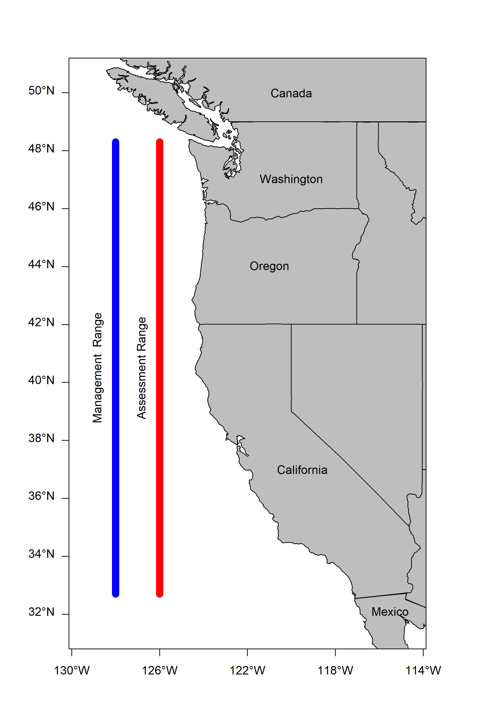
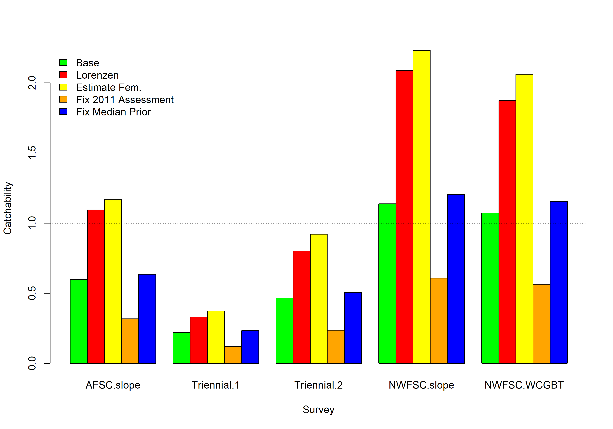

<!--chapter:end:00a.Rmd-->

---
author:
  - name: Chantel R. Wetzel
    code: 1
    first: C
    middle: R
    family: Wetzel
  - name: Aaron M. Berger
    code: 2
    first: A
    middle: M
    family: Berger
author_list: Wetzel, C.R., A.M. Berger
affiliation:
  - code: 1
    address: Northwest Fisheries Science Center, U.S. Department of Commerce, National
      Oceanic and Atmospheric Administration, National Marine Fisheries Service, 2725
      Montlake Boulevard East, Seattle, Washington 98112
  - code: 2
    address: Northwest Fisheries Science Center, U.S. Department of Commerce, National
      Oceanic and Atmospheric Administration, National Marine Fisheries Service, 2032
      Southeast OSU Drive, Newport, Oregon 97365
address:
  - ^1^Northwest Fisheries Science Center, U.S. Department of Commerce, National Oceanic
    and Atmospheric Administration, National Marine Fisheries Service, 2725 Montlake
    Boulevard East, Seattle, Washington 98112
  - ^2^Northwest Fisheries Science Center, U.S. Department of Commerce, National Oceanic
    and Atmospheric Administration, National Marine Fisheries Service, 2032 Southeast
    OSU Drive, Newport, Oregon 97365
---

<!--chapter:end:00authors.Rmd-->

---
title: Status of Dover sole (_Microstomus pacificus_) along the U.S. West Coast in
  2021
---

<!--chapter:end:00title.Rmd-->

\pagenumbering{roman}

\renewcommand{\thetable}{\roman{table}}
\renewcommand{\thefigure}{\roman{figure}}

\setlength\parskip{0.5em plus 0.1em minus 0.2em}

\vspace{500cm}

# Disclaimer{-}

_**These materials do not constitute a formal publication and are for information only. They are in a pre-review, pre-decisional state and should not be formally cited or reproduced. They are to be considered provisional and do not represent any determination or policy of NOAA or the Department of Commerce.**_

\pagebreak

<!--chapter:end:01a.Rmd-->

# One Page Summary{-}

\begin{itemize}

\item This assessment for Dover sole incorporates a wide range of data sources: landings data and discard estimates; survey indices of abundance, length- and/or age-composition data for each fishery or survey (with conditional age-at-length data used for the surveys); information on weight-at-length, maturity-at-length, and fecundity-at-length; information on natural mortality and the steepness of the Beverton-Holt stock-recruitment relationship; and estimates of ageing error.

\item The longest time series of fishery-independent information off the U.S. west coast arises from the \gls{s-wcgbt} that has been conducted annually from 2003 - 2019. The length and age data from this survey were highly influential on the model estimates of stock size and status. Additionally, these data were used to externally estimate starting parameter values by sex for length-at-age and the fixed values by sex for length-weight relationship.   

\item Dover sole off the U.S. west coast appear to have complex movement patterns, moving across depths, likely driven by season, spawning, and by size. Additionally, observations indicate possible sex-specific aggregations where a higher proportion of female fish are found in shallower (less than 300 m) and deeper waters (greater than 900 m), with higher proportion of males observed at intermediate depths (300 - 700 m).

\item The model parameterization allowed for sex-specific selectivity with female Dover sole never fully selected (maximum selectivity less than 1.0). Large female Dover sole are observed at the deepest depth sampled (1,280 m) off the West Coast and likely extend into unobserved deeper depths. Lack of full selectivity of female Dover sole results in a fraction of unobserved spawning biomass in the population, increasing uncertainty in the estimate of the stock scale that the base model may not fully capture (via asymptotic error assumptions around estimated parameters).  

\item The model was highly sensitive to the assumed value of natural mortality.  The base model fixed the instantaneous rate of natural mortality for females at the median of the prior, 0.108 per year, and estimated male natural mortality as an offset from the female value. When estimated, female natural mortality was well below the median of the prior, at 0.082 per year, which did not appear well supported by longevity information and resulted in estimates of survey catchability at or above 2.0.  However, the relative difference in natural mortality by sex appeared to be well defined across reasonable ranges of natural mortality which informed the decision to only estimate male natural mortality parameterized as an offset from the fixed female value.   

\item The estimated spawning biomass at the beginning of 2021 was 232,065 mt ($\sim$95 percent asymptotic intervals: 154,153 to 309,977 mt), which when compared to unfished spawning biomass (294,070 mt) equates to a relative stock status level of 79 percent ($\sim$95 percent asymptotic intervals: 71 to 87 percent).  The estimated scale of the stock ($SB_0$) from this assessment, 294,070 mt, is lower than the value estimated in the 2011 assessment of 469,866 mt but well within the 2011 $\sim$95 percent asymptotic interval (182,741 - 756,991 mt).

\item  Fishing intensity (1 - SPR) over the past decade has been well below the target $\text{SPR}_{30\%}$, ranging between 0.11 and 0.2. The estimated target spawning biomass based on the 25 percent management target is 73,518. Sustainable total yield, landings plus discards, using $\text{SPR}_{30\%}$ is estimated at 22,891 mt.   

\end{itemize}

\newpage

<!--chapter:end:01b_onepage.Rmd-->

# Executive Summary{-}

## Stock{-}
This assessment reports the status of Dover sole (_Microstomus pacificus_) off the U.S. west coast using data through 2020. Dover sole are also harvested from the waters off the Canadian coast and in the Gulf of Alaska, and although those catches were not included in this assessment, it is not certain if those populations contribute to the biomass of Dover sole off the U.S. west coast. Dover sole exhibit complex seasonal and ontogenetic movement, moving to deeper waters based on size but also shifting seasonally, moving from shallower feeding grounds on the continental shelf during the summer months to deeper spawning habitat on the outer continental shelf and slope in the winter. However, the specific mechanisms that drive stock structure and related variability over space and time, are not well understood.

## Landings{-}
Dover sole were first landed in California in the early part of the 20th century with landings beginning in Oregon and Washington in the 1940's (Figure \ref{fig:es-catch}). Landings remained relatively constant throughout the 1950s and 1960s before increasing rapidly into the early 1990s. Subsequently, the landings declined by nearly 60 percent in California and Oregon/Washington until 2007 when harvest guidelines increased the allowable catch leading to increased landings between 2007 - 2010.  Since 2011, landings have been steadily decreasing, where the landings in 2020 is the lowest on record since the 1940s (Table \ref{tab:removalsES}). There are multiple factors that have led to the recent low landings of Dover sole (e.g., co-occurrence with constraining stocks, market forces). 

Groundfish trawl fisheries account for the majority of Dover sole landings off the West Coast, with fixed gears, shrimp trawls, and recreational fisheries collectively make up a very small amount of fishing mortality (less that 1 percent of the total). Some discarding of Dover sole has occurred in these fisheries, primarily prior to the implementation of the Individual Fishing Quota (IFQ) Catch Shares Program in 2011. Discard mortality was estimated within the model based on data of discarding rates and lengths across time. Landings and the estimates of total mortality are reported (Table \ref{tab:removalsES}). 

\clearpage

\input{tex_tables/a_Catches_ES.tex}

{width=100% height=100% alt="Landings by fleet used in the base model where catches in metric tons by fleet are stacked."}

\clearpage

## Data and assessment{-}

This stock assessment for Dover sole off the west coast of the U.S. was developed using the length- and age-structured model Stock Synthesis (version 3.30.16).  The previous stock assessment of Dover sole was conducted in 2011 and estimated the stock to be increasing with a stock status determination of 84 percent of virgin (or unfished) spawning biomass at the beginning of 2011. During the development of this assessment, model specifications including fleet structure, landings, data, and model structural assumptions were re-evaluated. Similar to the previous assessment, a single coastwide population was modeled allowing for area-specific fleets and separate growth and mortality parameters for each sex (i.e., a two-sex model).  The model time domain is 1911 to 2020, with a 12 year forecast beginning in 2021.

All the data sources included in the base model for Dover sole have been re-evaluated for this assessment, including improvements and updates in the data (and associated analyses) that were used in the previous assessment. Estimate of landings prior to the mid-1980s have also been updated using the new historical catch reconstruction time series for Oregon. Survey data from the \gls{afsc} and \gls{nwfsc} have been used to construct four sets of relative abundance indices, each spanning different time periods, were independently developed using a spatio-temporal delta-generalized linear mixed model (i.e., VAST). 

The definition of fishing fleets changed in this assessment relative to those in the 2011 assessment. Two fishing fleets are now defined in the model: 1) a combined gear California fleet and 2) a combined gear Oregon/Washington fleet. The fleet grouping for Oregon and Washington was suggested by State representatives during the pre-assessment data meeting because of  similarities in fishing across this region while also avoiding the inherent difficulties associated with separating data between Oregon and Washington due to the intermixing of fishing and landing locations across state boundaries. 

This assessment integrates data and information from multiple sources into one modeling framework. Specifically, the assessment uses landings data and discard estimates; survey indices of abundance, length- and/or age-composition data for each fishery or survey (with conditional age-at-length data used for the \gls{s-nwslope} and \gls{s-wcgbt}); information on weight-at-length, maturity-at-length, and fecundity-at-length; information on natural mortality and the steepness of the Beverton-Holt stock-recruitment relationship; and estimates of ageing error. The base model was tuned to account for the weighting of composition data as well as the specification of recruitment variance and recruitment bias adjustments.  Estimates of recruitment at equilibrium spawning biomass ($R_0$), annual recruitment deviations, sex-specific length-based selectivity of the fisheries and surveys, retention for each of the fishery fleets, catchability of the surveys, sex-specific growth, the time series of spawning biomass, age and size structure, and current and projected future stock status are derived outputs of the model. 

Multiple sources of uncertainty are explicitly included in this assessment, including parameter uncertainty using prior distributions, observational uncertainty through standard deviations of survey estimates, and model uncertainty through a comprehensive sensitivity analyses to data source and model structural assumptions. A base model was selected that best fit the observed data while concomitantly balancing the desire to capture the central tendency across those sources of uncertainty, ensure model realism and tractability, and promote robustness to potential model misspecification.

## Stock biomass and dynamics{-}

The terms "spawning output" and "spawning biomass" are used interchangeably in this document in reference to total female spawning biomass. For the purposes of this assessment, female spawning biomass is assumed to be proportional to egg and larval production (i.e., spawning output). The estimated spawning biomass at the beginning of 2021 was 232,065 mt (~95 percent asymptotic intervals: 154,153 to 309,977 mt, Table \ref{tab:ssbES} and Figure \ref{fig:es-ssb}), which when compared to unfished spawning biomass (294,070 mt) equates to a relative stock status level of 79 percent (~95 percent asymptotic intervals: 71 to 87 percent, Figure \ref{fig:es-depl}).  Overall, spawning stock biomass has steadily declined from near unfished levels in the 1940s to a time series low of 60 percent of unfished levels in 1994 following high landings in the 1980s and early 1990s. Over the past two decades, spawning stock biomass has generally been increasing as total landings have decreased. The stock is estimated to be well above the management target of $SB_{25\%}$ in 2021 and has remained well above the target throughout the time series (Table \ref{tab:ssbES} and Figure \ref{fig:es-depl}).

\input{tex_tables/b_SSB_ES.tex}

_with_95_asymptotic_intervals_intervals.png){width=100% height=100% alt="Estimated time series of spawning output (circles and line: median; light broken lines: 95 percent intervals) for the base model."}

{width=100% height=100% alt="Estimated time series of fraction of unfished spawning output (circles and line: median; light broken lines: 95 percent intervals) for the base model."}

\clearpage

## Recruitment{-}

There is large uncertainty associated with annual differences in recruitment across much of the time series due to a lack of informative data during the early period and little contrast in composition and index data in the later period to signal much variation in cohort strength (Table \ref{tab:recrES} and Figure \ref{fig:es-recruits}). Data were most informative from the early-2000s to the mid-2010s, where estimates showed periods of below average recruitment (2002-2006) and above average recruitment (2008-2010). The 2000 and 2009 year classes are estimated to be the largest across the time series and were well determined as being above average (i.e., ~95 percent asymptotic intervals did not span 0, Figure \ref{fig:es-rec-devs}). Overall, the Dover sole stock has not been reduced to levels that would provide considerable information on how recruitment changes with across spawning biomass levels (i.e., inform the steepness parameter).  Thus, all recruitment is based on a fixed assumption about steepness ($h$ = 0.80) and recruitment variability ($\sigma_R$ = 0.35).

\input{tex_tables/c_Recr_ES.tex}

_with_95_asymptotic_intervals.png){width=100% height=100% alt="Estimated time series of age-0 recruits (1000s) for the base model with 95 percent intervals."}

{width=100% height=100% alt="Estimated time series of recruitment deviations."}

\clearpage

## Exploitation status{-}

Trends in fishing intensity (1 - SPR) largely mirrored that of landings given the relative lack of large variations in annual recruitment such that there was a steady increase from the 1940s to the mid to late 1980s before decreasing to current levels of 0.11 for 2020 (Figure \ref{fig:es-1-spr}).  The maximum fishing intensity was 0.45 in 1991, well below the target harvest rate of 0.70 (1 - $\text{SPR}_{30\%}$). Fishing intensity over the past decade has ranged between 0.11 and 0.2 and the exploitation rate has been low (0.01 - 0.02, Table \ref{tab:exploitES}). Current estimates indicate that Dover sole spawning biomass is greater than 3 times higher than the target biomass level ($\text{SB}_{25\%}$), and fishing intensity remains well below  the target harvest rate.

\input{tex_tables/d_SPR_ES.tex}

{width=100% height=100% alt="Estimated 1 - relative spawning ratio (SPR) by year for the base model. The management target is plotted as a red horizontal line and values above this reflect harvest in excess of the proxy harvest rate."}

\clearpage

## Ecosystem considerations{-}

Ecosystem factors have not been explicitly modeled in this assessment but there are several aspects of the California current ecosystem that may impact Dover sole population dynamics and warrant further research. Survival of Dover sole eggs and pelagic larvae that have a protracted pelagic phase are linked to water circulation patterns [@king_climate_2011]. The timing of settlement occurs typically between January and March and is correlated with Ekman transport, positive vertical velocity, and relatively warm bottom temperatures [@toole_settlement_1997].  Markle et al. [-@markle_metamorphosis_1992] hypothesized that juvenile Dover sole move inshore to nursery habitat by making vertical ascents during the night off bottom until they encounter suitable habitat.  Tolimieri et al. [-@tolimieri_spatio-temporal_2020] identified multiple areas off the coast of southern California that had high densities of young Dover sole. This is consistent with the finding of Toole et al. [-@toole_seasonal_2011] that juvenile Dover sole 10 - 22 cm tended to move inshore during summer months. As Dover sole grow they generally move offshore into deep waters. Changing water temperature due to climate change may alter the winter onshore Ekman transport which could have impacts on juvenile survival and result in distributional shifts of favorable spawning grounds, or nursery habitats of Dover sole.

## Reference points{-}

The 2021 spawning biomass relative to unfished equilibrium spawning biomass is well above the management target of 25 percent of unfished spawning biomass. The relative biomass compared to the ratio of the estimated SPR to the management target ($\text{SPR}_{30\%}$) across all model years are shown in Figure \ref{fig:es-phase} where warmer colors (red) represent early years and colder colors (blue) represent recent years.  The relative biomass and estimated SPR have been well above the management biomass target (25 percent) and well below the SPR target across all model years. Figure \ref{fig:es-yield} shows the equilibrium curve based on a steepness value fixed at 0.8 with vertical dashed lines to indicate the estimate of fraction unfished at the start of 2021 (current) and the estimated management targets calculated based on the relative target biomass (B target), the SPR target, and the maximum sustainable yield (MSY).

{width=100% height=100% alt="Phase plot of estimated 1-SPR versus fraction unfished for the base model."}

{width=100% height=100% alt="Equilibrium yield curve for the base case model. Values are based on the 2020
fishery selectivities and with steepness fixed at 0.80."}

Reference points were calculated using the estimated selectivities and catch distributions among fleets in the most recent year of the model, 2020 (Table \ref{tab:es-reference}). Sustainable total yield, landings plus discards, using an $\text{SPR}_{30\%}$ is 22,891 mt. The spawning biomass equivalent to 25 percent of the unfished spawning biomass ($\text{SB}_{25\%}$) calculated using the SPR target ($\text{SPR}_{30\%}$) was 74,498 mt. Recent removals have been below the point estimate of the potential long-term yields calculated using an $\text{SPR}_{30\%}$ reference point and the population scale has been relatively stable or increasing over the last decade.

\input{tex_tables/e_ReferencePoints_ES.tex}

\clearpage

## Management performance{-}

Exploitation on Dover sole slowly increased starting around 1940 and reached a high in the early 1990s. After peaking in the 1990s exploitation rates declined steadily through 2006, increased from 2007 - 2010, but have steadily declined since. In the last ten years the annual catch limit (ACL) has been set well below the overfishing limit (OFL) and acceptable biological catch (ABC) (Table \ref{tab:ofl-es}).  Total mortality has ranged between 10 - 15 percent of the ACL in the most recent five years.

\begingroup\fontsize{10}{12}\selectfont
\begingroup\fontsize{10}{12}\selectfont

\begin{longtable}[t]{l>{\raggedright\arraybackslash}p{1.83cm}>{\raggedright\arraybackslash}p{1.83cm}>{\raggedright\arraybackslash}p{1.83cm}>{\raggedright\arraybackslash}p{1.83cm}>{\raggedright\arraybackslash}p{1.83cm}}
\caption{(\#tab:ofl-es)The OFL, ABC, ACL, landings, and the estimated total mortality in metric tons.}\\
\toprule
Year & OFL & ABC & ACL & Landings & Est. Total Mortality\\
\midrule
\endfirsthead
\caption[]{(\#tab:ofl-es)The OFL, ABC, ACL, landings, and the estimated total mortality in metric tons. \textit{(continued)}}\\
\toprule
Year & OFL & ABC & ACL & Landings & Est. Total Mortality\\
\midrule
\endhead

\endfoot
\bottomrule
\endlastfoot
2011 & 44400 & 42436 & 25000 & 7782 & 7893\\
2012 & 44826 & 42843 & 25000 & 7328 & 7430\\
2013 & 92955 & 88865 & 25000 & 7970 & 8078\\
2014 & 77774 & 74352 & 25000 & 6449 & 6543\\
2015 & 66871 & 63929 & 50000 & 6327 & 6354\\
2016 & 59221 & 56615 & 50000 & 7318 & 7350\\
2017 & 89702 & 85755 & 50000 & 7892 & 7925\\
2018 & 90282 & 86310 & 50000 & 6421 & 6447\\
2019 & 91102 & 87094 & 50000 & 5767 & 5790\\
2020 & 92048 & 87998 & 50000 & 4688 & 4707\\*
\end{longtable}
\endgroup{}
\endgroup{}

## Unresolved problems and major uncertainties{-}

The base case model was developed with the goal of balancing parsimony with realism and fitting the data. To achieve parsimony, some simplification of model structure was assumed which may impact the interpretation and fit to specific data sets. The maturity-at-length or -at-age analysis conducted for this assessment identified possible differences in Dover sole south and north of Point Reyes. Currently, there is limited information on the movement of Dover sole by latitude or depth which could provide insights into the mechanisms behind these observed differences. Spatial estimates of biomass north and south of Point Reyes, using \gls{s-wcgbt} data averaged across the most recent five years, indicated that approximately 67 percent of the West Coast Dover sole biomass is estimated to be north of Point Reyes.  Additionally, in recent years the majority of fishery data have been collected from ports north of Point Reyes, which limits the ability to support additional model complexity. Given the lack of information to inform the structure and parameterization of a spatial model, the base model assumed a single homogeneous population structure at this time. Future research into the biology and movement of Dover sole could facilitate future spatial modeling efforts if found to be the appropriate approach. 

Uncertainty in natural mortality translates into uncertain estimates of both status and sustainable fishing levels for Dover sole. In the base model, a balance between fixing and estimating this key parameter was achieved by fixing female natural mortality at the median of the prior while estimating the relative difference in male natural mortality. The difference between male and female natural mortality appeared to be well informed (likelihood profile) with estimates consistent with the data and biology of Dover sole across its range (U.S. west coast, Canada, U.S. Alaska waters). The likelihood profile across values of female natural mortality supported lower values, which were not expected _a priori_ based on the available age data and were largely driven by length data from the AFSC slope survey.  This could be due to limited information about maximum age for Dover sole in the data, the limited selection of female Dover sole by the fisheries and surveys or could indicate model misspecification. It is unclear what is driving this behavior in the model. 

Dover sole life history exhibit strong relationships with depth that indicate the stock is more complex than the model assumes. Small fish are found in shallow water, with the median observed size increasing with depth. However, the variability of sizes observed by sex increases moving from deeper to shallower waters. Specifically, the \gls{s-wcgbt} observes large females at the deepest depths sampled but also observe some of the largest female Dover sole in waters less than 300 meters. In addition, there is a pattern of sex ratio by depth with more males being found in middle depths and more females found in shallow and deeper depths.  These patterns are apparent in the summer fisheries and surveys.  It is uncertain how the patterns affect the data (they may be a cause of the bi-modal length distributions seen in the slope surveys) and if these patterns can be effectively modeled to produce better fits to the data and better predictions of biomass while still preserving model parsimony.

## Scientific uncertainty{-}

The model estimated uncertainty around the 2021 spawning biomass was $\sigma$ = 0.17 and the uncertainty around the OFL was $\sigma$ = 0.16. This is likely an underestimate of overall uncertainty because of the necessity to fix several population dynamic parameters (e.g., steepness, recruitment variance, female natural mortality) and no explicit incorporation of model structural uncertainty (although see the decision table for alternative states of nature).

## Harvest projections and decision table{-}

The forecast of stock abundance and yield was developed using the base model. The total catches in 2021 and 2022 were set at 10,000 mt, well below the adopted 50,000 mt ACL for those year, based on recommendations from the Groundfish Management Team (GMT). These assumed removals are likely higher than what the true removals may be in 2021 and 2022 but have limited impact in the stock status and future removals during the projected period in the base model. The exploitation rate for 2023 and beyond is based upon an SPR of 30 percent and the 25:5 harvest control rule. The average exploitation rates, across recent years, by fleet were used to distribute catches during the forecast period. The ABC values were estimated using a category 1 time-varying $\sigma_y$ starting at 0.50 combined with a P* value of 0.45. The catches in the base model during the projection period, 2023 - 2032 were set equal to the year-specific ABC using the current flatfish harvest control rule, 25:5 (Table \ref{tab:es-project}). 

The axes of uncertainty  in the decision table are based on the uncertainty around female natural mortality. The default category 1 $\sigma$ value of 0.50 was used to identify the low and high states of nature relative to the estimated 2021 spawning biomass  (i.e., 1.15 standard deviations corresponding to the 12.5 and 87.5 percentiles). A search across female natural mortality values was done to identify the natural mortality value that resulted in  current year spawning biomass values for the low and high states of nature based on the percentiles. The female natural mortality values that corresponded with the lower and upper percentiles were 0.084 yr^-1^ and 0.126 yr^-1^. 

Initial explorations were conducted using the model estimated uncertainty around 2021 spawning biomass of $\sigma$ = 0.17 rather than the higher default category 1 $\sigma$ value.  However, the range of the low and high states of nature relative to the base model were determined to not adequately capture uncertainty based on feedback received during the STAR panel review. Model estimated uncertainty is an underestimate of the true uncertainty around the stock size since it only captures within model uncertainty and does not account for structural uncertainties. Applying a higher $\sigma$ value allowed the low and high states of nature to capture a larger uncertainty range around the base model which may be more in line with the cumulative model and structural uncertainty. It was noted that the low and high states of nature results in catchability values (low state of nature catchability = 2.0 and high state of nature catchability = 0.56) for the \gls{s-wcgbt} that were factors higher or lower than the base model catchability (1.072). Catchability values could potentially provide understanding of the plausibility of alternative states; however, adequately interpreting values of catchability comes with inherent challenges due to changes in other key model parameters (e.g., selectivity). 

Three alternative catch streams were created for the decision table (Table \ref{tab:es-dec-tab}). The first option uses ABC values which are adjusted based on time-varying $\sigma_y$ starting at 0.50 and increasing annually combined with a P$^*$ value of 0.45. The two alternative catch streams assume fixed catches of either 7,000 or 20,000 mt for the 10 year projection period. All of these options assume full attainment of the catch values.  

Across the low and high states of nature and across alternative future harvest scenarios the fraction of unfished ranges between 0.023 - 0.895 by the end of the 10 year projection period (Table \ref{tab:es-dec-tab}). The low state of nature assuming full ABC removals results in a nearly depleted stock at the end of the time series.  This is due to the assumption or removing the full ABC derived from the base model to the low state of nature which had an overall lower unfished spawning biomass associated with a low natural mortality value which results in a more depleted stock in 2021 relative to the base model.     

\begingroup\fontsize{10}{12}\selectfont

\begin{landscape}\begingroup\fontsize{10}{12}\selectfont

\begin{longtable}[t]{>{\raggedright\arraybackslash}p{2cm}>{\raggedright\arraybackslash}p{2cm}>{\raggedright\arraybackslash}p{2cm}>{\raggedright\arraybackslash}p{2cm}>{\raggedright\arraybackslash}p{2cm}>{\raggedright\arraybackslash}p{2cm}>{\raggedright\arraybackslash}p{2cm}>{\raggedright\arraybackslash}p{2cm}>{\raggedright\arraybackslash}p{2cm}>{\raggedright\arraybackslash}p{2cm}}
\caption{(\#tab:es-project)Projections of potential OFLs (mt), ABCs (mt), the buffer (ABC = buffer x OFL), estimated spawning biomass, and fraction unfished. The adopted OFL, ABC, and ACL for 2021 and 2022 reflect adopted management limits and the assumed removal is the removal assumptions applied for 2021 and 2022. The full ABC was assumed to be removed for 2023 - 2032}\\
\toprule
Year & Adopted OFL (mt) & Adopted ABC (mt) & Adopted ACL (mt) & Assumed Removal (mt) & OFL (mt) & ABC (mt) & Buffer & Spawning Biomass (mt) & Fraction Unfished\\
\midrule
\endfirsthead
\caption[]{(\#tab:es-project)Projections of potential OFLs (mt), ABCs (mt), the buffer (ABC = buffer x OFL), estimated spawning biomass, and fraction unfished. The adopted OFL, ABC, and ACL for 2021 and 2022 reflect adopted management limits and the assumed removal is the removal assumptions applied for 2021 and 2022. The full ABC was assumed to be removed for 2023 - 2032 \textit{(continued)}}\\
\toprule
Year & Adopted OFL (mt) & Adopted ABC (mt) & Adopted ACL (mt) & Assumed Removal (mt) & OFL (mt) & ABC (mt) & Buffer & Spawning Biomass (mt) & Fraction Unfished\\
\midrule
\endhead

\endfoot
\bottomrule
\endlastfoot
2021 & 93547 & 84192 & 50000 & 10000 & - & - & - & 232065 & 0.79\\
2022 & 87540 & 78436 & 50000 & 10000 & - & - & - & 231642 & 0.79\\
2023 & - & - & - & - & 63834 & 59684 & 0.935 & 230918 & 0.79\\
2024 & - & - & - & - & 55859 & 51949 & 0.93 & 207333 & 0.71\\
2025 & - & - & - & - & 49608 & 45937 & 0.926 & 187284 & 0.64\\
2026 & - & - & - & - & 44769 & 41277 & 0.922 & 170449 & 0.58\\
2027 & - & - & - & - & 41053 & 37646 & 0.917 & 156459 & 0.53\\
2028 & - & - & - & - & 38217 & 34892 & 0.913 & 144943 & 0.49\\
2029 & - & - & - & - & 36050 & 32770 & 0.909 & 135500 & 0.46\\
2030 & - & - & - & - & 34389 & 31088 & 0.904 & 127779 & 0.43\\
2031 & - & - & - & - & 33108 & 29797 & 0.9 & 121483 & 0.41\\
2032 & - & - & - & - & 32100 & 28762 & 0.896 & 116323 & 0.40\\*
\end{longtable}
\endgroup{}
\end{landscape}
\endgroup{}

\input{tex_tables/decision_table_es.tex}

\clearpage

## Research and data needs{-}

Investigating and or addressing the following items could improve future assessments of Dover sole: 

\begin{itemize}

\item Spatiotemporal distribution patterns with depth:  There are patterns of length and sex ratios with depth which may indicate that the stock is more complex than currently modeled.  Further research into the causes of these patterns as well as differences between seasons would help with understanding the stock characteristics such that a more realistic model could be built.  This may also provide further insight into migration and help determine if there are localized populations.

\item Stock boundaries: A common question in stock assessments is whether or not the entire stock is being represented. Dover sole live deeper than the range of the fisheries and surveys.  The assessment model attempts to account for out of area biomass through catchability coefficients and selectivity curves, but that portion of the stock is unknown and can only be conjectured.  Research into abundance in deep areas would be useful to verify that the assessment adequately predicts the entire spawning stock of Dover sole.

\item Unavailable biomass: The distribution of Dover sole covers a wide-depth range off the West Coast. Dover sole are observed by the \gls{s-wcgbt} out to 1,280 m, the maximum depth sampled, where the majority of Dover sole observations at these depths are females. The sex-specific movement of Dover sole across depths results in the model estimating that females` are never fully selected (maximum selectivity well below 1.0 or dome-shaped) by the fisheries or the surveys. This results in an assumption that there is some portion of cryptic biomass that is unavailable for selection by the fisheries or observation by the surveys.  Improved understanding about sex-specific availability across depths by season and the proportion of Dover sole biomass, particularly female biomass, at depths beyond the range of the survey would improve future estimates of stock size. 

\item California Sampling for Ages: Since 1990, nearly 60 percent of fish aged have been landed at the Crescent City port with some years all aged fish being landed there. In contrast, the majority of Dover sole landed in California occur at the Eureka port (approximately 67 percent over the last 10 years). Ensuring that sampling is spread across California ports and otoliths selected for ageing are spread across ports proportional to area removals may provide additional insights to area-specific population attributes.

\end{itemize}

<!--chapter:end:01executive.Rmd-->

\pagebreak
\setlength{\parskip}{5mm plus1mm minus1mm}
\pagenumbering{arabic}
\setcounter{page}{1}
\renewcommand{\thefigure}{\arabic{figure}}
\renewcommand{\thetable}{\arabic{table}}

\setcounter{table}{0}
\setcounter{figure}{0}

\setlength\parskip{0.5em plus 0.1em minus 0.2em}

<!--chapter:end:10a.Rmd-->

# Introduction

The Dover sole (_Microstomus pacificus_) is a flatfish belonging to the family Pleuronectidae and is called a sole although it is a flounder.  Dover sole has also been known by several different common names including slippery sole, lemon sole, smear dab, rubber sole, short finned sole, slime sole, and tongue sole.  Although there was little interest in Dover sole when the U.S. west coast trawl fishery first began in the late 19th century, the species is now commonly landed.

This is an assessment of the Dover sole population off of the U.S. west coast, including coastal waters of California, Oregon, and Washington from the U.S./Mexico border to the U.S./Canadian border (Figure \ref{fig:map}).  It does not include Canadian or Alaskan populations and assumes that these northern populations do not contribute to the stock being assessed here.

## Life History

Dover sole range from Baja California to the Bering Sea and eastern Aleutian Islands [@kramer_guide_1995]. Dover sole are generally found on mud or mud-sand bottom deeper than 20 fathoms (37 m) and out to below 1,500 m [@jacobson_bathymetric_1993]. They feed on polychaete worms, pink shrimp, brittle stars, gammarid amphipods, and small bivalves [@pearcy_feeding_1978; @gabriel_feeding_1981].  Dover sole exhibit dimorphic growth by sex with females off the West Coast reaching a maximum length around 48 cm, approximately 5 cm greater than males. Dover sole are estimated to live up to a maximum age of approximately 50 years.

Based on samples from the commercial fishery in northern California, Hagerman [-@hagerman_biology_1952] concluded that the spawning period for Dover sole is during November to March or April with heavy spawning during December to February.  In contrast, a later study by Markle et al. [-@markle_metamorphosis_1992] concluded that Dover sole off the coast of Oregon appear to reach peak spawning in early spring. Spawning occurs in relatively deep water [@hagerman_biology_1952] and prior to 1954 few Dover sole were caught during winter months because the fish were generally unavailable on the continental shelf during winter.  Dover sole eggs and larvae are buoyant [@hagerman_biology_1952] with an extended larval phase lasting at least one year [@pearcy_distribution_1977; @markle_metamorphosis_1992; @butler_growth_1996].  Additionally, Markle et al. [-@markle_metamorphosis_1992] postulate that Dover sole larvae may extend settlement by delaying metamorphosis to avoid unfavorable oceanographic conditions.  

Based on research survey tows, Jacobson and Hunter [-@jacobson_bathymetric_1993] found that the catches of Dover sole in a given area and depth zone were not randomly distributed by sex, with males and females tending to occur in separate patches. Furthermore, Dover sole appear to undergo ontogenetic shifts in their distribution with fish gradually moving to deeper water as they grow [@jacobson_depth_2001].  Westrheim et al. [-@westrheim_stock_1992] summarized the results from multiple tagging studies between 1948 - 1979 and indicated seasonal movements of Dover sole onto the continental shelf in the summer and off the shelf in the winter, but little evidence of north-south movement or appreciable mixing between Pacific Marine Fisheries Commission (PMFC) statistical areas. However, a few tagged fish were observed to have moved long distances. For example, Westrheim and Morgan [-@westrheim_results_1963] reported that a fish caught and tagged in the Willapa Deep area off Washington was subsequently recaptured off Humboldt Bay, California, 360 nautical miles south.  Barss et al. [-@barss_marine_1977] reported having records for 13 tagged fish that were recaptured after 10 or more years at liberty. The longest time a fish was at liberty was 22 years and was recaptured within 1 nautical mile of its original release location. Although, Westrheim et al. [-@westrheim_stock_1992] found little observed movement movement north and south, they note that the majority of the tagging work was done prior to the development of the deepwater trawl fishery for Dover sole (except PFMC area 1C).  Additionally, Dover sole larvae have an extensive pelagic period, greater than one year, which may allow larvae movement across the West Coast [@hagerman_biology_1952].

Ono et al. [-@ono_space-time_2016] examined movement patterns of Dover sole using \gls{s-wcgbt} data collected off the West Coast in early summer and early fall. They found that Dover sole displayed ontogenetic movement, moving to shallower and deeper water during summer months. Additionally, Dover sole appeared to move from areas southwest of San Francisco and northwest of Eureka to the northern or southern edges of the U.S. coast in late summer, aggregating along the Washington coast and south of Point Conception in California [@ono_space-time_2016]. This movement pattern identified by Ono et al. [-@ono_space-time_2016] differs from the limited latitudinal movement identified by early tagging studies of Dover sole [@westrheim_stock_1992].

Stock structure is not well understood. Based on tagging study results that show limited adult movement, there may be multiple stocks of Dover sole due to limited intermingling adult populations, but larvae probably intermingle during their long pelagic life [@westrheim_stock_1992].  Stepien [-@stepien_phylogeographical_1999] used sequences of mitochondrial DNA extracted from Dover sole sampled at six sites ranging from southern California to the Gulf of Alaska and found phylogeographical structure in West Coast Dover sole with spatial clustering of genetically similar individuals. However, there were several unusual clusters of specimens having apparently similar genetic make-up although they were geographically separated (i.e., fish from Alaska with similar genetics as fish from San Diego). 

## Ecosystem Considerations

Ecosystem factors have not been explicitly modeled in this assessment but there are several aspects of the California current ecosystem that may impact Dover sole population dynamics and warrant further research. Survival of Dover sole eggs and pelagic larvae that have a protracted pelagic phase are linked to water circulation patterns [@king_climate_2011]. The timing of settlement occurs typically between January and March and is correlated with Ekman transport, positive vertical velocity, and relatively warm bottom temperatures [@toole_settlement_1997].  Markle et al. [-@markle_metamorphosis_1992] hypothesized that juvenile Dover sole move inshore to nursery habitat by making vertical ascents during the night off bottom until they encounter suitable habitat.  Tolimieri et al. [-@tolimieri_spatio-temporal_2020] identified multiple areas off the coast of southern California that had high densities of young Dover sole. This is consistent with the finding of Toole et al. [-@toole_seasonal_2011] that juvenile Dover sole 10 - 22 cm tended to move inshore during summer months. As Dover sole grow they generally move offshore into deep waters. Changing water temperature due to climate change may alter the winter onshore Ekman transport which could have impacts on juvenile survival and result in distributional shifts of favorable spawning grounds, or nursery habitats of Dover sole.

## Historical and Current Fishery Information

Trawl fishing with boats powered by sail began in California waters in 1876 and caught many flatfishes, including Dover sole [@hagerman_biology_1952]. Even though there are reports of Dover sole being sold in summer markets in San Francisco as early as 1878 (Lockington [-@lockington_report_1880] as referenced by Hagerman [-@hagerman_biology_1952]), it was not until the early part of the 20th century that landings of Dover sole were recorded.  In a 1936 biological report from the State of Washington Department of Fisheries Dover sole was described as "very slimy and is repulsive to handle" and "[i]t has no value as a commercial fish" [@smith_report_1936]. It was not long after 1936 that Dover sole were being landed in significant quantities up and down the U.S. west coast.  

Since Dover sole was considered a "repulsive" fish by some [@smith_report_1936] in the early years of the West Coast fishery development, it was likely discarded as bycatch when pursuing other more desirable species such as petrale sole (_Eopsetta jordani_) and English sole (_Parophrys vetulus_). However, markets were eventually developed and landings began steadily increasing in the 1940s. While early Dover sole landings were first recorded in California, fisheries for Dover sole had developed in Oregon and Washington by the 1930s  (Table \ref{tab:allcatches} and Figure \ref{fig:catch}). Landings remained relatively constant throughout the 1950s and 1960s before increasing rapidly into the early 1990s.  Starting around 1980 landings in Oregon surpassed California landings, becoming the state with the highest landing of Dover sole. In recent years in California, the majority of removals of Dover sole have been landed in northern California ports (Eureka, Fort Bragg, and Crescent City). In Oregon, the majority of recent landings occur at Astoria and Newport followed by Coos Bay and Brookings. In Washington, ports in Bellingham and Westport, have the highest landings in recent years.

Over the last twenty years, the landings declined (mostly in California) until 2007 when harvest guidelines increased the allowable catch based on the 2005 assessment results [@sampson_status_2005]. In 2015 the  Annual Catch Limit (ACL) of Dover sole increased from 25,000 to 50,000 mt for Dover sole with 95 percent of the ACL allocated to the trawl fishery. However, attainment of Dover sole has been low (less than 15 percent). The reasons for low attainment of Dover sole are complex. Dover sole co-occur with sablefish (_Anoplopoma fimbria_) which has been a constraining species for Dover sole landings due to the lower ACLs of sablefish and allocation challenges among sablefish fishing sectors. Additionally, petrale sole (_Eopsetta jordani_), a highly targeted flatfish off the West Coast, was declared overfished in 2010 [@haltuch_status_2011], resulting in lower ACLs for petrale sole prior to the stock rebuilding in 2015 which could have limited opportunities for Dover sole landings. Finally, in recent years there has been increased competition in the whitefish markets with other inexpensive fish options (e.g., tilapia and catfish) which may have displaced U.S. wild caught species such as Dover sole [@norma-lopez_is_2009]. 

Groundfish trawl fisheries land the majority of Dover sole (greater than 99 percent total landings) while fixed gears, shrimp trawls, and recreational fisheries make up a very small amount of fishing mortality. Shrimp trawls have been using excluders which have reduced bycatch of many species including Dover sole. The trawl fisheries typically catch Dover sole while targeting the deepwater complex consisting of Dover sole, sablefish, shortspine thornyhead (_Sebastolobus alascanus_), and longspine thornyhead (_Sebastolobus altivelis_, DTS deepwater complex) but also encounter Dover sole when targeting petrale sole or nearshore mix species. The fishery targets Dover sole across a range of depths (50 - 330 fathoms) depending upon the season (Scott Malvitch, personal communication, ODFW).  

Historically, discarding of Dover sole occurred for a variety of reasons. Dover sole was discarded due to trip limits, small size, or even being too large. Dover sole of the largest size caught at deep depths  become "jellied" where the tissue becomes soft and has little marketability (Mike Okoniewski, personal communication). Since the introduction of individual fishery quotas (IFQ) in 2011, the discarding of all quota species, including Dover sole, has dramatically declined across the IFQ trawl fleet.  

## Summary of Management History and Performance

Management restrictions for Dover sole came largely into place in the early 1980s with the implementation of trip limits and quotas on DTS species, which mostly limited catches of Dover sole because of more restrictive trip limits on the higher priced sablefish and thornyheads. Trip limits specific for Dover sole were implemented for portions of 1994, 1996, the start of 1997, and for years thereafter. Catches of the deepwater species during earlier years were controlled primarily by trip limits on the landings of sablefish and thornyheads, for which the fishers received much higher prices. 

In studies of trawl logbook data from California (1985-91), Washington (1986-92), and Oregon (1987-93), Sampson [-@sampson_effective_1997] tabulated how many trawl trips landed within 90 percent of the trip limits in effect at the time of each trip. Trips were sometimes constrained by the trip limits on sablefish (up to 43 percent of the trips landing in California, 32 percent of the trips landing in Oregon, and 27 percent of the trips landing in Washington). Trips were much less frequently constrained by the trip limits on the deepwater complex (up to 15 percent of the trips landing in California, 17 percent of the trips landing in Oregon, and 8 percent of the trips landing in Washington).

The introduction of the IFQ fishery in 2011 created an allocation system of quota pounds to vessels participating in the catch share program for species in the groundfish Fishery Management Plan. Overall, Dover sole removals have been well below the annual catch limits (ACLs, Table \ref{tab:ofl}).

## Fisheries off Canada and Alaska

Dover sole in Canadian waters are treated as two distinct stocks; a northern stock and a southern stock.  The fishery in the north began in the 1970s while the fishery off of the West Coast of Vancouver Island started in the late 1980s. Area quotas were used to manage the two stocks until the introduction of individual based quotas in 1996. A 1999 assessment reported that the stocks were being exploited at levels near the maximum sustainable yield [@department_of_fisheries_and_ocean_dover_1999]. The stock has not been assessed since; however, was slated for assessment in 2020 (it is unknown if this was done according to schedule). For the two areas combined (3C/D), the total allowable catch in recent years has been set at 1,375 mt [@department_of_fisheries_and_ocean_pacific_2019].

In the Gulf of Alaska, the flatfish fishery has caught substantial quantities of Dover sole, with the peak of 9,740 mt in 1991 [@stockhausen_gulf_2006]. Gulf of Alaska catches or Dover sole have been well below the Total Allowable Catch (TAC) which was set at 9,501 mt in 2019 [@the_plan_team_for_the_groundfish_fisheries_of_the_gulf_of_alaska_stock_2019]. In 2020 the spawning biomass for Dover sole was estimated to be 27,935 mt, well above the biomass target for the Gulf of Alaska of 7,613 mt [@the_plan_team_for_the_groundfish_fisheries_of_the_gulf_of_alaska_stock_2019].  

<!--chapter:end:11introduction.Rmd-->

# Data
A description of each data source is provided below (Figure \ref{fig:data-plot}).

<!--chapter:end:20data.Rmd-->

## Fishery-Dependent Data

### Recent Commercial Fishery Landings

The commercial removals were extracted from the Pacific Fisheries Information Network (PacFIN) database for 1981 - 2020 for California and Washington and 1987 - 2020 for Oregon on January 28, 2021. The majority of removals for Dover sole arise from trawl gear (i.e., greater than 99 percent). Commercial removals for all gear types were combined into two area-specific fleets: a California fleet and a combined Oregon/Washington fleet. The fleet grouping for Oregon and Washington was suggested by State representatives during the pre-assessment data meeting because of  similarities in fishing across this region while also avoiding the inherent difficulties associated with separating data between Oregon and Washington due to the intermixing of fishing and landing locations across state boundaries. 

#### Washington Landings Prior to 1981

Historical commercial landings of non-shrimp trawl gear were reconstructed for Dover sole landed in Washington for use in the 2011 assessment by Greg Lippert (Washington Department Fish and Wildlife, WDFW).  Shrimp trawl, fixed gear, and recreational landings constitute a negligible amount of the total mortality for Dover sole.  Historical landings of Dover sole landed in the state of Washington were determined from various data sources using era-specific understanding of fishing behavior.  For details, please see Hicks and Wetzel [-@hicks_status_2011]. The historical landings for Washington were revised slightly from those used in 2011 to include historical catches that were captured in Washington water but landed in California. See details below in [Oregon Landings Prior to 1986](#or-hist).    

#### Oregon Landings Prior to 1986 {#or-hist}

Historical commercial fishery landings of Dover sole in Oregon for the years 1911 - 1986 were obtained from Alison Whitman (Oregon Department of Fish and Wildlife, ODFW). A description of the historical reconstruction methods can be found in Karnowski et al. [-@karnowski_historical_2014]. The California catch reconstruction (discussed below, Ralston et al. [-@ralston_documentation_2010]) excluded fish that were caught in Oregon or Washington waters and landed at a California port. In contrast, Oregon's historical catch reconstruction was based on the port of landing. This disconnect between methods applied by California and Oregon was brought to light during the [2016 Catch Reconstruction workshop](https://www.pcouncil.org/documents/2017/03/i2_att1_catch_reconstruction_workshop_report_mar2017bb.pdf/).  Landings estimates between 1948 - 1968 for Dover sole that were identified to have occurred in Oregon or Washington waters and excluded from the California reconstruction were provided by John Field (Southwest Fishery Science Center, SWFSC, NOAA).  These landings of Dover sole were added to the Oregon/Washington fleet within the model (Table \ref{tab:or-wa-add-catch}). 

#### California Landings Prior to 1981

Historical commercial fishery landings of Dover sole from 1948 - 1980 were obtained directly from E.J. Dick (SWFSC, NOAA) who retrieved the data from the California Cooperative Groundfish Survey data system (CALCOM). The method of reconstructing California historical landings are described by Ralston et al. [-@ralston_documentation_2010]. 

At present, no landing for Dover sole before 1948 are available in CALCOM.  For years prior to 1948, the landings from the 2005 assessment [@sampson_status_2005] were used (as was done in the 2011 assessment). The data from Sampson [-@sampson_status_2005] for the years of 1911 - 1947 include assumed discards of Dover sole from other fisheries operating at the time in California and represent total removals in comparison to the data from CALCOM account for only landed Dover sole. To account for this difference in the input catches for California a retention block was applied for 1911 - 1947 that assumed 100 percent retention (i.e., no additional discarding would be assumed since the removals during this period represent landings + discards). 

### Commercial Discards

Data on discards of Dover sole are available from a few different data sources.  Multiple historical discard studies were used in the model: estimates for the California trawl fishery discarding rate in 1992 (Humboldt State Study), Oregon at-sea discarding study between 1959 - 1961 [@hermann_results_1963], Pikitch discard study in Oregon and Washington between 1985 - 1987, 1974 discard rate analysis in Oregon (Methot et al. [-@methot_jr_assessment_1990] based on TenEyck and Demory [-@teneyck_utilization_1975]), and discard observations from the West Coast Groundfish Observer Program (WCGOP). 

Brodziak et al. [-@brodziak_assessment_1997] described a discard study during 1989 - 1996 by researchers from Humboldt State University. Across 28 observed trips in California waters a total of 21,950 pounds of Dover sole were discarded from a total catch of 172,737 pounds. The authors did not specify what portions of the discards were due to the small size of the fish versus due to trip limits. 

Hermann and Harry [-@hermann_results_1963] conducted a discard study in Oregon examining at-sea and landed length observation for multiple years between 1950 - 1961 (6 sampled years). The data consisted of length frequency measurements taken at-sea and comparable measurements taken at the docks, after sorting and discarding of small unmarketable fish. Retained and discarded fish were estimated by converting observations to pounds using average weights. Estimates of the total length distribution measured at-sea and landed fish were used in previous assessments of Dover sole [@sampson_status_2005; @hicks_status_2011]; however, these data were not available for evaluation in this assessment and were only included as 'ghost' observations (allows to see the implied data fits without being incorporated in the model likelihood estimation). Hermann and Harry [-@hermann_results_1963] report did include estimates of at-sea catches and landed Dover sole for each year. Discard rates for well sampled years, 1959 - 1961, were  retained for use in this assessment. The discarding rate per year ranged from 0.112 - 0.232.

Based on sampling at-sea during summer 1974 in Oregon waters, TenEyck and Demory [-@teneyck_utilization_1975] estimated age-specific retention rates and reported age-at-50-percent-retention of 7.4 years for male Dover sole and 6.9 years for females, equivalent to lengths at 50 percent retention around 33 cm. Based on data from the 1974 study, Methot et al. [-@methot_jr_assessment_1990] reported that the fraction discarded on a weight basis was 0.167.

A trawl discard study conducted in 1985 - 1987, referred to as the Pikitch study, organized by Ellen Pikitch resulted in discard rates and length observations for various groundfish species including Dover sole [@pikitch_evaluation_1988]. The northern and southern boundaries of the study were $48^\circ 42^\prime$ N. latitude and $42^\circ 60^\prime$ N. latitude respectively, which is primarily within the Columbia INPFC area, falling within Oregon/Washington waters [@pikitch_evaluation_1988; @rogers_numerical_1992].  Participation in the study was voluntary and included vessels using bottom, midwater, and shrimp trawl gears.  Observers on commercial vessels collected the data, estimated the total weight of the catch by tow, and recorded the weight of species retained and discarded in the sample.  Results of the Pikitch discard study were processed and provided by John Wallace (personal communication, Northwest Fishery Science Center, NWFSC, NOAA) in the form of ratios of discard weight to retained weight of Dover sole and sex-specific length frequencies. The observed discard length observations by year and sex for Dover sole from the Pikitch study were limited. In order to reduce the noise in these data sex-specific observations were combined based on the assumption that discarding of small fish was not sex-specific (there was no indication of this in the data).  

The final data for discard rate and length observations is from the WCGOP.  This program is part of the NWFSC and has been recording discard observations starting in 2003. Since 2011, when the IFQ program was implemented, observer coverage rates increased to nearly 100 percent for all the limited entry trawl vessels in the program and discard rates declined compared to pre-2011 rates. Discard rates were obtained for both the IFQ catch-share (observed and electronic monitored vessels) and the non-catch share sector for Dover sole. A single discard rate was calculated by weighting discard rates based on the commercial landings by each sector.  Coefficient of variations were calculated for the non-catch shares sector and pre-catch share years by bootstrapping vessels within ports because the observer program randomly chooses vessels within ports to be observed. Post trawl rationalization, all catch-share vessels have 100 percent observer coverage and discarding is assumed to be known. 

The discard rates across all data sources for the California and the Oregon/Washington fleets are shown in Table \ref{tab:disc-rates} and Figures \ref{fig:ca-disc-ob} - \ref{fig:orwa-disc-len-ob-2}. The mean weights of discarded Dover sole from WCGCOP data are shown in Figures \ref{fig:ca-disc-wght-ob} and \ref{fig:orwa-disc-wght-ob}. The discard length observations from the Pikitch study (Oregon/Washington only) and WCGOP are shown in Figures \ref{fig:ca-disc-len-ob} and \ref{fig:orwa-disc-len-ob-2}. The observed lengths discarded and the overall discard rate by the California fleet in recent years appeared to have roughly two periods: 2011 - 2014 and 2015 - 2019. The discard rates from 2015 - 2019 were lower than the earlier IFQ years (Figure \ref{fig:ca-disc-ob}) with a higher proportion of smaller fish discarded (Figure \ref{fig:ca-disc-len-ob}, except 2017). The number of discard length observations in California in recent years (2015 - 2019, samples ranged from 82 - 733 per year) was lower than the earlier years (2011 - 2014, samples ranged from 618 - 1310 per year).  This may be due to both a decrease in discarding of Dover sole and increase in the number of vessels using electronic monitoring (EM) where EM vessels only carry observers 20 percent of the time. There was a similar decline in length discard samples from WCGOP for the 2015 - 2019 period for Washington/Oregon but not to the extent observed in California. However, the discard rates and length discarded in Oregon/Washington appeared relatively consistent across the IFQ period.    
  

### Commercial Fishery Length and Age Data

The PacFIN Biological Data System (BDS) contains data for Dover sole from ODFW (1987-present) and WDFW (1967- present), but only 1989 - present data from California Department of Fish and Game (CDFG). In contrast for California, the CALCOM database contains earlier length (1969 - 1988) and age samples (1981 - 1989) that are not currently available in PacFIN. Expanded length and age data from CALCOM for all years available were provided by E.J. Dick (personal communication, SWFSC, NOAA). Since there were early samples that were available in CALCOM and not PacFIN, the CALCOM expanded length and ages were used in this assessment. Early model sensitivities conducted reflected little difference in model estimates for Dover sole, a well sampled species with large landings, when the same years of data were used between PacFIN or CALCOM. 

Commercial length-frequency distributions based on the fishing year were developed for each state for years where observations were available. For each fleet, the raw observations (compiled from the PacFIN and CALCOM databases) were expanded to the sample level, to allow for any fish that were not measured, then to the trip level to account for the relative size of the landing from which the sample was obtained. The expanded length observations were then expanded by the landings in each state. Post-expanded length data were combined into a single fleet for Oregon/Washington. Age frequencies were computed in the same manner.

Length and age data collected from commercial landings for each state are summarized by the number of trips and fish sampled by year (Tables \ref{tab:com-len-samps} and \ref{tab:com-age-samps}). The lengths sampled by port for California are shown in Figure \ref{fig:ca-len-port} based on port information in PacFIN. While the model used length data from CALCOM due to the early years of data available, the years where CALCOM and PacFIN overlap the samples should be the same. Length observations in California generally range between 30 - 50 cm with females consisting of a higher proportion of the larger sizes due to dimorphic growth (Figure \ref{fig:ca-len-data}). Observed average size had high large variance prior to 1988, due to lower input sample sizes, with the variance of observations in recent years being low (Figure \ref{fig:mean-ca-len-data}). The length composition data aggregated across years for the California fishery shows that a higher proportion of males are selected relative to females and the peak length of males selected is lower than the female peak size (Figure \ref{fig:agg-len-data}). 

The age samples by port in California are shown in Figure \ref{fig:ca-age-port} based on data in PacFIN. Due to limited ageing capacity no otoliths collected in California between 2010 - 2020 were read for this assessment. The majority of read ages for California were sampled from otoliths from fish landed at the Crescent City port, followed by samples from the Eureka and Fort Bragg ports. The mean age of sampled fish fluctuated between 11 and 17 years of age across years with available age data from California (Figures \ref{fig:ca-age-data} and \ref{fig:mean-ca-age-data}). The peak age observed in aged fish for males and females were around 10 years of age  (Figure \ref{fig:agg-age-data}). 

Length and age data collected from commercial landings for Oregon and Washington are summarized by the number of trips and fish sampled by year (Tables \ref{tab:com-len-samps} and \ref{tab:com-age-samps}). The length samples by port for Oregon and Washington are shown in Figure \ref{fig:or-len-port} and \ref{fig:wa-len-port}. The observed range of lengths by sex (and unsexed) combined between Oregon and Washington primarily range between 35 - 45 cm prior to 1985 then  slightly shift to a larger range of selected fish from 1985 - present (Figure \ref{fig:orwa-len-data}).  The mean lengths observed across available data years also show the increased variance in early year samples and the lower mean size observed, around 35 cm in recent years (Figure \ref{fig:mean-orwa-len-data}).  The length composition data aggregated across years for the Oregon/Washington fishery shows a higher proportion of males are selected relative to females, similar to that observed in California, but even more extreme with a sharp peak for males selected around 30 cm (Figure \ref{fig:agg-len-data}). For clarity, the aggregated length figure shows both female and unsexed lengths plotted in the top section of the fleet specific panel where the unsexed lengths are plotted behind the female lengths.  There  unsexed length compositions from Oregon/Washington were primarily from early data years. 

The otoliths read by port of collection for Oregon and Washington are shown in Figures \ref{fig:or-age-port} and \ref{fig:wa-age-port}. There are a reduced number of otoliths read from Oregon and Washington since the last assessment in 2011 due to limited ageing capacity (Table \ref{tab:com-age-samps}). The mean age of sampled fish across all years ranged between 11 and 14 years of age in Oregon and Washington (Figures \ref{fig:orwa-age-data} and \ref{fig:mean-orwa-age-data}). The peak age observed in aged fish for males and females was around 10 years of age similar to the California fleet observations (Figure \ref{fig:agg-age-data}).  

The input sample sizes for each fleet in the model were calculated via the Stewart method (Ian Stewart, personal communication):

\begin{centering}

Input effN = $N_{\text{trips}} + 0.138 * N_{\text{fish}}$ if $N_{\text{fish}}/N_{\text{trips}}$ is $<$ 44

Input effN = $7.06 * N_{\text{trips}}$ if $N_{\text{fish}}/N_{\text{trips}}$ is $\geq$ 44

\end{centering}

\vspace{0.50cm}

To avoid double use of the length and age data from individual fish, the length and age data sources were each given 0.50 weight in the likelihood calculations when model fitting.  

<!--chapter:end:21f-.Rmd-->

## Fishery-Independent Data

Data from four research surveys have been used in this assessment to provide fishery-independent information about the abundance, distribution, and biological characteristics of Dover sole.  The longest time series of fishery-independent data arises from the NWFSC West Coast Groundfish Bottom Trawl Survey (WCGBTS) which began in 2003. This survey samples the shelf and slope off the U.S. West Coast covering depths from 30 - 700 fathoms (55 - 1,280 meters) on an annual basis (excluding 2020 due to COVID-19). This assessment also used data from three additional fishery-independent surveys: \gls{s-tri}, \gls{s-aslope}, and \gls{s-nwslope}. The \gls{s-tri} began in 1980 and repeated every three years through 2004.  The \gls{s-aslope} conducted tows on the U.S. West Coast slope area using the research vessel R/V _Miller Freeman_ sampling subsets of the coastline starting in 1984, with full sampling coverage between 1997 - 2001. The final survey, \gls{s-nwslope}, was a cooperative survey using commercial fishing vessels which began in 1998 as a survey for deepwater species (Dover sole, longspine thornyhead, shortspine thornyhead, and sablefish) survey and was expanded to other groundfish in 1999. 

### NWFSC West Coast Groundfish Bottom Trawl Survey {#nwfsc-wcgbt}

The \gls{s-wcgbt} is based on a random-grid design; covering the coastal waters from a depth of 55 - 1,280 m [@bradburn_2003_2011]. This design generally uses four industry-chartered vessels per year assigned to a roughly equal number of randomly selected grid cells and divided into two 'passes' of the coast. Two vessels fish from north to south during each pass between late May to early October. This design therefore incorporates both vessel-to-vessel differences in catchability, as well as variance associated with selecting a relatively small number (approximately 700) of possible cells from a very large set of possible cells spread from the Mexican to the Canadian borders.

Dover sole are observed across a wide depth range with the largest and oldest individuals often being found in deeper depths (Figures \ref{fig:data-len-depth}, \ref{fig:data-age-depth}, and \ref{fig:cpue-len}). The majority of tows between 100 - 700 m observed Dover sole (Figure \ref{fig:pos-tows-sex-ratio}).  The sex ratio across depths varied with greater than 50 percent of the fish sampled between 200 - 800 m being male Dover sole, with observations of females dominating deeper depths. 

The data from the \gls{s-wcgbt} was analyzed using a spatio-temporal delta-model [@thorson_geostatistical_2015], implemented as an R package, VAST [@thorson_comparing_2017], which is publicly available [online](https://github.com/James-Thorson/VAST).  Spatial and spatio-temporal variation is specifically included in both encounter probability and positive catch rates, a logit-link for encounter probability and a log-link for positive catch rates.  Vessel-year effects were included for each unique combination of vessel and year in the data to account for the random selection of commercial vessels used during sampling [@helser_generalized_2004; @thorson_accounting_2014]. Spatial variation was approximated using 500 knots, and the model used the bias-correction algorithm [@thorson_implementing_2016] in Template Model Builder [@kristensen_tmb:_2016]. 

Data collected by the \gls{s-wcgbt} were used to generate an index of abundance from 2003 - 2019. The estimated index of abundance is shown in Table \ref{tab:indices} and Figure \ref{fig:wcgbt-index}.   The gamma distribution with random strata-year, pass, and vessel effects had the lowest AIC and was chosen as the final model. The Q-Q plot does not show meaningful departures from the assumed distribution (Figure \ref{fig:wcgbt-qq}) with no clear pattern in residuals (Figure \ref{fig:wcgbt-resid}).  The indices for the \gls{s-wcgbt} show a generally flat trend with a possible slight dip around 2010.  A comparison between the VAST and design-based indices of abundance are shown in Figure \ref{fig:db-vs-vast}. The area stratification used in the design-based index calculation is shown in Table \ref{tab:wcgbts-strata}.

Length compositions were expanded based upon the stratification and the age data were used as conditional age-at-length data.  The number of tows that collected length measurements of Dover sole ranged between 400 - 600 tows per year (Table \ref{tab:wcgbt-len-samps}) with ages collected for Dover sole in nearly every tow length data were collected (Table \ref{tab:wcgbt-age-samps}). The reduced number of tows with lengths or age data collected in 2019 was due to a reduction in survey effort in that year alone (2 vessels vs. 4 vessels used for all other years).  

The expanded length frequencies by sex are shown in Figure \ref{fig:wcgbt-len-data}.  The mean length by year decreased between 2003-2005, increased until approximately 2012, and has been stable at a lower mean size from 2013-2019 (Figure \ref{fig:mean-wcgbt-len-data}). The age frequencies by sex are shown in Figure \ref{fig:wcgbt-age-data} and the mean age across years are shown in Figure \ref{fig:mean-wcgbt-age-data}. The length data aggregated across years shows a peak in the length observations of males between 30 - 35 cm (Figure \ref{fig:agg-len-data}). There was a wide range of female lengths observed and no clear peak.  

Fish with ages also have an associated length and each type of data have been used in the model. Age data from the \gls{s-wcgbt} were used as conditional-age-at-length data within the model, which avoids double use of fish with length and an age observation by explicitly stating the length associated with each aged fish.  Hence, the length and conditional-age-at-length data from the \gls{s-wcgbt} were given full weight in likelihood calculations when model fitting. 

The input sample sizes for length and marginal age-composition data for all fishery-independent surveys were calculated according to Stewart and Hamel [-@stewart_bootstrapping_2014], which determined that the approximate realized sample size for flatfish species was $3.09*N_{\text{tow}}$. The effective sample size of conditional-age-at-length data was set at the number of fish at each length by sex and by year. The conditional-age-at-length data were not expanded and were binned according to length, age, sex, and year.

### AFSC/NWFSC West Coast Triennial Shelf Survey

The \gls{s-tri} was first conducted by the \gls{afsc} in 1977, and the survey continued until 2004 [@weinberg_2001_2002]. Its basic design was a series of equally-spaced east-to-west transects across the continental shelf from which searches for tows in a specific depth range were initiated. The survey design changed slightly over time. In general, all of the surveys were conducted in the mid-summer through early fall. The 1977 survey was conducted from early July through late September. The surveys from 1980 through 1989 were conducted from mid-July to late September. The 1992 survey was conducted from mid-July through early October. The 1995 survey was conducted from early June through late August. The 1998 survey was conducted from early June through early August. Finally, the 2001 and 2004 surveys were conducted from May to July.

Haul depths ranged from 91 - 457 m during the 1977 survey with no hauls shallower than 91 m. Due to haul performance issues and truncated sampling with respect to depth, the data from 1977 were omitted from this analysis. The surveys in 1980, 1983, and 1986 covered the U.S. west coast south to 36.8\textdegree N. latitude and a depth range of 55 - 366 m. The surveys in 1989 and 1992 covered the same depth range but extended the southern range to $34^\circ 50^\prime$ N. latitude (near Point Conception). From 1995 through 2004, the surveys covered the depth range 55 - 500 m and surveyed south to $34^\circ 50^\prime$ N. latitude. In 2004, the final year of the \gls{s-tri} series, the \gls{nwfsc} \gls{fram} conducted the survey following similar protocols to earlier years. Due to changes in survey timing, the \gls{s-tri} data have been split into independent early (1980 - 1992) and late (1995 - 2004) survey time series. The split of the time series was done in the base model via a shift in catchability (Q) between the 1992 and 1995 survey years.

Data collected by the \gls{s-tri} were used to generate indices of abundance using VAST, described above in Section \ref{nwfsc-wcgbt}. Spatial variation was approximated using 500 knots and the model used the bias-correction algorithm [@thorson_implementing_2016] in Template Model Builder [@kristensen_tmb:_2016]. The indices of abundance were estimated using VAST separately for the early and late periods of the survey. The estimated early and late indices of abundance are shown in Table \ref{tab:indices} and Figures \ref{fig:tri-early-index} and \ref{fig:tri-late-index}.  The lognormal distribution with random strata-year and vessel effects had the lowest AIC and was chosen as the final model. The Q-Q plots examining potential departure from the assumed distribution are shown in Figures \ref{fig:tri-early-qq} and \ref{fig:tri-late-qq}. The Q-Q plot for the early period did not show meaningful departures from the assumed distribution; however, the late period Q-Q plot had some departures from expected but there was no  clear pattern in residuals (Figures \ref{fig:tri-early-resid} and \ref{fig:tri-late-resid}).  The indices for the early and late periods of the \gls{s-tri} were generally flat with a slight increase in 2001 and a sharp increase in 2004. The 2004 data point increased at a rate beyond what may be anticipated for a longer lived flatfish life history such as Dover sole.  A similar spike in abundance in 2004 has been observed for other species sampled (e.g., petrale sole) observed in the \gls{s-tri} which may be indicative of a change in the application of the survey rather than an increase in biomass. A comparison between the VAST and design based indices of abundance are shown in Figure \ref{fig:db-vs-vast}. The area stratification used in the design-based index calculation are shown in Tables \ref{tab:tri-early-strata} and \ref{tab:tri-late-strata}.

Length bins from 8 to 60 cm in 2 cm increments were used to summarize the length frequency of the survey catches in each year. Tables \ref{tab:tri-early-len-samps} and \ref{tab:tri-late-len-samps} shows the number of lengths taken by the survey per year. The length frequency distributions for the \gls{s-tri} from 1980 - 2004 are shown in Figure \ref{fig:tri-len-data}. The stratifications for length data expansions are provided in Tables \ref{tab:tri-early-strata} and \ref{tab:tri-late-strata}. The mean length observed by year is show in Figure \ref{fig:mean-tri-len-data}. The lengths aggregated by sex are shown in Figure \ref{fig:agg-len-data}. 

There are no Dover sole age data from the \gls{s-tri}.  

The input sample sizes for length data were calculated using the same approach for the \gls{s-wcgbt} data described in Section \ref{nwfsc-wcgbt}. 

### AFSC Slope Survey

The \gls{s-aslope} operated during the months of October to November aboard the R/V _Miller Freeman_. Partial survey coverage of the U.S. west coast occurred during the years 1988 - 1996 and complete coverage (north of $34^\circ 30^\prime$ N. latitude) during the years 1997 and 1999-2001. Typically, only these four years that are seen as complete surveys are included in groundfish stock assessments.

Data collected by the \gls{s-aslope} were used to generate an index of abundance using VAST, described above in Section \ref{nwfsc-wcgbt}. Spatial variation was approximated using 500 knots, and the model used the bias-correction algorithm [@thorson_implementing_2016] in Template Model Builder [@kristensen_tmb:_2016]. The estimated index of abundance is shown in Table \ref{tab:indices} and Figure \ref{fig:afsc-index}.  The gamma distribution with random strata-year and vessel effects had the lowest AIC and was chosen as the final model. The Q-Q plots do not show any meaningful departures from the assumed distribution (Figure \ref{fig:afsc-qq}) with no clear pattern in residuals (Figure \ref{fig:afsc-resid}).  The index for the \gls{s-aslope} was generally flat with a slight increase in 2001. A comparison between the VAST and design-based indices of abundance are shown in Figure \ref{fig:db-vs-vast}. The area stratification used in the design-based index calculation is shown in Table \ref{tab:afsc-strata}.

Length bins from 8 to 60 cm in 2 cm increments were used to summarize the length frequency of the survey catches in each year. Table \ref{tab:afsc-len-samps} shows the number of lengths taken by the survey per year. The length frequency distributions for the \gls{s-aslope} are shown in Figure \ref{fig:afsc-len-data}. The stratifications for length data expansions are provided in Table \ref{tab:afsc-strata}. The mean length observed by year is show in Figure \ref{fig:afsc-len-data}. The lengths aggregated by sex show a peak in males observed around 30 cm with a wide range of female lengths being observed with a slight peak around 30 cm and a second peak around 40 - 45 cm (Figure \ref{fig:agg-len-data})

During the 2011 STAR panel review, an issue with the \gls{s-aslope} age data was identified. Aged fish for Dover sole did not appear to be a representative sample of the lengths observed and these data were not used in the 2011 assessment. Additional explorations were conducted examining these data for use in this assessment and a similar conclusion was reached that the length of aged fish did not appear to be a random representative sample of all observed lengths. These data were not used in this assessment.

The input sample sizes for length data were calculated using the same approach for the \gls{s-wcgbt} data described in Section \ref{nwfsc-wcgbt}. 

### NWFSC Slope Survey 

The \gls{s-nwslope} covered waters throughout the summer from 183 m to 1,280 m north of $34^\circ 30^\prime$ N. latitude, which is near Point Conception, from 1999 and 2002. The survey sampled 80 fixed east - west transects of latitude, separated by 10 minutes of latitude.  Five stations in each transect were selected from two depth categories: shallow strata (184 - 549 m) and deep strata (550 - 1,280 m). There were a total of 400 possible stations to sample from each year, with 302 - 327 successful tows on average per year. The survey was conducted from mid-August to mid-October in 1998 but was somewhat earlier in 1999 and 2000 (late-June to late- September). 

Data collected by the \gls{s-nwslope} were used to generate an index of abundance using VAST, described above in Section \ref{nwfsc-wcgbt}. Spatial variation was approximated using 500 knots, and the model used the bias-correction algorithm [@thorson_implementing_2016] in Template Model Builder [@kristensen_tmb:_2016]. The estimated index of abundance is shown in Table \ref{tab:indices} and Figure \ref{fig:nwfsc-index}.  The gamma distribution with random strata-year and vessel effects had the lowest AIC and was chosen as the final model. The Q-Q plots do not show any meaningful departures from the assumed distribution (Figure \ref{fig:nwfsc-qq}) with no clear pattern in residuals (Figure \ref{fig:nwfsc-resid}). The index for the \gls{s-nwslope} was generally flat with a slight increase in 2002. A comparison between the VAST and design-based indices of abundance are shown in Figure \ref{fig:db-vs-vast}. The area stratification used in the design-based index calculation is shown in Table \ref{tab:nwfsc-strata}.

Length bins from 8 to 60 cm in 2 cm increments were used to summarize the length frequency of the survey catches in each year. Table \ref{tab:nwfsc-len-samps} shows the number of lengths taken by the survey per year. The length frequency distributions for the \gls{s-nwslope} are shown in Figure \ref{fig:nw-slope-len-data}. The stratifications for length data expansions are provided in Table \ref{tab:nwfsc-strata}. The mean length observed by year ranged between 33 - 36 cm and is show in Figure \ref{fig:mean-nw-slope-len-data}. The selected lengths aggregated across years by the \gls{s-nwslope} was similar to the lengths observed by the other slope survey \gls{s-aslope} (Figure \ref{fig:agg-len-data}). 

Age data from the \gls{s-nwslope} were used as conditional age-at-length age data within the model. Table \ref{tab:nwfsc-age-samps} show the number of ages taken by the survey per year. The age frequency observed by the \gls{s-nwslope} ranged between 2-60 years of age with a median age of 13 and 10 years for females and males, respectively (Figures \ref{fig:nw-slope-age-data} and \ref{fig:mean-nw-slope-age-data}).

The input sample sizes for length data were calculated using the same approach for the \gls{s-wcgbt} data described in Section \ref{nwfsc-wcgbt}. The effective sample size of conditional-age-at-length data was set at the number of fish at each length by sex and by year. The conditional-age-at-length data were not expanded and were binned according to length, age, sex, and year.

### Summary of Fishery-Independent Indices of Abundance

The indices from each fishery-independent source were standardized for comparison.  Each index of abundance was rescaled relative its mean index value (i.e., each index centered around 1.0). The four indices of abundance were relatively consistent, with the notable exception of the late \gls{s-tri} 2001 and 2004 data points which were well above the \gls{s-tri} mean value (Figure \ref{fig:index-compare}).  

<!--chapter:end:21s-.Rmd-->

## Biological Data

### Natural Mortality

Natural mortality is a parameter that is often highly uncertain in fish stocks.  There are no current published estimates of natural mortality for Dover sole, aside from what has been used in previous assessments which were based upon maximum ages.  Assessments of Dover sole off the West Coast in 1997 and 2005 both fixed this parameter at 0.09 yr^-1^ for both males and females [@brodziak_assessment_1997; @sampson_status_2005]. The 2011 assessment estimated natural mortality at 0.117 yr^-1^ for females and 0.142 yr^-1^ for males [@hicks_status_2011]. 

The current method for developing a prior on natural mortality for West Coast groundfish stock assessments is based on Hamel [-@hamel_method_2015], a method for combining meta-analytic approaches relating the $M$ rate to other life-history parameters such as longevity, size, growth rate, and reproductive effort to provide a prior on $M$. This approach modifies work done by Then et al. [-@then_evaluating_2015] who estimated $M$ and related life history parameters across a large number of fish species from which to develop an $M$ estimator for fish species in general. They concluded by recommending $M$ estimates be based on maximum age alone, based on an updated Hoenig non-linear least squares estimator $M = 4.899A^{-0.916}_{\text{max}}$. Hamel [-@hamel_method_2015] re-evaluated the data used by Then et al. [-@then_evaluating_2015] by fitting the one-parameter $A_{\text{max}}$ model under a log-log transformation (such that the slope is forced to be -1 in the transformed space [@hamel_method_2015]), the point estimate and median of the prior for $M$ is:

\begin{centering}

$M=\frac{5.4}{A_{\text{max}}}$

\end{centering}

\vspace{0.5cm}

where $A_{\text{max}}$ is the maximum age. The prior is defined as a lognormal distribution with mean $ln(5.4/A_{\text{max}})$ and standard error = 0.438.  The maximum age for Dover sole was selected based on available age data from all West Coast data sources (Figure \ref{fig:all-ages}). The oldest aged Dover sole was 69 years, captured by the commercial fishery in 1989, not accounting for potential ageing error. Examining all aged fish, a maximum age of 50 was selected. Across all data sources there were limited observation greater than 50 years of age (79 observations in total). In the fish that have been aged from the \gls{s-wcgbt} there have been 41 observations of fish greater than 50 years old (25 females and 16 males). There was little support for a sex-specific differences in maximum age. However, age data are subject to ageing error which could impact this estimate of longevity.  Using a maximum age of 50, the median of the prior was 0.108 yr^-1^ with a standard error of 0.438.
  

### Maturation and Fecundity

Estimates of maturity at length and age for Dover sole have been variable across historical studies. Hagerman [-@hagerman_biology_1952] reported that 50 percent of 35 cm female Dover sole were mature with 100 percent maturity-at-length of 45 cm. Yoklavich and Pikitch [-@yoklavich_reproductive_1989] reported a smaller size at 50 percent maturity. Hunter et al. [-@hunter_fecundity_1992] reported that different collection times and methods of analysis resulted in different estimates of maturity at length and suggest that differences reported between Hagerman [-@hagerman_biology_1952] and Yoklavich and Pikitch [-@yoklavich_reproductive_1989] may have been due to these differences rather than changes in maturity. Brodziak and Mikus [-@brodziak_variation_2000] found significant north-south differences in maturity curves derived for International North Pacific Fisheries Commission (INPFC) areas, with fish maturing at smaller sizes in the north. Their estimate of length at 50 percent maturity was less than 34.3 cm, as reported by Hagerman [-@hagerman_biology_1952].

The maturity-at-length assumed in this assessment was based on new Dover sole maturity reads conducted by Melissa Head (NWFSC, NOAA) examining a total of 428 from the \gls{s-wcgbt} (N = 309) and ODFW State sampling (N = 119). The coastwide 50 percent size-at-maturity was estimated at 32.8 cm and a slope of -0.28 with maturity asymptoting to 1.0 for larger fish. The shape of the new maturity-at-length curve and a comparison to the maturity curve used in the 2011 assessment is shown in Figure \ref{fig:compare-mat-at-len}. The new maturity-at-length curve was based on the estimate of functional maturity, an approach that classifies maturity with developing oocytes as mature or immature based on the proportion of vitellogenin in the cytoplasm and the measured frequency of atretic cells (Melissa Head, personal communication, NWFSC, NOAA). 

Spatial difference in life history traits is commonly observed in groundfish species off the West Coast. Maturity-at-length was examined spatially splitting Dover sole samples into north and south of Point Reyes off the California coast (approximately $38^\circ 0^\prime$ N. lat.). The latitudinal split was selected prior to examining the data and in a somewhat arbitrary fashion, with the decision driven by the number of samples available by area and based on work by Tolimieri et al. [-@tolimieri_spatio-temporal_2020] which identified areas of high age-1 Dover sole density. The northern group had 334 maturity samples and the southern group had 94 maturity samples. The estimated length at 50 percent maturity was significantly different for fish in the north and south, with fish in the south maturing at larger sizes (39.84 cm) relative to fish in the north (31.23 cm, Figure \ref{fig:spat-mat-at-len}). These results are consistent in trend with those from Brodziak and Mikus [-@brodziak_variation_2000] who also determined that fish in the north appear to mature at smaller sizes relative to fish in the south. However, the measured variation in maturity-at-length by area in Brodziak and Mikus [-@brodziak_variation_2000] was less extreme (Coastwide: 33.4 cm, Vancouver: 28.2 cm, Columbia: 32.0 cm, Eureka: 34.6 cm, Monterrey: 35.3 cm) compared to the current estimates north and south of Point Reyes. Spatial estimates of biomass north and south of Point Reyes, using \gls{s-wcgbt} data averaged across the most recent five years, indicated that approximately 67 percent of the West Coast Dover sole biomass is estimated to be north of Point Reyes.

The size and age of fish observed in shallower depths (less than 400 m) varies between the north and south (Figure \ref{fig:samples-north-south}). In the north a wide range of sizes and ages are observed at shallower depths, while only younger and smaller fish are observed at shallower depths in the south. This pattern in sizes and age are also apparent when looking at all observations of Dover sole by the \gls{s-wcgbt} (Figure \ref{fig:fish-by-lat}) with a distinct break in observations around San Francisco, just south of Point Reyes. The mechanisms leading to these differences across the coast are unclear. Future work should be done to determine if maturity-at-length or -age slowly change across latitudes or if there are distinct changes by area.    

This assessment did not account for these spatial differences in maturity and assumed a homogeneous population structure for Dover sole off the West Coast due to challenges in the ability to split data by area combined with the uncertain spatial migration patterns of Dover sole off the West Coast. The new maturity-at-length estimates were concluded approximately two months prior to the assessment deadline which provided time to incorporate the new estimates in the base model. However, the time was not sufficient to adequately evaluate the viability of creating a spatial model for Dover sole. Future analysis should be conducted to further understand potential patterns in life history traits across the coast combined with tagging studies which could provide insight in movement.    

Fecundity is related to body size of Dover sole. Yoklavich and Pikitch [-@yoklavich_reproductive_1989] estimated fecundity of Dover sole off the Oregon coast reporting that a 40 cm female produces about 40,000 oocytes and a 55 cm female produces about 160,000 oocytes.  Hunter et al. [-@hunter_fecundity_1992] estimated the fecundity of Dover sole samples off the coasts of Oregon and California and found no statistical difference in the fecundity by area and estimated no statistical difference in Oregon between their results and those from Yoklavich and Pikitch [-@yoklavich_reproductive_1989].

The relationship of fecundity to weight concluded by Yoklavich and Pikitch [-@yoklavich_reproductive_1989] was nearly linear when translated from length to weight. Based on the work of Yoklavich and Pikitch [-@yoklavich_reproductive_1989] fecundity was assumed to be equal to body weight in this assessment (e.g., spawning output equal to spawning biomass).  

### Length-Weight Relationship

Weight-at-length data collected by the \gls{s-wcgbt} were used to externally estimate a weight-length relationship for both sexes of Dover sole. Weight-at-length was generally similar between females and males (Figure \ref{fig:est-len-wght}). Males were estimated to marginally weigh more at the larger lengths (> 50 cm) compared to females.  However, the majority of observations of fish greater than 50 cm are predominated by female fish because males generally do not tend to grow as large in comparison. The following estimate of the weight-at-length relationship was used by sex in this assessment:

\begin{centering}

Females: $\alpha$ = 2.97e-06; $\beta$ = 3.33

Males: $\alpha$ = 2.6e-06; $\beta$ = 3.37

\end{centering}

\vspace{0.50cm}

where weight is measured in grams and length in cm.

### Growth (Length-at-Age)

The length-at-age was estimated for male and female Dover sole using data collected from the \gls{s-wcgbt} survey. Figure \ref{fig:est-len-at-age} shows the lengths and ages for all years and all data as well as predicted von Bertalanffy fits to the data. Females grow larger reaching a maximum around 48 cm, while males reach maximum size around 43 cm. However, there is considerable variation in length-at-age for both sexes. 

Brodziak and Mikus [-@brodziak_variation_2000] reported differences in growth curves between some INPFC areas using data collected on the continental slope (183 - 1,280 m).  Using data collected during the \gls{s-wcgbt} (55 - 1,280 m) variation in length-at-age was investigated for four different regions along the coast: south of Point Conception, north of Point Conception to the California/Oregon border, Oregon, and Washington.  Figure \ref{fig:est-len-at-age-region} shows the differences between female and male growth curves in each of these areas. The $L_{\infty}$ for males south of Point Conception was the largest of the areas, although the differences in maximum size were relatively small. The difference in sizes for females was also minimal, with females generally reaching larger sizes in the northern areas. 

Coastwide sex-specific growth parameters were initially estimated external to the model at the following values:

\begin{centering}

Females $L_{\infty}$ = 48.5; $L1$ = 11.1 cm; $k$ = 0.117 per year

Males $L_{\infty}$ = 43.1 cm; $L1$ = 15.5 cm; $k$ = 0.106 per year

\end{centering}

\vspace{0.50cm}

These values were used as starting parameter values within the base model prior to estimating each parameter for male and female Dover sole.

The \gls{s-wcgbt} was used to examine the variation in length-at-age by year. The base model assumes that length-at-age and weight-at-age were static across the modeled years.  However, if there are significant variations in growth by year that are not accounted for in the model, this could result in bias parameter and model estimates due to the model attributing patterns in the data to other sources (e.g., recruitment, growth parameters). Variations in growth by year could result from annual recruitment strength or positive and negative oceanographic conditions. The \gls{s-wcgbt} data did not indicate large meaningful variations in observed length-at-age or weight-at-age across the survey years (Figures \ref{fig:tv-len-at-age} and \ref{fig:tv-wght-at-age}). 

### Sex Ratio

The sex ratio observed by depth showed interesting patterns. First, because males grow to a smaller size, the proportion of females at intermediate lengths is less than 50 percent, and is 100 percent at larger lengths (Figure \ref{fig:sex-by-len}). This inter-plays with the pattern of larger fish in deeper water and results in fewer females at intermediate depths (250-750 m) and nearly all females in the deepest depths (Figure \ref{fig:fem-by-lat-depth}).  Sex ratio was slightly variable over latitude but showed no specific pattern (Figure \ref{fig:fem-by-lat-depth}). The assessment assumed a sex ratio of 50:50 at the time of settlement. 

### Ageing Precision and Bias

Uncertainty surrounding the age-reading error process for Dover sole was incorporated by estimating ageing error by age. Age composition data used in the model were from break-and-burn otolith reads. In the early years of data, ages were based on scale reads. However, after examining the distribution of ages by length, there were concerns about the potential bias in these data (Figure \ref{fig:scale-age}). These age reads were not used in the base model and were not used in the 2005 or 2011 assessments of Dover sole.  

Aged Dover sole used in the assessment were aged by either the Cooperative Ageing Project (CAP) in Newport, Oregon or the California Department of Fish and Wildlife (CDFW). Otoliths collected by each survey, Oregon fishery, and Washington fishery data were read by the CAP ageing lab. Otoliths collected from the California fishery were aged by CDFW.  Within-lab ageing error was estimated for both CAP and CDFW. Break-and-burn double reads of more than 8,000 otoliths were provided by the CAP lab (unpublished data) and 160 double reads from CDFW (unpublished data).  An ageing error estimate was made based on these double reads using a computational tool specifically developed for estimating ageing error [@punt_quantifying_2008] and using release 1.1.0 of the R package \href{https://github.com/nwfsc-assess/nwfscAgeingError}{nwfscAgeingError} [@thorson_nwfscageingerror:_2012] for input and output diagnostics. A linear standard error was estimated by age where there is more variability in the age of older fish (Figure \ref{fig:age-error}). Sensitivities to alternative ageing error estimates (curvilinear relationship with age) were conducted during model development and the model was relatively insensitive to alternative ageing error assumptions. 

## Environmental and Ecosystem Data

This assessment did not explicitly incorporate environmental data. 

<!--chapter:end:22biology.Rmd-->

# Assessment Model

## Summary of Previous Assessments and Reviews

### History of Modeling Approaches 

The previous assessment of Dover sole conducted in 2011 [@hicks_status_2011] estimated the fraction unfished of Dover sole off the U.S. west coast at 84 percent, well above the target biomass (25 percent of unfished). The 2011 assessment modeled the Dover sole using three state-specific fishing fleets with four fishery-independent surveys. The model estimated sex-specific natural mortality, growth, and selectivity. The 2011 assessment of Dover sole included some new concepts, mainly new features of Stock Synthesis at the time. Selectivity curves for both slope surveys were modeled using cubic splines which allows for greater flexibility in the shape of selectivity. The sex-specific selectivities were estimated where female selectivity was not forced to asymptote at 1.0, allowing for the possibility of differential maximum selection by sex. The estimate of spawning biomass of 393,507 mt in 2011 was highly uncertain, with the 95 percent confidence interval ranging between 81,000 - 705,000 mt.  This estimated stock size was considerably higher than the final year spawning biomass from the 2005 assessment of 188,987 mt.

The 2005 assessment of Dover sole also concluded that the biomass of Dover sole off of the U.S. west coast was well above the target biomass (40 percent, the management target at that time), at 63 percent of unfished biomass [@sampson_status_2005].  The 2005 assessment assumed a different fishery fleet structure from that used in 2011. Two fisheries fleets, a southern fleet from Eureka to Conception and a northern fleet from U.S. Vancouver to Columbia based on INPFC areas was assumed, with sex-specific, domed selection curves based on length for each fleet. This assessment used three survey time-series with dome-shaped sex-specific selectivity with female Dover sole never being fully selected (maximum selectivity less than 1.0).

### Response to the 2011 STAR Panel Recommendations and SSC 

*General Research Recommendations*

**Recommendation**: Complete and review the Washington catch reconstruction and review the California and Oregon catch reconstructions. The accuracy and wide availability of consistent basic information is essential to the development of Pacific coast assessments. In addition to the raw data, the reliability and availability of more spatially dis-aggregated forms of the data should be investigated to determine if they could be used to develop more spatially explicit models without causing sacrifices in accuracy.

**Response**: In 2016 a [groundfish historical catch reconstruction workshop](https://www.pcouncil.org/documents/2017/03/i2_att1_catch_reconstruction_workshop_report_mar2017bb.pdf/) was held to review catch reconstructions (landings prior to 1981) for California, Oregon, and Washington. During this workshop, a divergence in approaches between California and Oregon catch reconstructions was identified. The California catch reconstruction did not include fish caught north of the California/Oregon border by trawlers that landed at ports in California between 1948 - 1968 and these fish were not accounted in the Oregon catch reconstruction. Flatfish (petrale sole and Dover sole) were approximately 75 percent of these landings. Estimates of these landings attributed to Dover sole were provided by Dr. John Field and were added to historical catches for the Oregon/Washington fleet in this assessment. Additionally, while California has created catch reconstruction for many species going back to the early 1900s, Dover sole historical catches are not available prior to 1948.  Future assessments of Dover sole would benefit from extending the catch reconstruction to earlier years, especially for species that have experienced a long time series of exploitation. WDFW is still undertaking efforts to develop historical catch reconstructions for groundfish species landed in Washington's waters and significant progress has been made. After discussions with WDFW it was determined that the historical catches used in the 2011 assessment still represented the best estimates of Dover sole removals. 

**Recommendation**: The difficulties encountered in the Dover sole assessment and some other flatfish assessments with respect to the linkage between selectivities require addressing. Although in many instances sized based selectivity may be appropriate, when sexes separate spatially there is a requirement for models to at least be able to investigate complete independence between genders. It is important that this be implemented in an updated version of Stock Synthesis.

**Response**: Stock Synthesis now provides additional flexibility in the parameterization of sex-specific selectivity curves for both the double normal and logistic selectivity functions. To take advantage of this new flexibility fleets in this assessment assumed double normal selectivity parameterization.  The new approach in Stock Synthesis allows the user to specify a sex (male or female) to apply the main parameter lines with the other sex being estimated as offsets from the main selectivity curve.  The offset selectivity estimates sex-specific parameters for the peak, ascending width, descending with, final selectivity, and a scale parameter.   

**Recommendation**: The panel investigated the use of age-specific natural mortality in both assessments presented during the STAR panel. In each case, one of the reasons for exploring different mortality schedules was the difficulty in fitting the imbalanced abundance at age information (as seen through residuals to fits), either in the sex ratio at older ages (Dover sole) or the ratio of young to old fish (sablefish). The use of Lorenzen M based on a decline in natural mortality by the inverse of the growth rate implies a link with predation; however, wider use and development of some guidance on the appropriateness of the implementation in other stock assessments should be investigated.

**Response**: Alternative parameterization of natural mortality by age and sex were explored during model development. Assuming either Lorenzen natural mortality or linear changes in natural mortality at age had limited impact in model estimates and generally did not result in large improvements in the fits to data. Estimating natural mortality for Dover sole was challenging in general due to variable observations by sex, size, and age resulting from complex ontogenetic movement patterns.

**Recommendation**: Currently the only available error distribution for age information is the multinomial probability function. It appears that this may have some impact with respect to underestimating strong year classes and it would be desirable to explore the use of alternative error assumptions in order to analyze survey information, in particular where variance estimates in catches-at-age may be less than independent on abundance.

**Response**: The current version of Stock Synthesis now allows for either multinomial or a Dirichlet Multinomial error distribution (linear or saturation). Both of the Dirichlet Multinomial parameterizations were explored during model development. The Dirichlet Multinomial approach in Stock Synthesis incorporates data weighting via an estimated parameter in the error distribution. The estimated parameter for data weight for each data source and type had issues of hitting the upper data weight bound (1.0). This method does not appear to work as intended for Dover sole.       

**Recommendation**: There should be new studies of maturity by length and age based on more comprehensive coastwide and depth-based sampling and using histological techniques for determining maturity stage. Given that there is uncertainty regarding the temporal stability of maturity schedules, there should be periodic monitoring to explore for changes in maturity.

**Response**: A new coastwide estimate of functional maturity was developed for use in this assessment.  The new functional maturity estimate of length at 50 percent maturity was similar to the assumed maturity in the 2011 assessment; however, the new slope reflected a more gradual increase in maturity-at-length. This new analysis also identified large spatial differences in maturity-at-length and -age spatially north and south of Point Reyes in California. This assessment did not explicitly account for this potential difference in maturity-at-length due to limited information on Dover sole movement patterns (latitudinal or/and water depth).  Additionally, the fine scale information of historical data (catches, lengths, and age) creates challenges from splitting data by area.  Additional, research should be conducted to evaluate movement and the variation in life history traits in Dover sole off the West Coast to improve future assessments. 

**Recommendation**: Update the STAR Terms of Reference (TOR) to ensure that assessment documents include standard plots (or tables) of likelihood profiles that include likelihood components by data source and fleet. Such plots are an important diagnostic tool for displaying tensions among data sources profiles. 

**Response**: The groundfish assessment TOR now requires standardized tables and figures and are provided in this assessment. Likelihood tables with the contribution by data type for the base model and each sensitivity are provided.

*Recommendations Specific to Dover sole*

**Recommendation**: Researching ageing error, particularly aging bias, is important for Dover sole given the current base models difficulty with reconciling some tensions between different data sources regarding the sex ratio at the oldest ages. In addition, the ability of the model to track cohorts accurately would be significantly disrupted if there were severe size-based bimodality in cohorts caused by vastly different times of settlement (Dover sole are thought to have a larval period of 6 - 18 months). Consequently, larval period should also be examined.

**Response**: A new ageing analysis was conducted for otoliths read by the CAP lab and CDFW. The ageing error analysis for otoliths read by the CAP lab consisted of over 8,000 double reads of Dover sole otoliths. The ageing error analysis for otoliths read by CDFW used the same data that were available in 2011. In regard to age at settlement, Stock Synthesis now provides the ability to account for this explicitly.  A range of alternative age at settlement and timing were explored during model development. Model fits to data did not appreciably improve across these sensitivities.  Additionally, estimates across models were similar to the base model, where the main difference appeared to be the years associated with a particular recruitment deviation.    

**Recommendation**: For the \gls{s-wcgbt}, raw age and length information appeared to imply persistently different sex ratios when viewed in isolation. The concern is that there is some unrepresentative sampling occurring in the age distribution as ages are sub-sampled from length. The sampling procedure should be investigated more closely and potentially improved.

**Response**: Examinations of the \gls{s-wcgbt} data were conducted examining the observations by sex across depths and examining potential non-representative sampling by sex, length, and age.  The sex ratio across depths for Dover sole are approximately 50:50 at shallower depths sampled by the survey, shifting to a higher proportion of males observed in mid-depths (300 - 800 m), and then shifting to a higher proportion of females at the deepest depths. This sex ratio pattern was observed across all of the four surveys used in this assessment implying a biological mechanism rather than non-representative sampling. 

**Recommendation**: The conclusions of the NMFS workshop on developing priors on catchability were not available to the Panel. These should be made available and the information reconsidered specifically with respect to Dover sole, in an attempt to reconcile the relatively low catchability estimates for the surveys, particularly the WCGBTS which is thought to cover the majority of the stock distribution.

**Response**: Unfortunately, there is still limited guidance regarding what catchability values by survey and species would be considered reasonable or expected. The derived catchability in this base model for the \gls{s-wcgbt} was greater than the 2011 value (0.69). The catchability for the \gls{s-wcgbt} fluctuated above and below 1.0 within models explored during development of the base model. This change in the catchability was not driven by a single change in the model structure but due to an aggregate of minor changes (i.e., combine Oregon and Washington into a single fleet, update and reprocess data based on current methodologies, if natural mortality was estimated). 

**Recommendation**: Having simplified the model compared to previous assessments, especially with respect to uniform growth, it is important to continue investigating if this is likely to introduce undesirable levels of bias into the assessment process as more information becomes available. Spatial information on the distribution by age/size of females, particularly in the southern part of the range, particularly across the stratification boundaries of the survey as well as between stocks, should be the primary focus of this work. 

**Response**: This is an area of needed ongoing research. 

<!--chapter:end:30model.Rmd-->

## Model Structure and Assumptions

### Modeling Platform and Structure

The assessment was conducted used Stock Synthesis version 3.30.16 developed by Dr. Richard Methot at the NOAA, NWFSC [@methot_stock_2013]. This most recent version was used because it included improvements and corrections to older model versions.  The previous assessment of Dover sole also used Stock Synthesis but an earlier version, 3.21f; model bridging was performed between both versions of Stock Synthesis and discussed below.  The R package [r4ss](https://github.com/r4ss/r4ss), version 1.38.0, along with R version 4.0.1 were used to investigate and plot model fits. 

### Model Selection and Evaluation

The base assessment model for Dover sole was developed to balance parsimony and realism, and the goal was to estimate a spawning output trajectory for the population of Dover sole off the west coast of the U.S. The model contains many assumptions to achieve parsimony and uses many different sources of data to estimate reality. A series of investigative model runs were done to achieve the final base model.

### Model Changes from the Last Assessment 

The assessment model structure was similar to that used in 2011, but there were a few meaningful changes to the model structure.  

First, in 2011 the options for estimating sex-specific selectivity were more restrictive than those available for use in this assessment. This assessment used the double normal selectivity parameterization for both fishery, \gls{s-tri}, and \gls{s-wcgbt} fleets in the model where the female sex-specific selectivity parameters were estimated as full offsets with a scale parameter relative to the male selectivity (offset parameters for the peak, ascending width, descending width, final selectivity, and a scale parameter).  In contrast, the option used in the 2011 assessment (the only available option in Stock Synthesis at the time) allowed for offset sex-selectivity estimation; however, the scaling of selectivities by sex were linked based on user inputs (i.e., referred to as "dogleg" parameterization where two parameters estimate the relative difference in log-space for male selectivity). Male Dover sole were generally determined to have a higher selectivity likely due their shallower depth distribution compared to females.  After model exploration, selectivity of both slope surveys, \gls{s-nwslope} and \gls{s-aslope}, were modeled using a cubic spline selectivity form, same as was done in the 2011 assessment. The use of the cubic spline selectivity allowed better fits to the length composition data which appeared to have bimodality across female Dover sole sampled. Both of these surveys observed a higher frequency of females compared to the other data sources, likely related to the deep water sampling design of these surveys, and male selectivity was estimated relative to female selectivity (i.e., estimated via dogleg parameterization).   

This assessment simplified the fleet structure by collapsing data and catches from Oregon and Washington into a single fleet. Vessels fishing out of Oregon and Washington often fish across state lines where the landed state port may not accurately reflect the area of removals. During the pre-assessment data webinar state representatives from WDFW and ODFW supported the aggregation of data from these states into a single fishing fleet within the model.  

A minor change in parameterization from the 2011 assessment was the change in estimating male biological parameters (natural mortality, growth) as offsets from the female parameters. The 2011 assessment STAR panel expressed concerns regarding potential confounding between the estimation of sex-specific selectivity and natural mortality. Switching to a biological offset parameterization creates a linkage between parameters by sex. The 2011 assessment determined that the estimates of natural mortality by sex were highly uncertain; however, joint likelihood profiles showed that the difference in natural mortality by sex was well defined.  An offset parameterization provides the flexibility to estimate all sex-specific natural mortality and growth parameters or to fix a parameter by sex (typically females) and only estimate the relative difference to the fixed parameter for the other sex. 

Data weighting approaches and application have evolved considerably since 2011 when the last assessment of Dover sole was conducted. Currently, there are three alternative approaches for data weighting that have been approved for West Coast groundfish stock assessments: 1) Francis method, 2) McAllister Ianelli Harmonic Mean method, or 3) Dirichlet-Multinomial method. The base  model was weighted using the "Francis method", which was based on equation TA1.8 in Francis [-@francis_data_2011]. This formulation looks at the mean length or age and the variance of the mean to determine if across years, the variability is explained by the model. If the variability around the mean does not encompass the model predictions, then that data source should be down-weighted. This method accounts for correlation in the data (i.e., the multinomial distribution). Sensitivities were performed examining the difference in weighting using McAllister Ianelli Harmonic Mean Weighting [-@mcallister_bayesian_1997] and the Dirichlet Multinomial Weighting [-@thorson_model-based_2017].

The final major changes relative to the 2011 assessment was the treatment of select biological parameters: natural mortality and the maturity-at-length.  The maturity-at-length was updated based on new research conducted by Melissa Head (NOAA, NWFSC). The new estimate was based on a relatively new concept of functional maturity, an approach that classifies maturity with developing oocytes as mature or immature based on the proportion of vitellogenin in the cytoplasm and the measured frequency of atretic cells. 

The method of developing a natural mortality prior has changed since the last assessment conducted in 2011.  The current approach used for stock assessments of West Coast groundfish is based on Hamel [-@hamel_method_2015]. Additionally, this assessment did not estimate female natural mortality and fixed the parameter at the median of the prior, 0.108 yr^-1^. During model development the estimate of female natural mortality was deemed to be unrealistic due to low parameter estimates (around 0.08 yr^-1^) which did not appear to be supported by the data. However, the relative difference in the natural mortality between male and female Dover sole appeared to be well defined.  Using the offset parameterization allowed for the estimation of male natural mortality only in the base model.  The 2011 assessment freely estimated (no offsets) sex specific natural mortality values (female = 0.116 yr^-1^ and male = 0.143 yr^-1^).    

### Bridging Analysis

The exploration of models began by bridging from the 2011 assessment to Stock Synthesis version 3.30.16, which produced minor differences in scale but a similar status (Figures \ref{fig:bridge-ssb} and \ref{fig:bridge-depl}). The data bridging process, where data were updated through 2010, were updated in a step-wise additive fashion where the fleet structure was first modified (e.g., change to two fleets compared to three state-specific fleets used in 2011), then catches, indices, discard rates and mean weights, lengths, and ages were updated in that order. The model that included all updated data, labeled "Age" in Figure \ref{fig:bridge-ssb}, also included data weighting according to the McAllister Ianelli method. The estimated stock scale dropped relative to the 2011 bridge model when the fleet structure was revised, declined further when discard rates were updated, but increased when lengths and ages were updated with the final scale and status similar to the 2011 model (Figures \ref{fig:data-bridge-ssb} and \ref{fig:data-bridge-depl}). 

The next step in the model bridging analysis was to update all data sources through 2020 and apply a current data weighting method. The catches, indices, lengths, ages, and discard data (rates, mean weights, and discarded length observations) through 2020 were all added to the model in an additive step-wise fashion. The length and age data for the California fleet reflect the data available in PacFIN because CALCOM data used in the final model were not available at the time. The estimated spawning output had large fluctuations, below and above, the 2011 estimated time series, based on each updated data set (Figure \ref{fig:all-data-bridge-ssb}). The model with all data extended through 2020 and data weighted estimated a slightly higher scale but was relatively similar with the 2011 assessment estimate. The estimated relative stock status across models ended up with similar final estimates in 2011 (Figure \ref{fig:all-data-bridge-depl}), although showed alternative trajectory patterns during the interim years.

The final step in the model bridging evaluated the impact of updated biological parameter starting values, updated prior value for natural mortality, switching to estimating female biological parameters as offsets from males, and updating all fishery and survey selectivity parameterization using the double-normal selectivity pattern with females estimated as offsets from males (this included both slope surveys which assumed a cubic spline selectivity in the base model).  All changes were done in an additive fashion.  Updating the starting biological parameters and prior for natural mortality resulted in limited changes in the model relative to the "Update - 2020 All Data" model (Figures \ref{fig:structure-bridge-ssb} and \ref{fig:structure-bridge-depl}). Switching to estimate male biological parameters as offset from the female parameters resulted in a down-ward shift in the estimated scale of the stock. The final model bridging comparison updated the parameterization of sex-specific selectivity resulted in a significant decrease in the uncertainty of the estimated stock scale, and with the relative stock status more depleted compared to previous model updates (Figure \ref{fig:structure-bridge-ssb} and \ref{fig:structure-bridge-depl}). The selectivity form used in this model bridging reflects the initial parameterization with females estimated as offsets for all fleets and maximum female selectivity being less the 1.0. The final model was updated from this initial parameter structure based on numerous model explorations but this comparisons shows the general impact of the initial switch to the new selectivity assumptions.

### Key Assumptions and Structural Choices

The specifications of the assessment are listed in Table \ref{tab:model-structure}. The model is a two-sex, age-structured model starting in 1911 with an accumulated age group at 60 years. Growth and natural mortality were assumed time invariant with constant growth estimated and female natural mortality fixed at the median of the prior and the relative offset of male natural mortality was estimated. The lengths in the population were tracked by 1 cm intervals and the length data were binned into 2 cm intervals. Stock Synthesis estimates growth in the age and size plus group. To avoid issues with additional estimated growth in the plus groups, the selection of the maximum age and length bins were selected to ensure that the numbers of fish in the plus group would be low. 

Time blocks on selectivity and retention parameters were used to allow for shifts in selectivity and retention curves. Time blocks for the peak of the selectivity parameter for the California and Oregon/Washington fleet were 1911 - 1984, 1985 - 1995, and 1996 - 2021. These blocks were based on what seemed to be large scale management changes to the DTS fishery but were also influenced by choices in previous Dover sole assessments [@sampson_status_2005; @hicks_status_2011]. Time blocks for the fishery retention in Oregon/Washington were 1911 - 1988, 1989 - 2003, 2004 - 2010, and 2011 - 2021. California did not have as much historical discard data, thus the time blocks on retention for this fleet were defined as 1911 - 2003, 2004 - 2010, 2011 - 2014, and 2015 - 2021. The 2011 - 2014 and 2015 - 2021 retention blocks for the California fleet were based on observed changes in the discard rates and lengths from WCGOP between the early IFQ and recent IFQ years.

The specification of when to estimate recruitment deviations is an assumption that affects the estimate of early model uncertainty around stock scale and status. Recruitment deviations were estimated from 1880 - 2018 to appropriately quantify uncertainty in the early model years. The earliest length-composition data occur in 1967 and the earliest age data were in 1981. The most informed years for estimating recruitment deviations were from about the mid-1990s to 2014. The period from 1880 - 1974 was fit using an early series with little or no bias adjustment, the main period of recruitment deviates occurred from 1975 - 2018 with an upward and downward ramping of bias adjustment, and 2019 onward were fit using forecast recruitment deviates with no bias adjustment. Methot and Taylor [-@methot_adjusting_2011] summarize the reasoning behind varying levels of bias adjustment based on the information available to estimate the deviates. The standard deviation of recruitment variability was assumed to be 0.35 based on the estimated variation in recruitment from the base model.

The following distributions were assumed for data fitting: survey indices were lognormal, total discards applied a t-distribution with 30 degrees of freedom, and the compositional data had a multinomial error structure.

### Priors

Priors were applied only to parameters for steepness ($h$) and natural mortality ($M$). The steepness prior is based on the Myers [-@myers_maximum_1999] meta-analysis of flatfish steepness and the natural mortality prior is based on a meta-analysis completed by Hamel [-@hamel_method_2015]. The prior for steepness assumed a beta distribution with a mean equal to 0.80 and a standard deviation of 0.09 (Figure \ref{fig:h-prior}). 

The prior distribution for natural mortality was based on the Hamel [-@hamel_method_2015] meta-analytic approach with  an assumed maximum age of 50 years for both males and females. The prior assumed a log normal distribution for natural mortality with a median of 0.108 yr^-1^ and a standard error of 0.438 (Figure \ref{fig:m-prior}). 

### Data Weighting

Length data from the four surveys, conditional age-at-length compositions from the \gls{s-wcgbt} and \gls{s-nwslope}, and length and marginal age compositions from the fishery fleets were fit and appropriately weighted within the model. Length and marginal age data started with a sample size determined from the equation listed in Section \ref{commercial-fishery-length-and-age-data} for both fishing fleets in the model. Input sample sizes for survey length data were calculated according to the method described in Section \ref{nwfsc-wcgbt}.  It was assumed for age-at-length data that each age was a random sample within the length bin and the model started with a sample size equal to the number of fish in that length bin.

Extra variability parameters were estimated and added to the input variance for the indices of abundance for three surveys in the model; 1) \gls{s-tri} both early and late, 2) \gls{s-nwslope}, and 3) \gls{s-aslope}. Estimating additional variance for the \gls{s-wcgbt} was explored and determined to not be required. WCGOP discard rate data during the pre-IFQ period (prior to 2011) were bootstrapped to provide uncertainty of the total discard rate estimates. The IFQ fishery starting in 2011 has 100 percent observer coverage and a low default uncertainty of 0.05 was assumed for discard rates from 2011 - 2021.

The base assessment model was weighted using the Francis method, which was based on equation TA1.8 in Francis [@francis_data_2011]. Sensitivities were performed examining the difference between the McAllister Ianelli [@mcallister_bayesian_1997] method (Harmonic Mean weighting) and the Dirichlet Multinomial Weighting [-@thorson_model-based_2017]  approaches. The weights applied to each length and age data set for the base model are shown in Table \ref{tab:dw} under the Francis method column.

### Estimated and Fixed Parameters

There were 229 estimated parameters in the base model. These included one parameter for $R_0$, 10 parameters for growth, 1 parameter for male natural mortality, 3 parameters for extra variability for the survey indices, 61 parameters for length-based selectivity, retention, and time blocking of the fleets and the surveys, 141 recruitment deviations (including 31 pre-model estimates), and 12 forecast recruitment deviations (Table \ref{tab:params}).

Fixed parameters in the model were as follows. Steepness was fixed at 0.80, the mean of the prior. A sensitivity analysis and a likelihood profile were performed for steepness. Natural mortality was fixed at 0.108 yr^-1^ for females, the median of the prior. Estimation of female natural mortality was explored during model development. The estimate of female natural mortality was low (around 0.082 yr^-1^) relative to the median of the prior which was based on maximum age; however, well within the prior distribution (SE = 0.438). There were limited observations of fish greater than 50 years of age, so a natural mortality that would be associated with a maximum around 65 years of age did not seem well supported. The 99th percentile of age data from West Coast surveys ranged between 45 - 50 years of age. Assumptions regarding Dover sole maximum age from other regions appear to have similar observations with a maximum age of 45 listed for British Columbia, Canada and the oldest age observed in the U.S. Gulf of Alaska of 59 years. Additionally, the population scale with female natural mortality estimated appeared low, where the catchability for the \gls{s-nwslope} and \gls{s-wcgbt} were above 2.0. The decision to fix natural mortality in the base model was based on each of these factors combined.  

The standard deviation of recruitment deviates was fixed at 0.35 ($\sigma_R$). Maturity-at-length was fixed as described above in Section \ref{maturation-and-fecundity}. Length-weight parameters were fixed at external estimates based on \gls{s-wcgbt} length-weight observations (Figure \ref{fig:est-len-wght}).

Sex-specific and dome-shaped selectivity was explored for all fleets within the model. Older Dover sole, particularly females, are often found in deeper waters and may move into areas that limit their availability to fishing gear. 

<!--chapter:end:32structure.Rmd-->

## Base Model Results

The base model parameter estimates along with approximate asymptotic standard errors (SD column) are shown in Table \ref{tab:params} and the likelihood components are shown in Table \ref{tab:likes}. Estimates of derived reference points and approximate 95 percent asymptotic confidence intervals are shown in Table \ref{tab:reference}. Estimates of stock size over time are shown in Table \ref{tab:timeseries}. 

### Parameter Estimates

The male natural mortality parameter was estimated as a relative offset from the fixed female value within the model. Male natural mortality was estimated to be 0.114 yr^-1^ and the female natural mortality was fixed at 0.108 yr^-1^.  The female value was fixed at the median of the prior.  

The estimates of growth parameters by sex varied relative to the externally estimated starting values.  The length at age 1 and the maximum length estimates for both sexes was slightly less than the external estimates but were well within the 95 percent confidence interval given the estimated uncertainty (Table \ref{tab:params} and Figure \ref{fig:mod-est-len-age}). The estimated $k$ for female and male fish were greater than the values estimated externally using only available survey data (0.132 yr^-1^ for females and 0.138 yr^-1^ for males).  The majority of female and male Dover sole growth occurs at younger ages, reaching near maximum length by age 20-25, depending upon sex, with female Dover sole reaching  larger maximum lengths (Figure \ref{fig:mod-est-len-age}). 

Length-based selectivity curves were estimated for the fishery and survey fleets by sex.  The estimated selectivities are shown in Figure \ref{fig:selex}. The selectivity for both commercial fleets (California and Oregon/Washington) were parameterized using the double-normal selectivity where female selectivity was estimated as an offset from males. Dome-shape selectivity was explore for each of these fleets by sex during model development. The best fit to the California length data by sex was achieved with an asymptotic male selectivity and a dome-shaped selectivity for females with maximum selection estimated less than 1.0.  The selectivity for the Oregon/Washington fleet was estimated to be dome-shaped for both sexes with maximum female selectivity less than 1.0. The selectivity for both commercial fleets shifted rightward or leftward by blocked year period, likely driven by management or fishery changes across time.

The selectivity of the \gls{s-tri} and the \gls{s-wcgbt} in the base model were estimated using the double-normal parameterization, allowing for dome-shaped selectivity. Female selectivity parameters were estimated as offsets from the male parameters. The \gls{s-tri} which surveyed depths 55 - 549 meters, only a subset of the depth range of Dover sole, had peak selectivity for both sexes around 30 cm and reduced selectivity for larger sizes where maximum female selectivity was less than 1.0. The \gls{s-wcgbt} which samples a wide range of depths (55 -1,280 m) had the highest female selectivity across sizes but maximum selectivity was still less than 1.0.  The two slope surveys, \gls{s-aslope} and \gls{s-nwslope}, which focused sampling at deeper depths were parameterized using a cubic spline function, which allows for bi-modal selectivity peaks across size. 

Retention curves were assumed to be asymptotic. The estimated curves for each commercial fleet based on the historical time blocks and discarded length composition data are shown in Figure \ref{fig:retention}. The earliest retention curve for California, 1911-1947, was fixed left skewed for full retention since the input catches for this period included estimates of discard mortality.  The retention curves for both commercial fleets since the start of the IFQ fishery have shifted leftward indicating very limited discarding of Dover sole. The model estimated coastwide discard and landings by fleet are shown in Figure \ref{fig:landings-discard}.

The catchability for each of the surveys was analytically solved comparing observed to expected vulnerable biomass across all years.  The catchability for the \gls{s-tri} was 0.219 and 0.467 for the early and late periods, respectively.  The catchability for the \gls{s-aslope} and the \gls{s-nwslope} was  and , respectively. The \gls{s-wcgbt} catchability was 1.072. 

Additional survey variability, process error added directly to each year's input standard deviation for the \gls{s-tri}, applied to both the early and late period of the survey, the \gls{s-aslope}, and the \gls{s-nwslope} was estimated within the model.  The model estimated a large added variance of 0.317 for the \gls{s-tri}.
The added variance estimate for both of the slope surveys was similar at 0.042 and 0.044. No added variance was estimated for the \gls{s-wcgbt}.

The time series of estimated recruitments and annual recruitment deviations are shown in Figures \ref{fig:recruits} and \ref{fig:rec-devs}. Years with the highest recruitment deviations were estimated to have occurred in 2000 and 2009 with the lowest between 2003 - 2005. There is little information regarding recruitment prior to 1970 but are estimated in the base model to account for uncertainty around the unfished condition. Estimated recruitment deviations during years with the majority of the compositional data, after 1980, have relatively high uncertainty intervals indicating lack of support for clear strong or poor recruitment years across data sources. Recruitment deviations after 2015 are relatively uninformed with estimated deviations near zero where recruitment is estimated primarily based on the spawner-recruit curve (Figure \ref{fig:bh-curve}). The recruitment bias adjustment applied within the model across years is shown in Figure \ref{fig:bias-adj}.

### Fits to the Data

There are numerous types of data for which the fits are discussed: survey abundance indices, discard data (rates, mean body weights, and length compositions), length composition data for the fisheries and surveys, marginal age compositions for the fisheries, and conditional age-at-length observations for the \gls{s-wcgbt} and \gls{s-nwslope}.

The fits to the survey indices are shown in Figures \ref{fig:wcgbt-index-fit} - \ref{fig:nwslope-index-fit}. The \gls{s-wcgbt} is the longest index of abundance for West Coast groundfish and was fit reasonably well for Dover sole with no estimated added variance (Figure \ref{fig:wcgbt-index-fit}). The index was variable with a slight dip around 2011 - 2013 but was relatively flat across years. The index of abundance for the \gls{s-tri} was fit as two periods, early 1980 - 1992 and late 1995 - 2004 using a shift in catchability. The year specific standard deviation estimated by VAST (thick black bars) was low compared to the large added variance (thin black lines) estimated within the model in order to fit each period of the index of abundance (Figure \ref{fig:tri-index-fit}). Even with the large estimated added variance the model did not fit the sharp peak in the 2004 estimate from the \gls{s-tri}. The indices from both slope surveys, \gls{s-aslope} and \gls{s-nwslope}, were generally flat and fit by the base model (Figures \ref{fig:afsc-index-fit} and \ref{fig:nwslope-index-fit}). For both surveys the estimated added variance allowed better fits to specific year values from each of these surveys: \gls{s-aslope} 2001 estimate and \gls{s-nwslope} values in 2000  and 2002. 

The observed WCGOP discard rates were fit by each fleet in the model using time blocks (Figures \ref{fig:ca-disc-fit} - \ref{fig:orwa-disc-fit}). The discard rates were fit well for the California fleet based on the retention blocks in the model.  The fits to the discard rates for the Oregon/Washington fleet were more variable compared to the California fleet (Figure \ref{fig:orwa-disc-fit}). The estimated discard rate for the early block 1910 - 2001 were driven by fits to the Pikitch discard rates, which had low uncertainty in the annual discard rate, compared to the earlier discard rates which were more uncertain. Additionally, the Pikitch discard lengths were the sole source of discard size observations for this period.  The WCGOP data between 2002 - 2010 had equally split years of higher and lower discard rate observations with the model fitting the lower discard rates well due to the low uncertainty intervals on years with low discard rates (i.e., there were similar standard deviations across years but result in tighter intervals on lower discard rates). The fit to the mean weight of discarded Dover sole was good for both fishing fleets in the model (Figures \ref{fig:ca-disc-mbw-fit} and \ref{fig:orwa-disc-mbw-fit}).

The  WCGOP discard lengths by the California fleet were relatively well fit, except for the most recent years where the observed lengths were quite variable (Figures \ref{fig:ca-disc-len-fit} and \ref{fig:ca-disc-pearson}). The period of variable lengths in recent years coincides with a decline in the number of observations by year.  The fits to the WCGOP discard lengths for the Oregon/Washington fleet fit well (Figures \ref{fig:orwa-disc-len-fit-1} - \ref{fig:orwa-disc-pearson}). The Pikitch discard lengths had little variability across size and the estimated model fit encapsulated the peak in the lengths but not the sharpness in observed discarding (1985 -1987 in Figure \ref{fig:orwa-disc-len-fit-1}).

Fits to the length data are shown based on the proportions of lengths observed by year and the Pearson residuals-at-length for all fleets. Detailed fits to the length data by year and fleet are provided in [Appendix A](#len-fit-data). Length composition aggregated fits by fleet are reasonably well fit and are shown in Figure \ref{fig:agg-fits}. The poorest fit was for unsexed length compositions from either the discard observations and the early year unsexed lengths from the Oregon/Washington fleet. There was little evidence for patterns of poor fits to the California length data Pearson residuals (Figure \ref{fig:ca-disc-pearson}). The Pearson residuals for the Oregon/Washington fleet were relatively small (maximum residual size = 1.66) similar to the California data but there was some evidence of the observations being greater than the predicted values (filled circles) for males around 36 cm (Figure \ref{fig:orwa-pearson}). The Oregon/Washington fleet had a high proportion of males observed at this size, greater than the proportion observed in the California fleet (Figure \ref{fig:agg-fits}). There was evidence of a slight female residual pattern around the largest sizes observed for Oregon/Washington, although the size of the residual was small. During model development increasing the selectivity of large female fish did not improve the fit to these data.  The mean length observed by year for both the California and Oregon/Washington fleet had larger mean lengths during the early years of available data (Figures \ref{fig:ca-mean-len} and \ref{fig:orwa-mean-len}). The mean of lengths observed in recent years by the California fleet ranged between 38 - 42 cm and ranged between 35-40 cm for the Oregon/Washington fleet.  

The observed ages aggregated across years for the California and Washington/Oregon fleet are shown in Figure \ref{fig:agg-age-fits}. The maximum size of the Pearson residuals for both fleets was generally small (maximum = 2.66, Figures \ref{fig:ca-pearson-age} and \ref{fig:orwa-pearson-age}). The mean age by year for California ranged between 12 - 18 years of age and the Oregon/Washington mean age was slightly lower ranging between 11 - 15 years of age (Figures \ref{fig:ca-mean-age} and \ref{fig:orwa-mean-age}). 
 
The length data from each survey were generally fit well (Figure \ref{fig:agg-fits}. The Pearson residuals for each survey show little evidence for model misfit to the data (Figures \ref{fig:tri-pearson} - \ref{fig:wcgbt-pearson}). The \gls{s-tri} observed the lowest mean length across years (less than 32 cm excluding 1980) and both slope surveys observed mean lengths ranging between 32 - 35.5 cm (Figures \ref{fig:tri-mean-len} - \ref{fig:nwslope-mean-len}). The mean length observed by the \gls{s-wcgbt} showed a slight pattern of increasing mean length between 2004 - 2012 and then a drop in mean length in 2013 which remained relatively constant around 33 - 34 cm for subsequent years (Figure \ref{fig:wcgbt-mean-len}).  

The ages from the \gls{s-nwslope} and \gls{s-wcgbt} were used as conditional-age-at-length data in the base model. The Pearson residuals by year for both data sets are available in the [Appendix]{#detailed-caal}. The fits to the conditional age-at-length data across ages and lengths each year are shown in Figures \ref{fig:nwslope-caal-fit-1} - \ref{fig:wcgbt-caal-fit-4} where the expected fit (blue line) generally matches the observations except at the largest lengths where the number of observations by age, length, and year are limited. The observed mean age by year from the \gls{s-nwslope} was either above or below the model predicted mean age by year but within the confidence interval by year (Figure \ref{fig:nwslope-mean-caal}). The observed mean age and the model predictions were reasonably consistent until 2010 for the \gls{s-wcgbt} (Figure \ref{fig:wcgbt-mean-age}). However, the recent years observed mean age (between 12 - 14 years of age) by year were greater compared to the model predicted mean age (approximately 11.5 - 12 years of age).

### Population Trajectory

The predicted spawning biomass is given in Table \ref{tab:timeseries} and plotted in Figure \ref{fig:ssb}. The predicted spawning biomass time series shows a slow decline in spawning biomass from the 1950s through the mid-1990s as catches increased between 1940 and the late 1980s (Figure \ref{fig:catch}). The predicted spawning biomass begins to slowly increase around 2000 through the final model year 2020 likely driven by a decrease in removals over the last 25 years. The estimated total biomass follows the same general trend as observed in the spawning biomass (Figure \ref{fig:tot-bio}). The estimated spawning biomass relative to unfished equilibrium spawning biomass has remained relatively high, never dropping below 0.60, and well above the current management target of 0.25 (Figure \ref{fig:depl}). The relative biomass at the start of 2021 is estimated at 0.79.

Female Dover sole were never fully selected by either fishery or any survey since the largest females tend to move to deeper depths that extend beyond the maximum depth sampled. This behavior results in a subset of the spawning biomass that is unobserved and unavailable. The model predicted available and unavailable spawning biomass is shown in Figure \ref{fig:unavail-bio}. The estimates of the unavailable spawning biomass are based on the catch by fleet, the model estimated numbers-at-age, and the derived age-specific selectivity all by year. The estimated unavailable spawning biomass is shown broken out by small and large fish where small fish are defined as fish less than the age of derived peak selectivity. The sharp increase in small fish reflected in the upper right panel is primarily an artifact of the Oregon/Washington fleet beginning around this time, later than the California fleet, and then drops when selectivity and retention changes during the mid-1980s. There is a large portion of the female spawning biomass estimated to be unavailable relative to the available spawning biomass.

Recruitment deviations were estimated for the entire time series that was modeled (Figure \ref{fig:rec-devs} and discussed in Section \ref{parameter-estimates}). Recruitment deviations were estimated to be above average in the late 1990s, below average in the early 2000s, and then generally above average between 2008 - 2012.  The stock-recruit curve resulting from a value of steepness fixed at 0.8 is shown in Figure \ref{fig:sr-curve} with estimated recruitments also shown. The stock is predicted to have never fallen to low enough levels that the effects of steepness are obvious.  Steepness was not estimated in this model, but a likelihood profile across steepness values is shown in Section \ref{likelihood-profiles}.

<!--chapter:end:33results.Rmd-->

## Model Diagnostics

### Convergence

Proper convergence was determined by starting the minimization process from dispersed values of the maximum likelihood estimates to determine if the model found a better minimum. Starting parameters were jittered using the jitter function built into Stock Synthesis, using jitter input of 0.05. This was repeated 100 times with only 1 out of 100 runs returning to the base model likelihood. However, a better, lower negative log-likelihood, model fit was not found. In the jittering analysis models with similar log-likelihood values (difference < 0.50 units) were often found with little difference in overall model estimates indicating a relatively flat likelihood surface around the maximum likelihood estimate. Additionally, jitters using a smaller jitter value yielded an increased frequency of runs returning to the base model with no models finding a better fit to the data. Through the jittering done as explained and likelihood profiles, we are confident that the base model as presented represents the best fit to the data given the assumptions made. There were no difficulties in inverting the Hessian to obtain estimates of variability, although much of the early model investigation was done without attempting to estimate a Hessian.

### Sensitivity Analyses

Sensitivity analyses were conducted to examine the relative influence of specific changes to data inputs and model structural assumptions to further address uncertainty associated with the base model estimates and derived management quantities.  The majority of the sensitivity models are the result of a single change relative to base model (i.e., they are not the result of cumulative changes such as the modeling approach used with the bridging analysis). Comparisons of likelihood values and estimates of key parameters from the sensitivity analysis are shown in Tables \ref{tab:sensitivities1} and \ref{tab:sensitivities2}. Many additional sensitivity runs were explored during development and testing of the base model. This section focuses on the main data and structural sensitivity model runs and includes the following:

Data Sensitivities

\begin{enumerate}
   
  \item Remove California commercial length data
  
  \item Remove Oregon/Washington commercial length data
  
  \item Remove \gls{s-aslope} length data
  
  \item Remove \gls{s-tri} length data
  
  \item Remove \gls{s-nwslope} length data
  
  \item Remove \gls{s-wcgbt} length data
  
  \item Remove California commercial age data
  
  \item Remove Oregon/Washington commercial age data
  
  \item Remove \gls{s-nwslope} age data
  
  \item Remove \gls{s-wcgbt} age data
  
  \item Remove \gls{s-aslope} index
  
  \item Remove \gls{s-tri} index
  
  \item Remove \gls{s-nwslope} index
  
  \item Remove \gls{s-wcgbt} index
  
\end{enumerate}

Structural Sensitivities

\begin{enumerate}
   
  \item Estimate Lorenzen natural mortality ($M$) by sex with the change of $M$ occurring at approximately age-at-50-percent maturity of 10 years old

  \item Allow the model to estimate female $M$

  \item Fix $M$ values by sex at the estimates from the 2011 assessment of Dover sole
  
  \item Fix $M$ values for each sex at the median of the prior distribution (0.108)
  
  \item Mirror the selectivity by sex for the California and Oregon/Washington fishing fleets

  \item Assume the 2011 parameterization of fishery selectivity

  \item Assume the 2011 parameterization of survey selectivity

  \item Fix the \gls{s-nwslope} female selectivity to asymptote at 1.0

  \item Assume the 2011 length-at-maturity estimate
  
  \item No estimation of recruitment deviations
  
  \item Use of the McAllister and Ianelli method for data-weighting (Table \ref{tab:dw})
  
  \item Use of the Dirichlet Multinomial method for data-weighting (Table \ref{tab:dw}) and
  
  \item Fix the extra standard deviation parameters for the \gls{s-aslope}, \gls{s-nwslope}, and \gls{s-tri} at a near negligible level (0.01)

\end{enumerate}

In general, the base model was the most sensitive (i.e., spawning biomass estimates beyond the 95 percent confidence interval for the base model) to models that applied alternative approaches to estimating or fixing natural mortality parameters and when the largest source of survey age data (\gls{s-wcgbt}) was removed (Figures \ref{fig:re-sens-structure} and \ref{fig:re-sens-data}). Fixing sex-specific $M$ at the 2011 assessment estimates (i.e., higher than the base model) resulted in an increase in overall spawning stock biomass and the fraction of unfished biomass (i.e., stock status), while adding the estimation of female $M$ or sex-specific Lorenzen $M$ (i.e., lower estimates than the base model) resulted in decreases relative to the base model (Table \ref{tab:sensitivities2}; Figures \ref{fig:sens-m-ssb} and \ref{fig:sens-m-relssb}). In general, natural mortality (fixed or estimated) ranged from 0.082 to 0.116 for females and 0.082 to 0.142 for males across sensitivity runs. The total negative log likelihood was slightly less for the models that estimated female $M$ and sex-specific Lorenzen $M$, suggesting a slightly better fit to the available data. However, natural mortality is often a difficult parameter to estimate in stock assessment such that model misspecification is always a concern. These two alternative $M$ models were not chosen as the base model for the following reasons. First, estimates near the lower range of $M$ values relate to a longevity of about 65 years (following from Hamel [-@hamel_method_2015]), which is not well supported by the observed data (i.e., few observations more than 50 years old). Second, the scale of the population was considerably reduced to the point where catchability doubled for the surveys, which for the \gls{s-wcgbt} and \gls{s-nwslope} meant unrealistically high (at or above 2) catchability coefficients (Figure \ref{fig:sens-m-survQ}). Third, the lack of contrast in data and in the population trajectory through time, as seen with Dover sole, are often limitations to estimating $M$ reliably without auxiliary information (e.g., tagging data) due to the inability of the model to decipher otherwise confounding causes of demographic change [@Wang1999; @Lee_est_m_2011]. 

The removal of ages from the \gls{s-wcgbt}, which represent a considerable amount of the total available age data since 2009, resulted in lower estimates of spawning biomass and the fraction of unfished biomass compared to the inclusion of these data in the base model (Figures \ref{fig:sens-age-ssb} and \ref{fig:sens-age-relssb}). This result is not surprising given that these age data suggest a higher population scale (Figure \ref{fig:r0-profile}) compared to other sources of age information. Whereas the removal of the Oregon/Washington commercial age data had the opposite effect (increase spawning biomass), though not quite as large of an effect as the removal of the \gls{s-wcgbt} age data. The removal of other sources of age data led to largely insensitive results relative to the base model, as did the removal on any one source of length data (Figures \ref{fig:sens-length-ssb} and \ref{fig:sens-length-relssb}) or survey index (Figures \ref{fig:sens-index-ssb} and \ref{fig:sens-index-relssb}).   

Other changes in model structure that led to moderately sensitive results (i.e., divergent from, but within the 95 percent confidence interval of, the base model) include assumptions based upon selectivity (Figures \ref{fig:sens-select-ssb} and \ref{fig:sens-select-relssb}) and the method for weighting data (Figures \ref{fig:sens-biodata-ssb} and \ref{fig:sens-biodata-relssb}). While the McAllister and Ianelli approach to data weighting led to an 11 percent, on average, decline in spawning biomass across the time series compared to the base model, it had less of an impact on overall stock status (76 percent compared to 79 percent in 2021, respectively). In general, the Francis approach to data weighting used in the base model applied less weight relative to input sample sizes compared to the McAllister and Ianelli approach (Table \ref{tab:dw}). The Dirichlet multinomial approach to data weighting was abandoned due to inconsistent results relative to input sample sizes and parameters hitting bounds (Table \ref{tab:dw}). Specifying survey selectivity patterns to match that used in the 2011 assessment was the most sensitive among alternative selectivity scenarios examined in terms of overall stock size and was also the most plausible of these in terms of the lowest total likelihood (Table \ref{tab:sensitivities2}), though not lower than the base model. This difference in stock size is largely explained by the increase in the male natural mortality estimate for this sensitivity model (Table \ref{tab:sensitivities2}).  

### Likelihood Profiles

Likelihood profiles were conducted for $R_0$, steepness, and sex-specific natural mortality values separately. These likelihood profiles were conducted by fixing the parameter at specific values and estimated the remaining parameters based on the fixed parameter value.

In regard to values of log($R_0$), the negative log-likelihood was minimized at approximately log($R_0$) of 12.27  (Figure \ref{fig:r0-profile}).  The estimate of log($R_0$) was informed by a relatively consistent signal from length data across all sources. While the length data across sources supported log($R_0$) values around 12.0, the age data primarily informed by the \gls{s-wcgbt} supported higher values.  The stock scale was highly sensitive to values with the final stock status ranging between 0.60 to 1.0 (Figures \ref{fig:r0-ssb} and \ref{fig:r0-depl}.

For steepness, the negative log-likelihood supported values between 0.40 - 1.0 (Figure \ref{fig:r0-profile}).  Likelihood components by data source show that the age data from the \gls{s-wcgbt} support lower steepness values while the length data across most fleets in the model were relatively flat.  The survey indices generally provide very little information concerning steepness but tend to support higher values of steepness. The estimated spawning biomass for Dover sole diverges most at the start of the time series (estimates of $SB0$) and across the final 25 years of the model (Figure \ref{fig:h-ssb})  The stock was estimated to be most depleted at the end of the time series with lower values of steepness (Figure \ref{fig:h-depl}).

The negative log-likelihood was minimized at a female natural mortality value around 0.08 with values from 0.07 - 0.09 supported based on the total negative-log-likelihood (Figure \ref{fig:m-profile}). The profile was run under the base model assumption that the offset of male natural mortality was estimate based on the fixed female natural mortality.  The length data was generally uninformative across fleets and surveys except for the \gls{s-aslope} that supported lower natural mortality values. The age data from this \gls{s-wcgbt} supported lower female natural mortality values. The stock scale and status was highly variable across natural mortality values where lower values resulted in lower stock scale and status (Figures \ref{fig:m-ssb} and \ref{fig:m-depl}).

The negative log-likelihood was minimized at a male natural mortality offset value at approximately 0.05 (a value of 0.114 yr^-1^ converted into regular space) with offset values from 0.0 - 0.1 supported based on the total negative-log-likelihood (Figure \ref{fig:m-male-profile}). The profile was run under the base model assumption that the female natural mortality was fixed at 0.108. The length data generally supported offset values of -0.1 - 0.1 (0.098 - 0.119 yr^-1^). The age data from this \gls{s-wcgbt} supported higher male offset natural mortality values. The stock scale and status was highly variable across male natural mortality values where lower values resulted in lower stock scale and status (Figures \ref{fig:m-male-ssb} and \ref{fig:m-male-depl}). 

### Retrospective Analysis

A ten-year retrospective analysis was conducted by successively removing years of data ranging from 2010 - 2019 (i.e., "Data -1 Years" corresponds to data through 2019). The estimated spawning output was generally consistent with the base model when recent years of data were removed (Figures \ref{fig:retro-ssb}). Although, when the most recent 9 or 10 years of data was removed (i.e., data available through 2010 and 2011) the estimate of stock scale dropped relative to the base model and other retrospective runs. The estimates of fraction unfished were fairly consistent with the base model (Figure \ref{fig:retro-depl}), except the retrospective run with 10 years of data removed estimated a slightly more depleted stock relative to the base model.

### Historical Analysis

The estimated spawning biomass from previous assessments since 2001 are shown in Figure \ref{fig:past-assess}. The estimate of stock scale from the base model is considerably lower relative to the 2011 assessment estimate, which was highly uncertain. The base model $SB_0$ was similar to the value estimated by the 2005 assessment, the stock trajectory from the base model diverged between 1960-2005 in comparison to the 2005 estimate. The relative stock status of the base model was relatively consistent in trend with the estimate from the 2011 assessment, although slightly less optimistic but still well above the management target.  

A comparison between the estimate of spawning biomass and fraction unfished including the uncertainty intervals from the 2011 and the base model are shown in Figures \ref{fig:ssb-2011-2021} and \ref{fig:depl-2011-2021}. The 2001 and 2005 assessments were not included because they were conducted in early version of Stock Synthesis which did not facilitate easy comparison of uncertainty estimates.   

<!--chapter:end:34diagnostics.Rmd-->

# Management 

## Reference Points

The 2021 spawning output relative to unfished equilibrium spawning output is well above the management target of 25 percent of unfished spawning output. The fishing intensity has been below the current management harvest rate limit ($\text{SPR}_{30\%}$) across all modeled years (Figure \ref{fig:1-spr}).  The relative biomass compared to the ratio of the estimated SPR to the management target ($\text{SPR}_{30\%}$) across all model years are shown in Figure \ref{fig:phase} where warmer colors (red) represent early years and colder colors (blue) represent recent years.  The relative biomass and estimated SPR has been well above the management biomass target (25 percent) and well below the SPR target across all model years. Figure \ref{fig:yield} shows the equilibrium curve based on a steepness value fixed at 0.8 with vertical dashed lines to indicate the estimate of fraction unfished at the start of 2021 (current) and the estimated management targets calculated based on the relative target biomass (B target), the SPR target, and the maximum sustainable yield (MSY).

Reference points were calculated using the estimated selectivities and catch distributions among fleets in the most recent year of the model, 2020 (Table \ref{tab:reference}). Sustainable total yield, landings plus discards, using an $\text{SPR}_{30\%}$ is 22,891 mt. The spawning output equivalent to 25 percent of the unfished spawning output ($\text{SB}_{25\%}$) calculated using the SPR target ($\text{SPR}_{30\%}$) was 74,498 millions of eggs. Recent removals have been below the point estimate of the potential long-term yields calculated using an $\text{SPR}_{30\%}$ reference point and the population scale has been relatively stable in recent years.

 

## Unresolved Problems and Major Uncertainties

The base case model was developed with the goal of balancing parsimony with realism and fitting the data. To achieve parsimony, some simplification of model structure was assumed which may impact the interpretation and fit to specific data sets. The maturity-at-length or -at-age analysis conducted for this assessment identified possible differences in Dover sole south and north of Point Reyes. Currently, there is limited information on the movement of Dover sole by latitude or depth which could provide insights into the mechanisms behind these observed differences. Spatial estimates of biomass north and south of Point Reyes, using \gls{s-wcgbt} data averaged across the most recent five years, indicated that approximately 67 percent of the West Coast Dover sole biomass is estimated to be north of Point Reyes.  Additionally, in recent years the majority of fishery data have been collected from ports north of Point Reyes, which limits the ability to support additional model complexity. Given the lack of information to inform the structure and parameterization of a spatial model, the base model assumed a single homogeneous population structure at this time. Future research into the biology and movement of Dover sole could facilitate future spatial modeling efforts if found to be the appropriate approach. 

Uncertainty in natural mortality translates into uncertain estimates of both status and sustainable fishing levels for Dover sole. In the base model, a balance between fixing and estimating this key parameter was achieved by fixing female natural mortality at the median of the prior while estimating the relative difference in male natural mortality. The difference between male and female natural mortality appeared to be well informed (likelihood profile) with estimates consistent with the data and biology of Dover sole across its range (U.S. west coast, Canada, U.S. Alaska waters). The likelihood profile across values of female natural mortality supported lower values, which were not expected _a priori_ based on the available age data and were largely driven by length data from the AFSC slope survey.  This could be due to limited information about maximum age for Dover sole in the data, the limited selection of female Dover sole by the fisheries and surveys or could indicate model misspecification. It is unclear what is driving this behavior in the model. 

Dover sole life history exhibit strong relationships with depth that indicate the stock is more complex than the model assumes. Small fish are found in shallow water, with the median observed size increasing with depth. However, the variability of sizes observed by sex increases moving from deeper to shallower waters. Specifically, the \gls{s-wcgbt} observes large females at the deepest depths sampled but also observe some of the largest female Dover sole in waters less than 300 meters. In addition, there is a pattern of sex ratio by depth with more males being found in middle depths and more females found in shallow and deeper depths.  These patterns are apparent in the summer fisheries and surveys.  It is uncertain how the patterns affect the data (they may be a cause of the bi-modal length distributions seen in the slope surveys) and if these patterns can be effectively modeled to produce better fits to the data and better predictions of biomass while still preserving model parsimony.

## Harvest Projections and Decision Tables

The forecast of stock abundance and yield was developed using the base model. The total catches in 2021 and 2022 were set at 10,000 mt, well below the adopted 50,000 mt ACL for those year, based on recommendations from the Groundfish Management Team (GMT). These assumed removals are likely higher than what the true removals may be in 2021 and 2022 but have limited impact in the stock status and future removals during the projected periord in the base model. The exploitation rate for 2023 and beyond is based upon an SPR of 30 percent and the 25:5 harvest control rule. The average exploitation rates, across recent years, by fleet were used to distribute catches during the forecast period. The ABC values were estimated using a category 1 time-varying $\sigma_y$ starting at 0.50 combined with a P* value of 0.45. The catches during the projection period, 2023 - 2032 were set equal to the year-specific ABC using the current flatfish harvest control rule, 25:5 (Table \ref{tab:es-project}). 

The axes of uncertainty  in the decision table is based on the uncertainty around female natural mortality. Uncertainty in the forecasts is based upon the category 1 default uncertainty of $\sigma$ = 0.50. The default $\sigma$ value was used to identify the 12.5 and 87.5 percentiles of the asymptotic standard deviation for the current year, 2021, spawning biomass from the base model to identify the low and high states of nature (i.e., 1.15 standard deviations corresponding to the 12.5 and 87.5 percentiles). Once the 2021 spawning biomass for the low and high states of nature were identified a search across female natural mortality values were done to attain the current year spawning biomass values. The female natural mortality values that corresponded with the lower and upper percentiles were 0.084 yr^-1^ and 0.126 yr^-1^. 

Initial explorations were conducted using the model estimated uncertainty around 2021 spawning biomass of $\sigma$ = 0.17 rather than the higher default $\sigma$ value.  However, the range of the low and high states of nature relative to the base model were determined to not adequately capture uncertainty based on feedback received during the STAR panel review. The model estimated $\sigma$ around the 2021 spawning biomass only captures model uncertainty which is an underestimate of the true uncertainty around the stock size. Applying a higher $\sigma$ value allowed the low and high states of nature to capture a larger uncertainty which may be more in line with the cumalative model and structural uncertainty. It was noted that the low and high states of nature results in catchability values (low state of nature catchability = 2.0 and high state of nature catchability = 0.56) for the \gls{s-wcgbt} that were factors higher or lower than the base model catchability (1.072). Interpreting values of catchability comes with inherent challenges due to changes in other key model parameters (e.g., selectivity). 

Three alternative catch streams were created for the decision table. The first option uses ABC values based on a category 1 $\sigma_y$ starting at 0.50 and increasing annually combined with a P$^*$ value of 0.45. The two alternative catch streams assume fixed catch of either 7,000 or 20,000 mt for the 10 year projection period. All of these options assume full attainment of the catch values.  

Across the low and high states of nature and across alternative future harvest scenarios the fraction of unfished ranges between 0.023 - 0.895 by the end of the 10 year projection period (Table \ref{tab:dec-tab}). The low state of nature assuming full ABC removals results in a nearly depleted stock at the end of the time series.  This is due to the assumption or removing the full ABC derived from the base model to the low state of nature which had an overall lower unfished spawning biomass associated with a low natural mortality value which results in a more depleted stock in 2021 relative to the base model. 

## Evaluation of Scientific Uncertainty

The model estimated uncertainty around the 2021 spawning biomass was $\sigma$ = 0.17 and the uncertainty around the OFL was $\sigma$ = 0.16. This is likely an underestimate of overall uncertainty because of the necessity to fix several population dynamic parameters (e.g., steepness, recruitment variance, female natural mortality) and no explicit incorporation of model structural uncertainty (although see the decision table for alternative states of nature).

## Regional Management Considerations

Currently Dover sole are managed using coastwide harvest specifications; therefore, this assessment does not provide a recommended method for allocating harvests regionally. There is currently no genetic evidence that there are distinct biological stocks of Dover sole off the U.S. west coast. The limited historical tagging data available describing adult movement suggests that there may be significant movement across depth but limited movement across latitude.

## Research and Data Needs

Investigating and or addressing the following items could improve future assessments of Dover sole: 

\begin{itemize}

\item Spatiotemporal distribution patterns with depth:  There are patterns of length and sex ratios with depth which may indicate that the stock is more complex than currently modeled.  Further research into the causes of these patterns as well as differences between seasons would help with understanding the stock characteristics such that a more realistic model could be built.  This may also provide further insight into migration and help determine if there are localized populations.

\item Stock boundaries: A common question in stock assessments is whether or not the entire stock is being represented. Dover sole live deeper than the range of the fisheries and surveys.  The assessment model attempts to account for out of area biomass through catchability coefficients and selectivity curves, but that portion of the stock is unknown and can only be conjectured.  Research into abundance in deep areas would be useful to verify that the assessment adequately predicts the entire spawning stock of Dover sole.

\item Unavailable biomass: The distribution of Dover sole covers a wide-depth range off the West Coast. Dover sole are observed by the \gls{s-wcgbt} out to 1,280 m, the maximum depth sampled, where the majority of Dover sole observations at these depths are females. The sex-specific movement of Dover sole across depths results in the model estimating that females` are never fully selected (maximum selectivity well below 1.0 or dome-shaped) by the fisheries or the surveys. This results in an assumption that there is some portion of cryptic biomass that is unavailable for selection by the fisheries or observation by the surveys.  Improved understanding about sex-specific availability across depths by season and the proportion of Dover sole biomass, particularly female biomass, at depths beyond the range of the survey would improve future estimates of stock size. 

\item California Sampling for Ages: Since 1990, nearly 60 percent of fish aged have been landed at the Crescent City port with some years all aged fish being landed there. In contrast, the majority of Dover sole landed in California occur at the Eureka port (approximately 67 percent over the last 10 years). Ensuring that sampling is spread across California ports and otoliths selected for ageing are spread across ports proportional to area removals may provide additional insights to area-specific population attributes.

\end{itemize}

<!--chapter:end:40management.Rmd-->

# Acknowledgments

Many people were instrumental in the successful completion of this assessment and their contribution is greatly appreciated.  This assessment draws heavily on the text and analyses from previous Dover sole assessments and has benefited greatly from the efforts of all authors contributing to those analyses. 

This assessment benefit from thoughtful feedback and review from Theresa Tsou (WDFW), Fabio Caltabellotta (Oregon State University), Noel Cadigan (Center for Independent Experts, Memorial University of Newfoundland), and Matt Cieri (Center for Independent Experts, Northeast Fisheries Science Center). Whitney Roberts (WDFW, GMT representative), Gerry Richter (B&G Seafoods, Groundfish Advisory Subpanel), and John Devore (PFMC) each provided valuable insight and input during the STAR panel review. 

Theresa Tsou (WDFW) and Greg Lippert (WDFW) provided Washington historical catches and quickly addressed our multiple questions in order to better understand the data. Alison Whitman (ODFW) provided Oregon  historical catches, corrected PacFIN catches, and quickly uploaded age data that were critical to this assessment. Melissa Mandrup (CDFW) and Brenda Erwin (CDFW) provided timely answers and resolutions regarding California data. 

This assessment was greatly benefited from thoughtful input we received during the pre-assessment data webinar. We would like to specifically thank Mike Okoniewski (Pacific Seafood) and Scott Malvitch (ODFW) who generously offered their time to answer specific questions we had regarding fishing practices for Dover sole across the West Coast.  We are very grateful to Patrick McDonald and the team of agers at CAP for their hard work reading numerous otoliths and availability to answer questions when needed.  Curt Whitmire provided updated survey age data in a timely manner which was critical for early analysis. Jason Jannot and Kayleigh Somers assisted with data from the WCGOP and entertained my many questions. E.J. Dick provided CALCOM expanded length and age samples and quickly addressed our questions about California data. We appreciate Melissa Head's effort to produce updated maturity estimates for the assessment. Also, we would like to acknowledge our survey team and their dedication to improving the assessments we do. The data they collect is essential to the assessment of West Coast stocks. 

The assessment was greatly improved through the streamlining of data processing tools (Kelli Johnson and Ian Taylor) and the many discussions within the Population Ecology team in the FRAM division at the NWFSC.

<!--chapter:end:41acknowledgments.Rmd-->

\clearpage

# References
<!-- If you want to references to appear somewhere before the end, add: -->

<!-- where you want it to appear -->
<!-- The following sets the appropriate indentation for the references
  but it cannot be used with bookdown and the make file because it leads
  to a bad pdf.
\noindent
\vspace{-2em}
\setlength{\parindent}{-0.2in}
\setlength{\leftskip}{0.2in}
\setlength{\parskip}{8pt}
 -->

<!--chapter:end:49bibliography.Rmd-->

\clearpage
# Tables

<!-- ======================================================= -->
<!-- ***************    Catches      *********************** --> 
<!-- ======================================================= -->
\begingroup\fontsize{10}{12}\selectfont
\begingroup\fontsize{10}{12}\selectfont

\begin{longtable}[t]{l>{\raggedright\arraybackslash}p{1.83cm}>{\raggedright\arraybackslash}p{1.83cm}>{\raggedright\arraybackslash}p{1.83cm}>{\raggedright\arraybackslash}p{1.83cm}>{\raggedright\arraybackslash}p{1.83cm}}
\caption{(\#tab:allcatches)Removals (mt) by state, the summed total landings across states (mt), and the estimated total mortality (mt) summed by year. Oregon and Washington were combined into a single fleet in the model}\\
\toprule
Year & California & Oregon & Washington & Total Landings & Est. Total Mortality\\
\midrule
\endfirsthead
\caption[]{(\#tab:allcatches)Removals (mt) by state, the summed total landings across states (mt), and the estimated total mortality (mt) summed by year. Oregon and Washington were combined into a single fleet in the model \textit{(continued)}}\\
\toprule
Year & California & Oregon & Washington & Total Landings & Est. Total Mortality\\
\midrule
\endhead

\endfoot
\bottomrule
\endlastfoot
1911 & 10 & 0 & 0 & 10 & 10\\
1912 & 20 & 0 & 0 & 20 & 20\\
1913 & 30 & 0 & 0 & 30 & 30\\
1914 & 40 & 0 & 0 & 40 & 40\\
1915 & 50 & 0 & 0 & 50 & 50\\
1916 & 56 & 0 & 0 & 56 & 56\\
1917 & 152 & 0 & 0 & 152 & 152\\
1918 & 184 & 0 & 0 & 184 & 184\\
1919 & 193 & 0 & 0 & 193 & 193\\
1920 & 166 & 0 & 0 & 167 & 167\\
1921 & 255 & 0 & 0 & 255 & 255\\
1922 & 430 & 0 & 0 & 430 & 430\\
1923 & 494 & 0 & 0 & 494 & 494\\
1924 & 693 & 0 & 0 & 693 & 693\\
1925 & 764 & 0 & 0 & 764 & 764\\
1926 & 754 & 0 & 0 & 754 & 754\\
1927 & 913 & 0 & 0 & 913 & 913\\
1928 & 896 & 0 & 0 & 896 & 896\\
1929 & 1020 & 1 & 0 & 1021 & 1021\\
1930 & 952 & 1 & 0 & 953 & 953\\
1931 & 820 & 1 & 0 & 821 & 821\\
1932 & 775 & 10 & 0 & 785 & 786\\
1933 & 724 & 5 & 0 & 729 & 730\\
1934 & 768 & 3 & 0 & 770 & 771\\
1935 & 785 & 5 & 95 & 886 & 895\\
1936 & 719 & 19 & 244 & 982 & 1007\\
1937 & 726 & 97 & 211 & 1034 & 1064\\
1938 & 680 & 5 & 260 & 946 & 971\\
1939 & 862 & 294 & 246 & 1401 & 1453\\
1940 & 656 & 528 & 297 & 1480 & 1560\\
1941 & 412 & 625 & 468 & 1505 & 1610\\
1942 & 274 & 1037 & 501 & 1811 & 1959\\
1943 & 409 & 2748 & 697 & 3854 & 4186\\
1944 & 418 & 681 & 499 & 1598 & 1712\\
1945 & 683 & 1176 & 501 & 2360 & 2522\\
1946 & 945 & 1431 & 527 & 2903 & 3092\\
1947 & 1104 & 910 & 434 & 2448 & 2578\\
1948 & 1555 & 1398 & 639 & 3592 & 3935\\
1949 & 2978 & 2034 & 514 & 5526 & 6054\\
1950 & 3732 & 3338 & 484 & 7554 & 8277\\
1951 & 3662 & 3866 & 379 & 7907 & 8664\\
1952 & 4797 & 3747 & 553 & 9097 & 9966\\
1953 & 3545 & 1601 & 421 & 5567 & 6098\\
1954 & 3638 & 2408 & 741 & 6787 & 7435\\
1955 & 3268 & 1659 & 1130 & 6057 & 6636\\
1956 & 3286 & 1906 & 932 & 6125 & 6711\\
1957 & 3159 & 2104 & 365 & 5629 & 6167\\
1958 & 3136 & 2196 & 642 & 5974 & 6545\\
1959 & 2784 & 2494 & 424 & 5702 & 6247\\
1960 & 3620 & 2676 & 1092 & 7388 & 8095\\
1961 & 3046 & 2367 & 717 & 6130 & 6716\\
1962 & 3407 & 2649 & 733 & 6789 & 7439\\
1963 & 3809 & 3213 & 969 & 7991 & 8756\\
1964 & 3898 & 2807 & 546 & 7252 & 7946\\
1965 & 4564 & 1757 & 497 & 6819 & 7470\\
1966 & 4383 & 1925 & 314 & 6622 & 7254\\
1967 & 3091 & 1902 & 227 & 5220 & 5720\\
1968 & 3647 & 2101 & 492 & 6240 & 6837\\
1969 & 5860 & 2622 & 461 & 8942 & 9797\\
1970 & 6877 & 2591 & 597 & 10065 & 11026\\
1971 & 6383 & 2633 & 394 & 9411 & 10310\\
1972 & 10016 & 2728 & 370 & 13114 & 14366\\
1973 & 10199 & 2076 & 384 & 12659 & 13867\\
1974 & 8658 & 2579 & 441 & 11678 & 12793\\
1975 & 10291 & 2071 & 428 & 12791 & 14012\\
1976 & 10322 & 2296 & 1073 & 13691 & 15000\\
1977 & 9944 & 1861 & 928 & 12734 & 13950\\
1978 & 9421 & 3384 & 1422 & 14227 & 15589\\
1979 & 10612 & 5065 & 2186 & 17863 & 19574\\
1980 & 8232 & 4025 & 1990 & 14247 & 15612\\
1981 & 9262 & 5250 & 1911 & 16423 & 17998\\
1982 & 10054 & 8083 & 2804 & 20941 & 22952\\
1983 & 8579 & 8454 & 3023 & 20057 & 21984\\
1984 & 9781 & 6102 & 3415 & 19298 & 21151\\
1985 & 12020 & 5691 & 2888 & 20599 & 22865\\
1986 & 11052 & 4772 & 1525 & 17348 & 19248\\
1987 & 10761 & 6057 & 1671 & 18489 & 20501\\
1988 & 8197 & 7677 & 2310 & 18184 & 20156\\
1989 & 7723 & 8908 & 2249 & 18880 & 20931\\
1990 & 6320 & 7509 & 1925 & 15753 & 17474\\
1991 & 7721 & 8813 & 1740 & 18273 & 20289\\
1992 & 8643 & 6075 & 1356 & 16074 & 17877\\
1993 & 6547 & 6483 & 1341 & 14371 & 16008\\
1994 & 4488 & 3871 & 1030 & 9388 & 10470\\
1995 & 6098 & 3535 & 959 & 10593 & 11823\\
1996 & 6405 & 4688 & 1095 & 12187 & 13480\\
1997 & 5309 & 3965 & 852 & 10125 & 11199\\
1998 & 3584 & 3800 & 639 & 8023 & 8869\\
1999 & 3826 & 4513 & 806 & 9145 & 10101\\
2000 & 3315 & 4707 & 758 & 8780 & 9691\\
2001 & 2441 & 3738 & 711 & 6890 & 7604\\
2002 & 3126 & 2722 & 453 & 6301 & 6772\\
2003 & 3245 & 3644 & 467 & 7356 & 7888\\
2004 & 2389 & 3802 & 554 & 6745 & 7204\\
2005 & 2206 & 3973 & 723 & 6902 & 7360\\
2006 & 1743 & 3526 & 701 & 5970 & 6354\\
2007 & 2761 & 5555 & 963 & 9279 & 9869\\
2008 & 3004 & 7265 & 957 & 11227 & 11909\\
2009 & 3163 & 7457 & 1127 & 11747 & 12451\\
2010 & 2620 & 6885 & 886 & 10392 & 10999\\
2011 & 2401 & 4741 & 641 & 7782 & 7893\\
2012 & 2161 & 4450 & 717 & 7328 & 7430\\
2013 & 2218 & 5146 & 606 & 7970 & 8078\\
2014 & 1955 & 4242 & 252 & 6449 & 6543\\
2015 & 1893 & 4174 & 260 & 6327 & 6354\\
2016 & 1808 & 5164 & 346 & 7318 & 7350\\
2017 & 2197 & 5203 & 492 & 7892 & 7925\\
2018 & 1640 & 4372 & 409 & 6421 & 6447\\
2019 & 1397 & 4067 & 303 & 5767 & 5790\\
2020 & 1617 & 3033 & 38 & 4688 & 4707\\*
\end{longtable}
\endgroup{}
\endgroup{}

\newpage

\newpage

<!-- ======================================================= --> 
<!-- *********** Removals vs. OFL/ACL   ******************** --> 
<!-- ======================================================= --> 

\begingroup\fontsize{10}{12}\selectfont
\begingroup\fontsize{10}{12}\selectfont

\begin{longtable}[t]{l>{\raggedright\arraybackslash}p{1.83cm}>{\raggedright\arraybackslash}p{1.83cm}>{\raggedright\arraybackslash}p{1.83cm}>{\raggedright\arraybackslash}p{1.83cm}>{\raggedright\arraybackslash}p{1.83cm}}
\caption{(\#tab:ofl)The OFL, ABC, ACL, landings, and the estimated total mortality in metric tons.}\\
\toprule
Year & OFL & ABC & ACL & Landings & Est. Total Mortality\\
\midrule
\endfirsthead
\caption[]{(\#tab:ofl)The OFL, ABC, ACL, landings, and the estimated total mortality in metric tons. \textit{(continued)}}\\
\toprule
Year & OFL & ABC & ACL & Landings & Est. Total Mortality\\
\midrule
\endhead

\endfoot
\bottomrule
\endlastfoot
2011 & 44400 & 42436 & 25000 & 7782 & 7893\\
2012 & 44826 & 42843 & 25000 & 7328 & 7430\\
2013 & 92955 & 88865 & 25000 & 7970 & 8078\\
2014 & 77774 & 74352 & 25000 & 6449 & 6543\\
2015 & 66871 & 63929 & 50000 & 6327 & 6354\\
2016 & 59221 & 56615 & 50000 & 7318 & 7350\\
2017 & 89702 & 85755 & 50000 & 7892 & 7925\\
2018 & 90282 & 86310 & 50000 & 6421 & 6447\\
2019 & 91102 & 87094 & 50000 & 5767 & 5790\\
2020 & 92048 & 87998 & 50000 & 4688 & 4707\\*
\end{longtable}
\endgroup{}
\endgroup{}

\newpage

<!-- ======================================================= -->
<!-- ********** Catches added to OR/WA ********************* --> 
<!-- ======================================================= -->

\begingroup\fontsize{10}{12}\selectfont
\begingroup\fontsize{10}{12}\selectfont

\begin{longtable}[t]{>{\raggedright\arraybackslash}p{2cm}>{\raggedright\arraybackslash}p{2.5cm}>{\raggedright\arraybackslash}p{2.5cm}}
\caption{(\#tab:or-wa-add-catch)Historical removals in metric tons that were caught in Oregon or Washington waters and landed in California that were excluded from the California historical catch reconstruction. These landings were added to the Oregon and Washington historical catch reconstructions}\\
\toprule
Year & Oregon (mt) & Washington (mt)\\
\midrule
\endfirsthead
\caption[]{(\#tab:or-wa-add-catch)Historical removals in metric tons that were caught in Oregon or Washington waters and landed in California that were excluded from the California historical catch reconstruction. These landings were added to the Oregon and Washington historical catch reconstructions \textit{(continued)}}\\
\toprule
Year & Oregon (mt) & Washington (mt)\\
\midrule
\endhead

\endfoot
\bottomrule
\endlastfoot
1948 & 70 & 0\\
1949 & 600 & 2\\
1950 & 587 & 13\\
1951 & 263 & 0\\
1952 & 511 & 21\\
1953 & 487 & 0\\
1954 & 863 & 4\\
1955 & 441 & 0\\
1956 & 457 & 0\\
1957 & 445 & 0\\
1958 & 502 & 0\\
1959 & 540 & 0\\
1960 & 546 & 0\\
1961 & 496 & 8\\
1962 & 484 & 2\\
1963 & 630 & 0\\
1964 & 305 & 0\\
1965 & 317 & 0\\
1966 & 294 & 0\\
1967 & 182 & 0\\
1968 & 225 & 0\\*
\end{longtable}
\endgroup{}
\endgroup{}

<!-- ======================================================= -->
<!-- ***************   Discard Data  *********************** --> 
<!-- ======================================================= -->

\include{tex_tables/discard_rate_table.tex}

<!-- ======================================================= -->
<!-- *************** Commercial Data *********************** --> 
<!-- ======================================================= -->

\include{tex_tables/Com_Length_Samples_by_State_CALCOM.tex}

\include{tex_tables/Com_Age_Samples_by_State_CALCOM.tex}

<!-- ======================================================= -->
<!-- ***************   Survey  Data  *********************** --> 
<!-- ======================================================= -->

\include{tex_tables/index_table.tex}

\include{tex_tables/nwfsc_wgbts_strata.tex}

\include{tex_tables/nwfsc_wcgbts_length_samps.tex}

\include{tex_tables/nwfsc_wcgbts_age_samps.tex}

<!-- ======================================================= -->
<!-- *************** Triennial  Data *********************** --> 
<!-- ======================================================= -->

\include{tex_tables/triennial_early_strata.tex}

\include{tex_tables/triennial_late_strata.tex}

\include{tex_tables/triennial_early_length_samps.tex}

\include{tex_tables/triennial_late_length_samps.tex}

<!-- ======================================================= -->
<!-- *************** AFSC Slope Data  ********************** --> 
<!-- ======================================================= -->

\include{tex_tables/afsc_slope_strata.tex}

\include{tex_tables/afsc_slope_length_samps.tex}

<!-- ======================================================= -->
<!-- *************** NWFSC Slope  Data ********************* --> 
<!-- ======================================================= -->

\include{tex_tables/nwfsc_slope_strata.tex}

\include{tex_tables/nwfsc_slope_length_samps.tex}

\include{tex_tables/nwfsc_slope_age_samps.tex}

<!-- ======================================================= -->
<!-- ***********   Model Structure      ******************** --> 
<!-- ======================================================= -->

\include{tex_tables/model_info.tex}

<!-- ======================================================= -->
<!-- ***********   Model Parameters     ******************** --> 
<!-- ======================================================= -->

\begingroup\fontsize{9}{11}\selectfont

\begin{landscape}\begingroup\fontsize{9}{11}\selectfont

\begin{longtable}[t]{>{\raggedright\arraybackslash}p{7cm}lllll>{\raggedright\arraybackslash}p{4cm}}
\caption{(\#tab:params)List of parameters used in the base model, including estimated values and standard deviations (SD), bounds (minimum and maximum), estimation phase (negative values not estimated), status (indicates if parameters are near bounds), and prior type information (mean and SD).}\\
\toprule
Parameter & Value & Phase & Bounds & Status & SD & Prior (Exp.Val, SD)\\
\midrule
\endfirsthead
\caption[]{(\#tab:params)List of parameters used in the base model, including estimated values and standard deviations (SD), bounds (minimum and maximum), estimation phase (negative values not estimated), status (indicates if parameters are near bounds), and prior type information (mean and SD). \textit{(continued)}}\\
\toprule
Parameter & Value & Phase & Bounds & Status & SD & Prior (Exp.Val, SD)\\
\midrule
\endhead

\endfoot
\bottomrule
\endlastfoot
NatM p 1 Fem GP 1 & 0.108 & -2 & (0.05, 0.2) & NA & NA & Log Norm (-2.226, 0.48)\\
L at Amin Fem GP 1 & 7.994 & 2 & (3, 25) & OK & 0.6519700 & None\\
L at Amax Fem GP 1 & 48.052 & 3 & (35, 60) & OK & 0.3001350 & None\\
VonBert K Fem GP 1 & 0.132 & 2 & (0.03, 0.2) & OK & 0.0041634 & None\\
CV young Fem GP 1 & 0.156 & 3 & (0.01, 1) & OK & 0.0117583 & None\\
CV old Fem GP 1 & 0.080 & 4 & (0.01, 1) & OK & 0.0034354 & None\\
Wtlen 1 Fem GP 1 & 0.000 & -99 & (0, 0.1) & NA & NA & None\\
Wtlen 2 Fem GP 1 & 3.332 & -99 & (2, 4) & NA & NA & None\\
Mat50% Fem GP 1 & 32.840 & -99 & (20, 40) & NA & NA & None\\
Mat slope Fem GP 1 & -0.278 & -99 & (-1, 0) & NA & NA & None\\
Eggs/kg inter Fem GP 1 & 1.000 & -99 & (-3, 3) & NA & NA & None\\
Eggs/kg slope wt Fem GP 1 & 0.000 & -99 & (-3, 3) & NA & NA & None\\
NatM p 1 Mal GP 1 & 0.054 & 3 & (-1, 1) & OK & 0.0359919 & Normal (0, 0.2)\\
L at Amin Mal GP 1 & 0.258 & 3 & (-1, 1) & OK & 0.0946283 & None\\
L at Amax Mal GP 1 & -0.135 & 4 & (-1, 1) & OK & 0.0094279 & None\\
VonBert K Mal GP 1 & 0.046 & 3 & (-1, 1) & OK & 0.0454348 & None\\
CV young Mal GP 1 & -0.122 & 4 & (-1, 1) & OK & 0.1162650 & None\\
CV old Mal GP 1 & -0.026 & 5 & (-1, 1) & OK & 0.0665667 & None\\
Wtlen 1 Mal GP 1 & 0.000 & -99 & (0, 0.1) & NA & NA & None\\
Wtlen 2 Mal GP 1 & 3.371 & -99 & (2, 4) & NA & NA & None\\
CohortGrowDev & 1.000 & -4 & (0, 1) & NA & NA & None\\
FracFemale GP 1 & 0.500 & -99 & (1e-06, 0.999999) & NA & NA & None\\
SR LN(R0) & 12.270 & 1 & (6, 17) & OK & 0.1273000 & None\\
SR BH steep & 0.800 & -7 & (0.22, 1) & NA & NA & Normal (0.8, 0.09)\\
SR sigmaR & 0.350 & -99 & (0.15, 0.55) & NA & NA & None\\
SR regime & 0.000 & -99 & (-2, 2) & NA & NA & None\\
SR autocorr & 0.000 & -99 & (0, 0) & NA & NA & None\\
Early InitAge 31 & 0.000 & 2 & (-5, 5) & act & 0.3499870 & dev (NA, NA)\\
Early InitAge 30 & 0.000 & 2 & (-5, 5) & act & 0.3499850 & dev (NA, NA)\\
Early InitAge 29 & 0.000 & 2 & (-5, 5) & act & 0.3499840 & dev (NA, NA)\\
Early InitAge 28 & 0.000 & 2 & (-5, 5) & act & 0.3499820 & dev (NA, NA)\\
Early InitAge 27 & 0.000 & 2 & (-5, 5) & act & 0.3499800 & dev (NA, NA)\\
Early InitAge 26 & 0.000 & 2 & (-5, 5) & act & 0.3499770 & dev (NA, NA)\\
Early InitAge 25 & 0.000 & 2 & (-5, 5) & act & 0.3499750 & dev (NA, NA)\\
Early InitAge 24 & 0.000 & 2 & (-5, 5) & act & 0.3499720 & dev (NA, NA)\\
Early InitAge 23 & 0.000 & 2 & (-5, 5) & act & 0.3499690 & dev (NA, NA)\\
Early InitAge 22 & 0.000 & 2 & (-5, 5) & act & 0.3499660 & dev (NA, NA)\\
Early InitAge 21 & 0.000 & 2 & (-5, 5) & act & 0.3499620 & dev (NA, NA)\\
Early InitAge 20 & 0.000 & 2 & (-5, 5) & act & 0.3499580 & dev (NA, NA)\\
Early InitAge 19 & 0.000 & 2 & (-5, 5) & act & 0.3499530 & dev (NA, NA)\\
Early InitAge 18 & 0.000 & 2 & (-5, 5) & act & 0.3499480 & dev (NA, NA)\\
Early InitAge 17 & 0.000 & 2 & (-5, 5) & act & 0.3499430 & dev (NA, NA)\\
Early InitAge 16 & 0.000 & 2 & (-5, 5) & act & 0.3499370 & dev (NA, NA)\\
Early InitAge 15 & 0.000 & 2 & (-5, 5) & act & 0.3499300 & dev (NA, NA)\\
Early InitAge 14 & 0.000 & 2 & (-5, 5) & act & 0.3499230 & dev (NA, NA)\\
Early InitAge 13 & 0.000 & 2 & (-5, 5) & act & 0.3499150 & dev (NA, NA)\\
Early InitAge 12 & -0.001 & 2 & (-5, 5) & act & 0.3499060 & dev (NA, NA)\\
Early InitAge 11 & -0.001 & 2 & (-5, 5) & act & 0.3498970 & dev (NA, NA)\\
Early InitAge 10 & -0.001 & 2 & (-5, 5) & act & 0.3498860 & dev (NA, NA)\\
Early InitAge 9 & -0.001 & 2 & (-5, 5) & act & 0.3498750 & dev (NA, NA)\\
Early InitAge 8 & -0.001 & 2 & (-5, 5) & act & 0.3498640 & dev (NA, NA)\\
Early InitAge 7 & -0.001 & 2 & (-5, 5) & act & 0.3498510 & dev (NA, NA)\\
Early InitAge 6 & -0.001 & 2 & (-5, 5) & act & 0.3498370 & dev (NA, NA)\\
Early InitAge 5 & -0.001 & 2 & (-5, 5) & act & 0.3498220 & dev (NA, NA)\\
Early InitAge 4 & -0.001 & 2 & (-5, 5) & act & 0.3498050 & dev (NA, NA)\\
Early InitAge 3 & -0.001 & 2 & (-5, 5) & act & 0.3497870 & dev (NA, NA)\\
Early InitAge 2 & -0.001 & 2 & (-5, 5) & act & 0.3497680 & dev (NA, NA)\\
Early InitAge 1 & -0.001 & 2 & (-5, 5) & act & 0.3497460 & dev (NA, NA)\\
Early RecrDev 1911 & -0.002 & 2 & (-5, 5) & act & 0.3497230 & dev (NA, NA)\\
Early RecrDev 1912 & -0.002 & 2 & (-5, 5) & act & 0.3496970 & dev (NA, NA)\\
Early RecrDev 1913 & -0.002 & 2 & (-5, 5) & act & 0.3496690 & dev (NA, NA)\\
Early RecrDev 1914 & -0.002 & 2 & (-5, 5) & act & 0.3496390 & dev (NA, NA)\\
Early RecrDev 1915 & -0.002 & 2 & (-5, 5) & act & 0.3496050 & dev (NA, NA)\\
Early RecrDev 1916 & -0.002 & 2 & (-5, 5) & act & 0.3495690 & dev (NA, NA)\\
Early RecrDev 1917 & -0.003 & 2 & (-5, 5) & act & 0.3495280 & dev (NA, NA)\\
Early RecrDev 1918 & -0.003 & 2 & (-5, 5) & act & 0.3494840 & dev (NA, NA)\\
Early RecrDev 1919 & -0.003 & 2 & (-5, 5) & act & 0.3494360 & dev (NA, NA)\\
Early RecrDev 1920 & -0.004 & 2 & (-5, 5) & act & 0.3493830 & dev (NA, NA)\\
Early RecrDev 1921 & -0.004 & 2 & (-5, 5) & act & 0.3493250 & dev (NA, NA)\\
Early RecrDev 1922 & -0.004 & 2 & (-5, 5) & act & 0.3492610 & dev (NA, NA)\\
Early RecrDev 1923 & -0.005 & 2 & (-5, 5) & act & 0.3491920 & dev (NA, NA)\\
Early RecrDev 1924 & -0.005 & 2 & (-5, 5) & act & 0.3491160 & dev (NA, NA)\\
Early RecrDev 1925 & -0.005 & 2 & (-5, 5) & act & 0.3490320 & dev (NA, NA)\\
Early RecrDev 1926 & -0.006 & 2 & (-5, 5) & act & 0.3489410 & dev (NA, NA)\\
Early RecrDev 1927 & -0.007 & 2 & (-5, 5) & act & 0.3488400 & dev (NA, NA)\\
Early RecrDev 1928 & -0.007 & 2 & (-5, 5) & act & 0.3487300 & dev (NA, NA)\\
Early RecrDev 1929 & -0.008 & 2 & (-5, 5) & act & 0.3486090 & dev (NA, NA)\\
Early RecrDev 1930 & -0.008 & 2 & (-5, 5) & act & 0.3484800 & dev (NA, NA)\\
Early RecrDev 1931 & -0.009 & 2 & (-5, 5) & act & 0.3483390 & dev (NA, NA)\\
Early RecrDev 1932 & -0.010 & 2 & (-5, 5) & act & 0.3481850 & dev (NA, NA)\\
Early RecrDev 1933 & -0.011 & 2 & (-5, 5) & act & 0.3480160 & dev (NA, NA)\\
Early RecrDev 1934 & -0.012 & 2 & (-5, 5) & act & 0.3478300 & dev (NA, NA)\\
Early RecrDev 1935 & -0.013 & 2 & (-5, 5) & act & 0.3476260 & dev (NA, NA)\\
Early RecrDev 1936 & -0.014 & 2 & (-5, 5) & act & 0.3474010 & dev (NA, NA)\\
Early RecrDev 1937 & -0.015 & 2 & (-5, 5) & act & 0.3471540 & dev (NA, NA)\\
Early RecrDev 1938 & -0.017 & 2 & (-5, 5) & act & 0.3468820 & dev (NA, NA)\\
Early RecrDev 1939 & -0.018 & 2 & (-5, 5) & act & 0.3465840 & dev (NA, NA)\\
Early RecrDev 1940 & -0.020 & 2 & (-5, 5) & act & 0.3462580 & dev (NA, NA)\\
Early RecrDev 1941 & -0.022 & 2 & (-5, 5) & act & 0.3459050 & dev (NA, NA)\\
Early RecrDev 1942 & -0.024 & 2 & (-5, 5) & act & 0.3455280 & dev (NA, NA)\\
Early RecrDev 1943 & -0.026 & 2 & (-5, 5) & act & 0.3451410 & dev (NA, NA)\\
Early RecrDev 1944 & -0.028 & 2 & (-5, 5) & act & 0.3447570 & dev (NA, NA)\\
Early RecrDev 1945 & -0.029 & 2 & (-5, 5) & act & 0.3443810 & dev (NA, NA)\\
Early RecrDev 1946 & -0.031 & 2 & (-5, 5) & act & 0.3440340 & dev (NA, NA)\\
Early RecrDev 1947 & -0.032 & 2 & (-5, 5) & act & 0.3437420 & dev (NA, NA)\\
Early RecrDev 1948 & -0.033 & 2 & (-5, 5) & act & 0.3435200 & dev (NA, NA)\\
Early RecrDev 1949 & -0.032 & 2 & (-5, 5) & act & 0.3433990 & dev (NA, NA)\\
Early RecrDev 1950 & -0.031 & 2 & (-5, 5) & act & 0.3434180 & dev (NA, NA)\\
Early RecrDev 1951 & -0.029 & 2 & (-5, 5) & act & 0.3435870 & dev (NA, NA)\\
Early RecrDev 1952 & -0.025 & 2 & (-5, 5) & act & 0.3439230 & dev (NA, NA)\\
Early RecrDev 1953 & -0.020 & 2 & (-5, 5) & act & 0.3444390 & dev (NA, NA)\\
Early RecrDev 1954 & -0.014 & 2 & (-5, 5) & act & 0.3451440 & dev (NA, NA)\\
Early RecrDev 1955 & -0.006 & 2 & (-5, 5) & act & 0.3459740 & dev (NA, NA)\\
Early RecrDev 1956 & 0.002 & 2 & (-5, 5) & act & 0.3468460 & dev (NA, NA)\\
Early RecrDev 1957 & 0.011 & 2 & (-5, 5) & act & 0.3476500 & dev (NA, NA)\\
Early RecrDev 1958 & 0.019 & 2 & (-5, 5) & act & 0.3481720 & dev (NA, NA)\\
Early RecrDev 1959 & 0.024 & 2 & (-5, 5) & act & 0.3481670 & dev (NA, NA)\\
Early RecrDev 1960 & 0.025 & 2 & (-5, 5) & act & 0.3474870 & dev (NA, NA)\\
Early RecrDev 1961 & 0.023 & 2 & (-5, 5) & act & 0.3462650 & dev (NA, NA)\\
Early RecrDev 1962 & 0.019 & 2 & (-5, 5) & act & 0.3449250 & dev (NA, NA)\\
Early RecrDev 1963 & 0.018 & 2 & (-5, 5) & act & 0.3440230 & dev (NA, NA)\\
Early RecrDev 1964 & 0.024 & 2 & (-5, 5) & act & 0.3438290 & dev (NA, NA)\\
Early RecrDev 1965 & 0.035 & 2 & (-5, 5) & act & 0.3440890 & dev (NA, NA)\\
Early RecrDev 1966 & 0.046 & 2 & (-5, 5) & act & 0.3440780 & dev (NA, NA)\\
Early RecrDev 1967 & 0.052 & 2 & (-5, 5) & act & 0.3430640 & dev (NA, NA)\\
Early RecrDev 1968 & 0.053 & 2 & (-5, 5) & act & 0.3408960 & dev (NA, NA)\\
Early RecrDev 1969 & 0.051 & 2 & (-5, 5) & act & 0.3377750 & dev (NA, NA)\\
Early RecrDev 1970 & 0.045 & 2 & (-5, 5) & act & 0.3339940 & dev (NA, NA)\\
Early RecrDev 1971 & 0.036 & 2 & (-5, 5) & act & 0.3302760 & dev (NA, NA)\\
Early RecrDev 1972 & 0.034 & 2 & (-5, 5) & act & 0.3277400 & dev (NA, NA)\\
Early RecrDev 1973 & 0.058 & 2 & (-5, 5) & act & 0.3277570 & dev (NA, NA)\\
Early RecrDev 1974 & 0.116 & 2 & (-5, 5) & act & 0.3299830 & dev (NA, NA)\\
Main RecrDev 1975 & 0.175 & 1 & (-5, 5) & act & 0.3249090 & dev (NA, NA)\\
Main RecrDev 1976 & 0.170 & 1 & (-5, 5) & act & 0.3194670 & dev (NA, NA)\\
Main RecrDev 1977 & 0.077 & 1 & (-5, 5) & act & 0.3079680 & dev (NA, NA)\\
Main RecrDev 1978 & -0.027 & 1 & (-5, 5) & act & 0.2940390 & dev (NA, NA)\\
Main RecrDev 1979 & -0.083 & 1 & (-5, 5) & act & 0.2825360 & dev (NA, NA)\\
Main RecrDev 1980 & -0.119 & 1 & (-5, 5) & act & 0.2722570 & dev (NA, NA)\\
Main RecrDev 1981 & -0.192 & 1 & (-5, 5) & act & 0.2652520 & dev (NA, NA)\\
Main RecrDev 1982 & -0.246 & 1 & (-5, 5) & act & 0.2607530 & dev (NA, NA)\\
Main RecrDev 1983 & -0.221 & 1 & (-5, 5) & act & 0.2564420 & dev (NA, NA)\\
Main RecrDev 1984 & -0.204 & 1 & (-5, 5) & act & 0.2571300 & dev (NA, NA)\\
Main RecrDev 1985 & -0.144 & 1 & (-5, 5) & act & 0.2559530 & dev (NA, NA)\\
Main RecrDev 1986 & -0.104 & 1 & (-5, 5) & act & 0.2641320 & dev (NA, NA)\\
Main RecrDev 1987 & 0.043 & 1 & (-5, 5) & act & 0.2750120 & dev (NA, NA)\\
Main RecrDev 1988 & 0.275 & 1 & (-5, 5) & act & 0.2644450 & dev (NA, NA)\\
Main RecrDev 1989 & 0.125 & 1 & (-5, 5) & act & 0.2870610 & dev (NA, NA)\\
Main RecrDev 1990 & 0.131 & 1 & (-5, 5) & act & 0.2892640 & dev (NA, NA)\\
Main RecrDev 1991 & 0.295 & 1 & (-5, 5) & act & 0.2775250 & dev (NA, NA)\\
Main RecrDev 1992 & 0.273 & 1 & (-5, 5) & act & 0.2650400 & dev (NA, NA)\\
Main RecrDev 1993 & -0.010 & 1 & (-5, 5) & act & 0.2590830 & dev (NA, NA)\\
Main RecrDev 1994 & -0.170 & 1 & (-5, 5) & act & 0.2439250 & dev (NA, NA)\\
Main RecrDev 1995 & -0.170 & 1 & (-5, 5) & act & 0.2305950 & dev (NA, NA)\\
Main RecrDev 1996 & -0.111 & 1 & (-5, 5) & act & 0.2425970 & dev (NA, NA)\\
Main RecrDev 1997 & 0.390 & 1 & (-5, 5) & act & 0.2005750 & dev (NA, NA)\\
Main RecrDev 1998 & 0.391 & 1 & (-5, 5) & act & 0.2083130 & dev (NA, NA)\\
Main RecrDev 1999 & 0.121 & 1 & (-5, 5) & act & 0.2380310 & dev (NA, NA)\\
Main RecrDev 2000 & 0.537 & 1 & (-5, 5) & act & 0.1646990 & dev (NA, NA)\\
Main RecrDev 2001 & 0.034 & 1 & (-5, 5) & act & 0.2040620 & dev (NA, NA)\\
Main RecrDev 2002 & -0.374 & 1 & (-5, 5) & act & 0.2074260 & dev (NA, NA)\\
Main RecrDev 2003 & -0.476 & 1 & (-5, 5) & act & 0.1978180 & dev (NA, NA)\\
Main RecrDev 2004 & -0.450 & 1 & (-5, 5) & act & 0.1907800 & dev (NA, NA)\\
Main RecrDev 2005 & -0.419 & 1 & (-5, 5) & act & 0.1924790 & dev (NA, NA)\\
Main RecrDev 2006 & -0.252 & 1 & (-5, 5) & act & 0.1885100 & dev (NA, NA)\\
Main RecrDev 2007 & -0.019 & 1 & (-5, 5) & act & 0.1767170 & dev (NA, NA)\\
Main RecrDev 2008 & 0.218 & 1 & (-5, 5) & act & 0.1632500 & dev (NA, NA)\\
Main RecrDev 2009 & 0.517 & 1 & (-5, 5) & act & 0.1423250 & dev (NA, NA)\\
Main RecrDev 2010 & 0.253 & 1 & (-5, 5) & act & 0.1761350 & dev (NA, NA)\\
Main RecrDev 2011 & 0.024 & 1 & (-5, 5) & act & 0.1993930 & dev (NA, NA)\\
Main RecrDev 2012 & 0.181 & 1 & (-5, 5) & act & 0.1762300 & dev (NA, NA)\\
Main RecrDev 2013 & -0.214 & 1 & (-5, 5) & act & 0.2153530 & dev (NA, NA)\\
Main RecrDev 2014 & -0.195 & 1 & (-5, 5) & act & 0.2233590 & dev (NA, NA)\\
Main RecrDev 2015 & -0.023 & 1 & (-5, 5) & act & 0.2512550 & dev (NA, NA)\\
Main RecrDev 2016 & -0.001 & 1 & (-5, 5) & act & 0.3100570 & dev (NA, NA)\\
Main RecrDev 2017 & -0.006 & 1 & (-5, 5) & act & 0.3393210 & dev (NA, NA)\\
Main RecrDev 2018 & -0.001 & 1 & (-5, 5) & act & 0.3446800 & dev (NA, NA)\\
Late RecrDev 2019 & 0.000 & 6 & (-5, 5) & act & 0.3500000 & dev (NA, NA)\\
Late RecrDev 2020 & 0.000 & 6 & (-5, 5) & act & 0.3500000 & dev (NA, NA)\\
LnQ base AFSC Slope(3) & -0.514 & -1 & (-25, 25) & NA & NA & None\\
Q extraSD AFSC Slope(3) & 0.042 & 3 & (0, 2) & OK & 0.0440172 & None\\
LnQ base Triennial(4) & -1.519 & 1 & (-10, 2) & OK & 0.2239780 & None\\
Q extraSD Triennial(4) & 0.317 & 3 & (0, 2) & OK & 0.0962624 & None\\
LnQ base NWFSC Slope(5) & 0.129 & -1 & (-25, 25) & NA & NA & None\\
Q extraSD NWFSC Slope(5) & 0.044 & 3 & (0, 2) & OK & 0.0388581 & None\\
LnQ base NWFSC WCGBT(6) & 0.070 & -1 & (-25, 25) & NA & NA & None\\
LnQ base Triennial(4) BLK4add 1995 & 0.756 & 3 & (-15, 15) & OK & 0.2799050 & None\\
Size DblN peak CA(1) & 37.419 & 1 & (15, 50) & OK & 0.6528580 & None\\
Size DblN top logit CA(1) & -15.000 & -3 & (-15, 7) & NA & NA & None\\
Size DblN ascend se CA(1) & 3.473 & 3 & (-10, 10) & OK & 0.1418580 & None\\
Size DblN descend se CA(1) & 6.000 & -4 & (-10, 10) & NA & NA & None\\
Size DblN start logit CA(1) & -20.000 & -9 & (-20, 30) & NA & NA & None\\
Size DblN end logit CA(1) & 10.000 & -4 & (-10, 10) & NA & NA & None\\
Retain L infl CA(1) & 25.682 & 2 & (10, 40) & OK & 1.1243100 & None\\
Retain L width CA(1) & 1.389 & 3 & (0.1, 5) & OK & 0.3298070 & None\\
Retain L asymptote logit CA(1) & 5.767 & 3 & (-10, 10) & OK & 0.2175330 & None\\
Retain L maleoffset CA(1) & 0.000 & -9 & (-10, 10) & NA & NA & None\\
SzSel Fem Peak CA(1) & 0.858 & 2 & (-20, 20) & OK & 0.6002580 & None\\
SzSel Fem Ascend CA(1) & 0.000 & -4 & (-5, 5) & NA & NA & None\\
SzSel Fem Descend CA(1) & 0.000 & -4 & (-10, 10) & NA & NA & None\\
SzSel Fem Final CA(1) & -11.283 & 3 & (-20, 10) & OK & 1.0255000 & None\\
SzSel Fem Scale CA(1) & 0.669 & 3 & (0.01, 1) & OK & 0.0697448 & None\\
Size DblN peak OR WA(2) & 36.462 & 2 & (15, 50) & OK & 0.0656806 & None\\
Size DblN top logit OR WA(2) & -11.469 & -3 & (-15, 5) & NA & NA & None\\
Size DblN ascend se OR WA(2) & 3.183 & 3 & (-10, 10) & OK & 0.0470625 & None\\
Size DblN descend se OR WA(2) & -9.977 & -4 & (-10, 10) & NA & NA & None\\
Size DblN start logit OR WA(2) & -20.000 & -9 & (-20, 30) & NA & NA & None\\
Size DblN end logit OR WA(2) & -0.524 & 2 & (-10, 10) & OK & 0.1895980 & None\\
Retain L infl OR WA(2) & 23.601 & 2 & (15, 40) & OK & 0.6895470 & None\\
Retain L width OR WA(2) & 1.561 & 3 & (0.1, 5) & OK & 0.1746760 & None\\
Retain L asymptote logit OR WA(2) & 6.273 & 3 & (-10, 10) & OK & 0.1758390 & None\\
Retain L maleoffset OR WA(2) & 0.000 & -9 & (-10, 10) & NA & NA & None\\
SzSel Fem Peak OR WA(2) & 5.067 & 2 & (-20, 20) & OK & 0.1074580 & None\\
SzSel Fem Ascend OR WA(2) & 1.242 & -4 & (-5, 5) & NA & NA & None\\
SzSel Fem Descend OR WA(2) & -0.888 & -4 & (-10, 10) & NA & NA & None\\
SzSel Fem Final OR WA(2) & -0.654 & 3 & (-20, 10) & OK & 0.2386450 & None\\
SzSel Fem Scale OR WA(2) & 0.534 & 3 & (0.1, 1) & OK & 0.0424478 & None\\
SizeSpline Code AFSC Slope(3) & 0.000 & -9 & (0, 2) & NA & NA & None\\
SizeSpline GradLo AFSC Slope(3) & 0.413 & 3 & (-0.001, 10) & OK & 0.0495267 & None\\
SizeSpline GradHi AFSC Slope(3) & -0.123 & 3 & (-1, 1) & OK & 0.0876719 & None\\
SizeSpline Knot 1 AFSC Slope(3) & 20.000 & -99 & (8, 60) & NA & NA & None\\
SizeSpline Knot 2 AFSC Slope(3) & 34.000 & -99 & (8, 60) & NA & NA & None\\
SizeSpline Knot 3 AFSC Slope(3) & 38.000 & -99 & (8, 60) & NA & NA & None\\
SizeSpline Knot 4 AFSC Slope(3) & 48.000 & -99 & (8, 60) & NA & NA & None\\
SizeSpline Val 1 AFSC Slope(3) & -2.101 & 2 & (-9, 7) & OK & 0.1740300 & None\\
SizeSpline Val 2 AFSC Slope(3) & 0.462 & 2 & (-9, 7) & OK & 0.0763358 & None\\
SizeSpline Val 3 AFSC Slope(3) & 0.000 & -99 & (-9, 7) & NA & NA & None\\
SizeSpline Val 4 AFSC Slope(3) & 0.444 & 2 & (-9, 7) & OK & 0.1727740 & None\\
SzSel MaleDogleg AFSC Slope(3) & 45.000 & -4 & (-10, 60) & NA & NA & None\\
SzSel MaleatZero AFSC Slope(3) & 0.000 & -5 & (-10, 10) & NA & NA & None\\
SzSel MaleatDogleg AFSC Slope(3) & 0.874 & 5 & (-10, 10) & OK & 0.1192610 & None\\
SzSel MaleatMaxage AFSC Slope(3) & -3.003 & -5 & (-10, 10) & NA & NA & None\\
Size DblN peak Triennial(4) & 31.124 & 2 & (15, 55) & OK & 0.4219320 & None\\
Size DblN top logit Triennial(4) & -9.119 & -3 & (-10, 5) & NA & NA & None\\
Size DblN ascend se Triennial(4) & 4.007 & 3 & (-10, 10) & OK & 0.1225830 & None\\
Size DblN descend se Triennial(4) & 2.992 & -4 & (-10, 10) & NA & NA & None\\
Size DblN start logit Triennial(4) & -20.000 & -9 & (-20, 30) & NA & NA & None\\
Size DblN end logit Triennial(4) & -2.566 & 3 & (-10, 10) & OK & 0.6052600 & None\\
SzSel Fem Peak Triennial(4) & 0.000 & -4 & (-20, 20) & NA & NA & None\\
SzSel Fem Ascend Triennial(4) & 0.000 & -4 & (-5, 5) & NA & NA & None\\
SzSel Fem Descend Triennial(4) & 0.000 & -4 & (-10, 10) & NA & NA & None\\
SzSel Fem Final Triennial(4) & 1.166 & 4 & (-20, 20) & OK & 0.6189130 & None\\
SzSel Fem Scale Triennial(4) & 0.698 & 3 & (0.01, 1) & OK & 0.0749704 & None\\
SizeSpline Code NWFSC Slope(5) & 0.000 & -9 & (0, 2) & NA & NA & None\\
SizeSpline GradLo NWFSC Slope(5) & 0.770 & 3 & (-0.001, 10) & OK & 0.2628160 & None\\
SizeSpline GradHi NWFSC Slope(5) & -0.199 & 3 & (-1, 1) & OK & 0.1431560 & None\\
SizeSpline Knot 1 NWFSC Slope(5) & 20.000 & -99 & (8, 60) & NA & NA & None\\
SizeSpline Knot 2 NWFSC Slope(5) & 34.000 & -99 & (8, 60) & NA & NA & None\\
SizeSpline Knot 3 NWFSC Slope(5) & 38.000 & -99 & (8, 60) & NA & NA & None\\
SizeSpline Knot 4 NWFSC Slope(5) & 48.000 & -99 & (8, 60) & NA & NA & None\\
SizeSpline Val 1 NWFSC Slope(5) & -4.012 & 2 & (-9, 7) & OK & 0.8145320 & None\\
SizeSpline Val 2 NWFSC Slope(5) & 0.317 & 2 & (-9, 7) & OK & 0.1373030 & None\\
SizeSpline Val 3 NWFSC Slope(5) & 0.000 & -99 & (-9, 7) & NA & NA & None\\
SizeSpline Val 4 NWFSC Slope(5) & 0.375 & 2 & (-9, 7) & OK & 0.2689290 & None\\
SzSel MaleDogleg NWFSC Slope(5) & 45.000 & -4 & (-10, 60) & NA & NA & None\\
SzSel MaleatZero NWFSC Slope(5) & 0.000 & -5 & (-10, 10) & NA & NA & None\\
SzSel MaleatDogleg NWFSC Slope(5) & 0.880 & 5 & (-10, 10) & OK & 0.1660520 & None\\
SzSel MaleatMaxage NWFSC Slope(5) & -5.624 & -5 & (-10, 10) & NA & NA & None\\
Size DblN peak NWFSC WCGBT(6) & 33.691 & 2 & (15, 55) & OK & 0.2174900 & None\\
Size DblN top logit NWFSC WCGBT(6) & -2.968 & -3 & (-15, 5) & NA & NA & None\\
Size DblN ascend se NWFSC WCGBT(6) & 4.077 & 3 & (-10, 10) & OK & 0.0445981 & None\\
Size DblN descend se NWFSC WCGBT(6) & -0.815 & -4 & (-10, 10) & NA & NA & None\\
Size DblN start logit NWFSC WCGBT(6) & -10.000 & -9 & (-20, 30) & NA & NA & None\\
Size DblN end logit NWFSC WCGBT(6) & 1.049 & 3 & (-10, 10) & OK & 0.2704930 & None\\
SzSel Fem Peak NWFSC WCGBT(6) & 0.000 & -4 & (-15, 15) & NA & NA & None\\
SzSel Fem Ascend NWFSC WCGBT(6) & 0.000 & -4 & (-5, 5) & NA & NA & None\\
SzSel Fem Descend NWFSC WCGBT(6) & 3.013 & -4 & (-10, 10) & NA & NA & None\\
SzSel Fem Final NWFSC WCGBT(6) & -0.952 & 4 & (-20, 20) & OK & 0.3046470 & None\\
SzSel Fem Scale NWFSC WCGBT(6) & 0.649 & 4 & (0.01, 1) & OK & 0.0371037 & None\\
Size DblN peak CA(1) BLK1repl 1910 & 39.938 & 4 & (15, 55) & OK & 0.7448700 & None\\
Size DblN peak CA(1) BLK1repl 1985 & 35.578 & 4 & (15, 55) & OK & 0.7699650 & None\\
Retain L infl CA(1) BLK2repl 1910 & 10.000 & -4 & (10, 40) & NA & NA & None\\
Retain L infl CA(1) BLK2repl 1948 & 28.901 & 5 & (15, 40) & OK & 0.5102720 & None\\
Retain L infl CA(1) BLK2repl 2011 & 25.233 & 5 & (15, 40) & OK & 1.4874500 & None\\
Retain L width CA(1) BLK2repl 1910 & 0.100 & -4 & (0.1, 5) & NA & NA & None\\
Retain L width CA(1) BLK2repl 1948 & 0.992 & 5 & (0.1, 5) & OK & 0.2835660 & None\\
Retain L width CA(1) BLK2repl 2011 & 1.055 & 5 & (0.1, 5) & OK & 0.5451350 & None\\
Retain L asymptote logit CA(1) BLK2repl 1910 & 10.000 & -4 & (-10, 10) & NA & NA & None\\
Retain L asymptote logit CA(1) BLK2repl 1948 & 2.375 & 5 & (-10, 10) & OK & 0.0839036 & None\\
Retain L asymptote logit CA(1) BLK2repl 2011 & 3.265 & 5 & (-10, 10) & OK & 0.0539576 & None\\
SzSel Fem Peak CA(1) BLK1repl 1910 & 0.978 & 4 & (-50, 50) & OK & 0.8112050 & None\\
SzSel Fem Peak CA(1) BLK1repl 1985 & 1.007 & 4 & (-50, 50) & OK & 0.8754770 & None\\
Size DblN peak OR WA(2) BLK1repl 1910 & 42.434 & 4 & (15, 55) & OK & 0.5659470 & None\\
Size DblN peak OR WA(2) BLK1repl 1985 & 35.499 & 4 & (15, 55) & OK & 0.0149884 & None\\
Retain L infl OR WA(2) BLK3repl 1910 & 27.904 & 5 & (15, 40) & OK & 0.6798150 & None\\
Retain L infl OR WA(2) BLK3repl 2002 & 27.172 & 5 & (15, 40) & OK & 0.6943230 & None\\
Retain L width OR WA(2) BLK3repl 1910 & 0.843 & 5 & (0.1, 5) & OK & 0.3719160 & None\\
Retain L width OR WA(2) BLK3repl 2002 & 1.378 & 5 & (0.1, 5) & OK & 0.3438220 & None\\
Retain L asymptote logit OR WA(2) BLK3repl 1910 & 2.340 & 5 & (-10, 10) & OK & 0.0859856 & None\\
Retain L asymptote logit OR WA(2) BLK3repl 2002 & 3.286 & 5 & (-10, 10) & OK & 0.1054710 & None\\
SzSel Fem Peak OR WA(2) BLK1repl 1910 & 10.066 & 4 & (-50, 50) & OK & 0.5665890 & None\\
SzSel Fem Peak OR WA(2) BLK1repl 1985 & 4.841 & 4 & (-50, 50) & OK & 0.2462730 & None\\*
\end{longtable}
\endgroup{}
\end{landscape}
\endgroup{}

<!-- ======================================================= -->
<!-- ***********    Like Contributions  ******************** --> 
<!-- ======================================================= -->

\include{tex_tables/likelihoods.tex}

<!-- ======================================================= -->
<!-- ********  Reference Points & Management *************** --> 
<!-- ======================================================= -->

\include{tex_tables/e_ReferencePoints.tex}

<!-- ======================================================= -->
<!-- ***********       Time Series      ******************** --> 
<!-- ======================================================= -->

\include{tex_tables/TimeSeries.tex}

\newpage

<!-- ======================================================= -->
<!-- ****************     Sensitivities      *************** --> 
<!-- ======================================================= -->

\begingroup\fontsize{10}{12}\selectfont
\begingroup\fontsize{10}{12}\selectfont

\begin{longtable}[t]{l>{\raggedright\arraybackslash}p{2cm}>{\raggedright\arraybackslash}p{2cm}>{\raggedright\arraybackslash}p{2cm}}
\caption{(\#tab:dw)Data weights applied by each alternative data weighting method. Weights for the Dirichlet
              multinomial are undetermined due to inconsistent results relative to input sample sizes and parameters
              hitting bounds.}\\
\toprule
Data & Francis & McAllister Ianelli & Dirichlet Multinomial\\
\midrule
\endfirsthead
\caption[]{(\#tab:dw)Data weights applied by each alternative data weighting method. Weights for the Dirich \textit{(continued)}}\\
\toprule
Data & Francis & McAllister Ianelli & Dirichlet Multinomial\\
\midrule
\endhead

\endfoot
\bottomrule
\endlastfoot
California Lengths & 0.082 & 0.182 & 0.972\\
Oregon/Washington Lengths & 0.093 & 0.084 & 0.951\\
AFSC Slope Lengths & 1.856 & 3.117 & 1.000\\
Triennial Lengths & 0.243 & 0.618 & 1.000\\
NWFSC Slope Lengths & 0.286 & 1.395 & 1.000\\
NWFSC WCGBT Lengths & 0.409 & 1.115 & 1.000\\
California Ages & 0.119 & 0.505 & 1.000\\
Oregon/Washington Ages & 0.189 & 0.563 & 1.000\\
NWFSC Slope Ages & 0.034 & 0.184 & 1.000\\
NWFSC WCGBT Ages & 0.111 & 0.157 & 1.000\\*
\end{longtable}
\endgroup{}
\endgroup{}

\newpage

\include{tex_tables/sensitivities_crw.tex}

\include{tex_tables/sensitivities2_crw.tex}

<!-- ======================================================= -->
<!-- ********  Reference Points & Management *************** --> 
<!-- ======================================================= -->

\begingroup\fontsize{10}{12}\selectfont

\begin{landscape}\begingroup\fontsize{10}{12}\selectfont

\begin{longtable}[t]{>{\raggedright\arraybackslash}p{2cm}>{\raggedright\arraybackslash}p{2cm}>{\raggedright\arraybackslash}p{2cm}>{\raggedright\arraybackslash}p{2cm}>{\raggedright\arraybackslash}p{2cm}>{\raggedright\arraybackslash}p{2cm}>{\raggedright\arraybackslash}p{2cm}>{\raggedright\arraybackslash}p{2cm}>{\raggedright\arraybackslash}p{2cm}>{\raggedright\arraybackslash}p{2cm}}
\caption{(\#tab:project)Projections of potential OFLs (mt), ABCs (mt), the buffer (ABC = buffer x OFL), estimated spawning biomass, and fraction unfished. The adopted OFL, ABC, and ACL for 2021 and 2022 reflect adopted management limits and the assumed removal is the removal assumptions applied for 2021 and 2022. The full ABC was assumed to be removed for 2023 - 2032}\\
\toprule
Year & Adopted OFL (mt) & Adopted ABC (mt) & Adopted ACL (mt) & Assumed Removal (mt) & OFL (mt) & ABC (mt) & Buffer & Spawning Biomass (mt) & Fraction Unfished\\
\midrule
\endfirsthead
\caption[]{(\#tab:project)Projections of potential OFLs (mt), ABCs (mt), the buffer (ABC = buffer x OFL), estimated spawning biomass, and fraction unfished. The adopted OFL, ABC, and ACL for 2021 and 2022 reflect adopted management limits and the assumed removal is the removal assumptions applied for 2021 and 2022. The full ABC was assumed to be removed for 2023 - 2032 \textit{(continued)}}\\
\toprule
Year & Adopted OFL (mt) & Adopted ABC (mt) & Adopted ACL (mt) & Assumed Removal (mt) & OFL (mt) & ABC (mt) & Buffer & Spawning Biomass (mt) & Fraction Unfished\\
\midrule
\endhead

\endfoot
\bottomrule
\endlastfoot
2021 & 93547 & 84192 & 50000 & 10000 & - & - & - & 232065 & 0.79\\
2022 & 87540 & 78436 & 50000 & 10000 & - & - & - & 231642 & 0.79\\
2023 & - & - & - & - & 63834 & 59684 & 0.935 & 230918 & 0.79\\
2024 & - & - & - & - & 55859 & 51949 & 0.93 & 207333 & 0.71\\
2025 & - & - & - & - & 49608 & 45937 & 0.926 & 187284 & 0.64\\
2026 & - & - & - & - & 44769 & 41277 & 0.922 & 170449 & 0.58\\
2027 & - & - & - & - & 41053 & 37646 & 0.917 & 156459 & 0.53\\
2028 & - & - & - & - & 38217 & 34892 & 0.913 & 144943 & 0.49\\
2029 & - & - & - & - & 36050 & 32770 & 0.909 & 135500 & 0.46\\
2030 & - & - & - & - & 34389 & 31088 & 0.904 & 127779 & 0.43\\
2031 & - & - & - & - & 33108 & 29797 & 0.9 & 121483 & 0.41\\
2032 & - & - & - & - & 32100 & 28762 & 0.896 & 116323 & 0.40\\*
\end{longtable}
\endgroup{}
\end{landscape}
\endgroup{}

\clearpage

\input{tex_tables/decision_table.tex}

\clearpage

<!--chapter:end:52tables.Rmd-->

\clearpage
# Figures

<!-- ====================================================================== --> 
<!-- *******************    Assessment Map      *************************** --> 
<!-- ====================================================================== --> 

{width=100% height=100% alt="Map of the assessment area."}

<!-- ====================================================================== -->  
<!-- ****************** Catches Used in the Model ************************* --> 
<!-- ====================================================================== -->  

{width=100% height=100% alt="Landings by fleet used in the base model where catches in metric tons by fleet are stacked."}

<!-- ====================================================================== --> 
<!-- ******************* Data Used in the Model *************************** --> 
<!-- ====================================================================== --> 

{width=100% height=100% alt="Summary of data sources used in the base model."}

<!-- ======================================================= -->
<!-- ***************   Discard Data  *********************** --> 
<!-- ======================================================= -->

{width=100% height=100% alt="Observed discard rates for the California fleet."}

{width=100% height=100% alt="Observed discard rates for the Oregon/Washington fleet."}

{width=100% height=100% alt="Observed discard mean weights for the California fleet."}

{width=100% height=100% alt="Observed discard mean weights for the Oregon/Washington fleet."}

{width=100% height=100% alt="Observed discard lengths for the California fleet."}

{width=100% height=100% alt="Observed discard lengths for the Oregon/Washington fleet."}

{width=100% height=100% alt="Observed discard lengths for the Oregon/Washington fleet."}

<!-- ======================================================= -->
<!-- *************** Commercial Data *********************** --> 
<!-- ======================================================= -->

{width=100% height=100% alt="The number of length samples by port and year from California."}

{width=100% height=100% alt="Length composition data from the California commercial fleet."}

{width=100% height=100% alt="Mean length for California commercial fleet with 95 percent confidence intervals."}

{width=100% height=100% alt="Length composition data aggregated across years by fleet."}

{width=100% height=100% alt="The number of read otoliths samples by port and year from California."}

{width=100% height=100% alt="Age composition data from the California commercial fleet."}

{width=100% height=100% alt="Mean age for California commercial fleet with 95 percent confidence intervals."}

{width=100% height=100% alt="Age composition data aggregated across years by fleet."}

{width=100% height=100% alt="The number of length samples by port and year from Oregon."}

\clearpage

{width=100% height=100% alt="The number of length samples by port and year from Washington."}

{width=100% height=100% alt="Length composition data from the Oregon/Washington commercial fleet."}

{width=100% height=100% alt="Mean length for Oregon/Washington commercial fleet with 95 percent confidence intervals."}

{width=100% height=100% alt="The number of read otoliths samples by port and year from Oregon."}

\clearpage

{width=100% height=100% alt="The number of read otoliths samples by port and year from Washington."}

{width=100% height=100% alt="Age composition data from the Oregon/Washington commercial fleet."}

{width=100% height=100% alt="Mean age for Oregon/Washington commercial fleet with 95 percent confidence intervals."}

<!-- ======================================================= -->
<!-- ***************  NWFSC WCGBT Survey ******************* --> 
<!-- ======================================================= -->

{width=100% height=100% alt="Observed length by depth from each survey by sex (red - females, blue - males) ."}

\newpage

{width=100% height=100% alt="Observed age by depth from the NWFSC Slope Survey and WCGBTS by sex (red - females, blue - males)."}

\newpage	

{width=100% height=100% alt="The catch-per-unit-effort (log-scale), lengths by sex observed by depth and latitude for the WCGBTS. The solid lines indicate the average length by depth or latitude by sex (red - females, blue - males, grey - unsexed)."}

\clearpage

{width=100% height=100% alt="Observed proportion of positive tows (tows that observed Dover sole, top panel) where positive tows are purple and negative tows are grey and sex ratio (red - females, blue - males, bottom panel) by depth bins (m) from the WCGBTS where the horizontal while line indicates 0.50."}

\newpage

{width=75% height=75% alt="Q-Q and diagnostics for the WCGBTS."}

\newpage

{width=100% height=100% alt="Residuals for the WCGBTS index."}

\newpage

{width=100% height=100% alt="The estimated index of abundance for the WCGBTS (coastwide - black line with circles). A loess soother line was fit to the data series and is denoted by the grey dashed line."}

\clearpage

{width=100% height=100% alt="VAST based indices compared to the design-based indices for each fleet."}

{width=100% height=100% alt="Length composition data from the WCGBTS."}

{width=100% height=100% alt="Mean length for WCGBTS with 95 percent confidence intervals."}

{width=100% height=100% alt="Age composition data from the WCGBTS."}

{width=100% height=100% alt="Mean age for WCGBTS with 95 percent confidence intervals."}

\newpage

<!-- ======================================================= -->
<!-- ***************     Triennial   *********************** --> 
<!-- ======================================================= -->

{width=100% height=100% alt="The estimated index of abundance for the early Triennial survey (coastwide - black line with circles). A loess soother line was fit to the data series and is denoted by the grey dashed line."}

\clearpage

{width=100% height=100% alt="The estimated index of abundance for the late Triennial survey (coastwide - black line with circles). A loess soother line was fit to the data series and is denoted by the grey dashed line."}

\clearpage

{width=75% height=75% alt="Q-Q and diagnostics for the early Triennial survey (1980 - 1992)."}

{width=75% height=75% alt="Q-Q and diagnostics for the late Triennial survey (1995 - 2004)."}

\newpage	

{width=100% height=100% alt="Residuals for the early Triennial survey."}

{width=100% height=100% alt="Residuals for the late Triennial survey."}

\newpage

{width=100% height=100% alt="Length composition data from the Triennial survey."}

{width=100% height=100% alt="Mean length for Triennial with 95 percent confidence intervals."}

<!-- ======================================================= -->
<!-- ***************   AFSC Slope    *********************** --> 
<!-- ======================================================= -->

{width=100% height=100% alt="The estimated index of abundance for the AFSC Slope survey (coastwide - black line with circles). A loess soother line was fit to the data series and is denoted by the grey dashed line."}

\newpage

{width=75% height=75% alt="Q-Q and diagnostics for the AFSC Slope survey ."}

\newpage	

{width=100% height=100% alt="Residuals for the AFSC Slope survey."}

{width=100% height=100% alt="Length composition data from the AFSC Slope survey."}

{width=100% height=100% alt="Mean length for AFSC Slope survey with 95 percent confidence intervals."}

<!-- ======================================================= -->
<!-- ***************   NWFSC Slope   *********************** --> 
<!-- ======================================================= -->

{width=100% height=100% alt="The estimated index of abundance for the NWFSC Slope survey (coastwide - black line with circles). A loess soother line was fit to the data series and is denoted by the grey dashed line."}

\newpage

{width=100% height=100% alt="Q-Q and diagnostics for the NWFSC Slope survey."}

\newpage	

{width=100% height=100% alt="Residuals for the NWFSC Slope survey."}

{width=100% height=100% alt="Length composition data from the NWFSC Slope survey."}

{width=100% height=100% alt="Mean length for NWFSC Slope survey with 95 percent confidence intervals."}

{width=100% height=100% alt="Age composition data from the NWFSC Slope survey."}

{width=100% height=100% alt="Mean age for NWFSC Slope survey with 95 percent confidence intervals."}

{width=100% height=100% alt="Standardized indices overlaid. Each index is rescaled to have mean observation = 1.0."}

<!-- ======================================================= -->  
<!-- ******************   Biology  ************************* --> 
<!-- ======================================================= -->  

{width=100% height=100% alt="Stacked distribution of observed ages across data sources summed across all years."}

{width=100% height=100% alt="Comparison of the maturity-at-length assumed in the 2011 assessment and the new estimate used in the base model where the vertical dashed lines indicates length-at-50-percent-maturity associated with each estimate."}

{width=100% height=100% alt="Comparison of the maturity-at-length between fish sample north (N = 334) and south of Point Reyes (N = 94) where dashed vertical lines indicate the length-at-50-percent maturity associated with each estimate."}

{width=100% height=100% alt="Comparison of the observed sizes and ages by depth between fish sample north and south of Point Reyes for maturity (black circles) and all female observations (open red circles) by the WCGBTS."}

{width=100% height=100% alt="Comparison of the observed sizes and ages by latitude where the vertical black dashed line at Point Reyes."}

{width=100% height=100% alt="Externally estimated length-weight by sex."}

{width=100% height=100% alt="Externally estimated length-at-age by sex."}

{width=100% height=100% alt="Externally estimated length-at-age by sex for four regions off the West Coast."}

{width=100% height=100% alt="Temporal patterns in mean length-at-age (cm) data. Colors correspond to different length-at-age values as shown in the legend, with red being the smallest fish (across all years and ages) and blue being the largest fish."}

{width=100% height=100% alt="Temporal patterns in mean weight-at-age (kg) data. Colors correspond to different weight-at-age values as shown in the legend, with red being the lightest fish (across all years and ages) and blue being the heaviest fish."}

{width=100% height=100% alt="Fraction female by length observed by the WCGBTS."}

{width=100% height=100% alt="Fraction female observations by depth and latitude from the WCGBTS."}

{width=100% height=100% alt="Comparison between break-and-burn versus scale age reads."}

{width=100% height=100% alt="The standard deviation by age for two ageing error applied to age data in the base model (method 1: CAP Lab, method 2: CDFW)."}

<!-- ======================================================= -->  
<!-- ******************   Bridge   ************************* --> 
<!-- ======================================================= -->

{width=100% height=100% alt="Model version bridge comparison of estimated spawning biomass."}

{width=100% height=100% alt="Model version bridge comparison of estimated fraction unfished."}

{width=100% height=100% alt="Data updated through 2010 bridge comparison of estimated spawning biomass."}

{width=100% height=100% alt="Data updated through 2010 bridge comparison of estimated fraction unfished."}

{width=100% height=100% alt="All data updated through 2020 bridge comparison of estimated spawning biomass."}

{width=100% height=100% alt="All data updated through 2020 bridge comparison of estimated fraction unfished."}

{width=100% height=100% alt="Estimated spawning biomass based on select structural changes and parameter updates."}

{width=100% height=100% alt="Estimated fraction of unfished based on select structural changes and parameter updates."}

<!-- ====================================================================== -->
<!-- *********************    Priors            ********************** --> 
<!-- ====================================================================== -->

{width=100% height=100% alt="Prior distribution for steepness."}

{width=100% height=100% alt="Prior distribution for natural mortality."}

<!-- ====================================================================== -->
<!-- *********************  Model Est. Biology       ********************** --> 
<!-- ====================================================================== -->

{width=100% height=100% alt="Model estimated length-at-age in the beginning of the year. Shaded area indicates 95 percent distribution of length-at-age around the estimated growth curve."}

<!-- ====================================================================== -->
<!-- *********************    Selectivity            ********************** --> 
<!-- ====================================================================== -->

{width=100% height=100% alt="Selectivity by fleet."}

{width=100% height=100% alt="Estimated retention curves by time block."}

{width=100% height=100% alt="Landings plus estimated discards in metric tons."}

<!-- ======================================================= -->  
<!-- ****************** Recruitment ************************ --> 
<!-- ======================================================= -->

_with_95_asymptotic_intervals.png){width=100% height=100% alt="Estimated time series of age-0 recruits (1000s)."}

{width=100% height=100% alt="Estimated time series of recruitment deviations."}

{width=100% height=100% alt="Stock-recruit curve. Point colors indicate year, with warmer colors indicating earlier years and cooler colors in showing later years."}

{width=100% height=100% alt="Recruitment bias adjustment applied in the base model."}

<!-- ====================================================================== -->
<!-- ****************** Fit to the Index Data  **************************** --> 
<!-- ====================================================================== -->

{width=100% height=100% alt="Fit to the NWFSC WCGBTS index of abundance."}

{width=100% height=100% alt="Fit to the Triennial survey index of abundance. Thicker lines indicate input uncertainty before the addition of estimated additional uncertainty parameter."}

{width=100% height=100% alt="Fit to the AFSC Slope survey index of abundance. Thicker lines indicate input uncertainty before the addition of estimated additional uncertainty parameter."}

{width=100% height=100% alt="Fit to the NWFSC Slope survey index of abundance. Thicker lines indicate input uncertainty before the addition of estimated additional uncertainty parameter."}

<!-- ====================================================================== -->
<!-- ****************** Fit to the Discard Data *************************** --> 
<!-- ====================================================================== -->

{width=100% height=100% alt="Fit to the annual discard rates for the California fleet."}

{width=100% height=100% alt="Fit to the annual discard rates for the Oregon/Washington fleet."}

{width=100% height=100% alt="Fit to the annual mean body weight observations for the California fleet."}

{width=100% height=100% alt="Fit to the annual mean body weight observations for the Oregon/Washington fleet."}

{width=100% height=100% alt="Fit to the annual length composition of discarded fish for the California fleet."}

{width=100% height=100% alt="Pearson residuals to annual length composition of discarded fish for the California fleet. Closed bubbles are positive residuals (observed > expected) and open bubbles are negative residuals (observed < expected)."}

{width=100% height=100% alt="Fit to the annual length composition of discarded fish for the Oregon/Washington fleet."}

{width=100% height=100% alt="Fit to the annual length composition of discarded fish for the Oregon/Washington fleet."}

{width=100% height=100% alt="Pearson residuals to annual length composition of discarded fish for the Oregon/Washington fleet. Closed bubbles are positive residuals (observed > expected) and open bubbles are negative residuals (observed < expected)."}

<!-- ====================================================================== -->
<!-- ****************** Fit to the Composition Data **************************** --> 
<!-- ====================================================================== -->

{width=100% height=100% alt="Aggregated length composition fit across time by fleet."}

{width=100% height=100% alt="Pearson residuals to annual length composition for the California fleet. Closed bubbles are positive residuals (observed > expected) and open bubbles are negative residuals (observed < expected)."}

{width=100% height=100% alt="Pearson residuals to annual length composition for the Oregon/Washington fleet. Closed bubbles are positive residuals (observed > expected) and open bubbles are negative residuals (observed < expected)."}

{width=100% height=100% alt="Mean length observations for the California fleet."}

{width=100% height=100% alt="Mean length observations for the Oregon/Washington fleet."}

{width=100% height=100% alt="Aggregated age composition fit across time by fleet."}

{width=100% height=100% alt="Pearson residuals to annual age composition for the California fleet. Closed bubbles are positive residuals (observed > expected) and open bubbles are negative residuals (observed < expected)."}

{width=100% height=100% alt="Pearson residuals to annual age composition for the Oregon/Washington fleet. Closed bubbles are positive residuals (observed > expected) and open bubbles are negative residuals (observed < expected)."}

{width=100% height=100% alt="Mean age observations for the California fleet."}

{width=100% height=100% alt="Mean age observations for the Oregon/Washington fleet."}

{width=100% height=100% alt="Pearson residuals to annual length composition for the Triennial survey. Closed bubbles are positive residuals (observed > expected) and open bubbles are negative residuals (observed < expected)."}

{width=100% height=100% alt="Pearson residuals to annual length composition for the AFSC Slope survey. Closed bubbles are positive residuals (observed > expected) and open bubbles are negative residuals (observed < expected)."}

{width=100% height=100% alt="Pearson residuals to annual length composition for the NWFSC Slope survey. Closed bubbles are positive residuals (observed > expected) and open bubbles are negative residuals (observed < expected)."}

{width=100% height=100% alt="Pearson residuals to annual length composition for the NWFSC WCGBTS. Closed bubbles are positive residuals (observed > expected) and open bubbles are negative residuals (observed < expected)."}

{width=100% height=100% alt="Mean length observations for the Triennial."}

{width=100% height=100% alt="Mean length observations for the AFSC Slope survey."}

{width=100% height=100% alt="Mean length observations for the NWFSC Slope survey."}

{width=100% height=100% alt="Mean length observations for the NWFSC WCGBTS."}

{width=100% height=100% alt="Conditional age-at-length for mean age and standard deviation for the NWFSC Slope survey (plot 1 of 2) Left plots are mean conditional age-at-length by size-class (observed and expected) with 90 percent confidence intervals based on adding 1.64 standard error  of mean to the data. Right plots in each pair are standard error of mean age-at-length (observed and expected) with 90 percent confidence intervals based on the chi-square distribution."}

{width=100% height=100% alt="Conditional age-at-length for mean age and standard deviation for the NWFSC Slope survey (plot 2 of 2) Left plots are mean conditional age-at-length by size-class (observed and expected) with 90 percent confidence intervals based on adding 1.64 standard error  of mean to the data. Right plots in each pair are standard error of mean age-at-length (observed and expected) with 90 percent confidence intervals based on the chi-square distribution."}

{width=100% height=100% alt="Conditional age-at-length for mean age and standard deviation for the NWFSC WCGBT (plot 1 of 5) Left plots are mean conditional age-at-length by size-class (observed and expected) with 90 percent confidence intervals based on adding 1.64 standard error  of mean to the data. Right plots in each pair are standard error of mean age-at-length (observed and expected) with 90 percent confidence intervals based on the chi-square distribution."}

{width=100% height=100% alt="Conditional age-at-length for mean age and standard deviation for the WCGBTS (plot 2 of 5) Left plots are mean conditional age-at-length by size-class (observed and expected) with 90 percent confidence intervals based on adding 1.64 standard error  of mean to the data. Right plots in each pair are standard error of mean age-at-length (observed and expected) with 90 percent confidence intervalss based on the chi-square distribution."}

{width=100% height=100% alt="Conditional age-at-length for mean age and standard deviation for the WCGBTS (plot 3 of 5) Left plots are mean conditional age-at-length by size-class (observed and expected) with 90 percent confidence intervals based on adding 1.64 standard error  of mean to the data. Right plots in each pair are standard error of mean age-at-length (observed and expected) with 90 percent confidence intervals based on the chi-square distribution."}

{width=100% height=100% alt="Conditional age-at-length for mean age and standard deviation for the WCGBTS (plot 4 of 5) Left plots are mean conditional age-at-length by size-class (observed and expected) with 90 percent confidence intervals based on adding 1.64 standard error  of mean to the data. Right plots in each pair are standard error of mean age-at-length (observed and expected) with 90 percent confidence intervals based on the chi-square distribution."}

{width=100% height=100% alt="Conditional age-at-length for mean age and standard deviation for the WCGBTS (plot 5 of 5) Left plots are mean conditional age-at-length by size-class (observed and expected) with 90 percent confidence intervals based on adding 1.64 standard error  of mean to the data. Right plots in each pair are standard error of mean age-at-length (observed and expected) with 90 percent confidence intervals based on the chi-square distribution."}

{width=100% height=100% alt="Mean age from conditional age-at-length data for the NWFSC Slope survey."}

{width=100% height=100% alt="Mean age observations from the conditional age-at-length data from the WCGBTS."}

<!-- ======================================================= -->  
<!-- ****************** Time Series ************************ --> 
<!-- ======================================================= -->

_with_95_asymptotic_intervals_intervals.png){width=100% height=100% alt="Estimated time series of spawning biomass."}

.png){width=100% height=100% alt="Estimated time series of total biomass."}

{width=100% height=100% alt="Estimated time series of fraction of unfished spawning biomass."}

{width=100% height=100% alt="Proportion of biomass unavailable due to selectivity for small and large fish."}

{width=100% height=100% alt="Stock recruit curve where point color indicate year, with warmer colors (yellow to green) indicating earlier years and cooler colors (blue) showing later years."}

<!-- ====================================================================== -->
<!-- ******************    Reference Points    **************************** --> 
<!-- ====================================================================== -->

{width=100% height=100% alt="Estimated 1 - relative spawning ratio (SPR) by year."}

\clearpage

{width=100% height=100% alt="Phase plot of the relative biomass (also referred to as fraction unfished) versus the SPR ratio where each point represents the biomass ratio at the start of the year and the relative fishing intensity in that same year. Lines through the final point show the 95 percent intervals based on the asymptotic uncertainty for each dimension. The shaded ellipse is a 95 percent region which accounts for the estimated correlations between the biomass ratio and SPR ratio."}

{width=100% height=100% alt="Equilibrium yield curve for the base case model. Values are based on the 2020
fishery selectivities and with steepness fixed at 0.80."}

<!-- ======================================================= -->  
<!-- ****************** Sensitivities ********************** --> 
<!-- ======================================================= -->

![Relative change in derived quantities (SB0: unfished spawning biomass, SB2021: spawning biomass in 2021, SB2021/SB0: fraction unfished in 2021, Yield SPR=0.30: Yield at the the target SPR, and F SPR=0.30: the exploitation rate at the target SPR) by structural sensitivities compared to the base model. A relative change value of 0.0 would indicate the same estimates from the sensitivity as the base model.  Positive relative changes values would indicate that the estimates from the sensitivity were greater than the base model. The target reference point (TRP) and limit reference point (LRP) only apply to the fraction unfished (SB2021/SB0).\label{fig:re-sens-structure}](//nwcfile/FRAM/Assessments/CurrentAssessments/Dover_sole_2021/models/_sensitivities/_Model_figures/Sensi_REplot_all.png){width=100% height=100% alt="Relative change in derived quantities (SB0: unfished spawning biomass, SB2021: spawning biomass in 2021, SB2021/SB0: fraction unfished in 2021, Yield SPR=0.30: Yield at the the target SPR, and F SPR=0.30: the exploitation rate at the target SPR) by structural sensitivities compared to the base model. A relative change value of 0.0 would indicate the same estimates from the sensitivity as the base model.  Positive relative changes values would indicate that the estimates from the sensitivity were greater than the base model. The target reference point (TRP) and limit reference point (LRP) only apply to the fraction unfished (SB2021/SB0)."}

![Relative change in derived quantities (SB0: unfished spawning biomass, SB2021: spawning biomass in 2021, SB2021/SB0: fraction unfished in 2021, Yield SPR=0.30: Yield at the the target SPR, and F SPR=0.30: the exploitation rate at the target SPR) by data sensitivities compared to the base model. A relative change value of 0.0 would indicate the same estimates from the sensitivity as the base model.  Positive relative changes values would indicate that the estimates from the sensitivity were greater than the base model. The target reference point (TRP) and limit reference point (LRP) only apply to the fraction unfished (SB2021/SB0).\label{fig:re-sens-data}](//nwcfile/FRAM/Assessments/CurrentAssessments/Dover_sole_2021/models/_sensitivities/_Data_figures/Sensi_REplot_all.png){width=100% height=100% alt="Relative change in derived quantities (SB0: unfished spawning biomass, SB2021: spawning biomass in 2021, SB2021/SB0: fraction unfished in 2021, Yield SPR=0.30: Yield at the the target SPR, and F SPR=0.30: the exploitation rate at the target SPR) by data sensitivities compared to the base model. A relative change value of 0.0 would indicate the same estimates from the sensitivity as the base model.  Positive relative changes values would indicate that the estimates from the sensitivity were greater than the base model. The target reference point (TRP) and limit reference point (LRP) only apply to the fraction unfished (SB2021/SB0)."}

{width=100% height=100% alt="Estimates of spawning biomass for the base model and alternative sensitivity models that remove (-) sources of length data."}

{width=100% height=100% alt="Estimates of relative spawning biomass for the base model and alternative sensitivity models that remove (-) sources of length data."}

{width=100% height=100% alt="Estimates of spawning biomass for the base model and alternative sensitivity models that remove (-) sources of age data."}

{width=100% height=100% alt="Estimates of relative spawning biomass for the base model and alternative sensitivity models that remove (-) sources of age data."}

{width=100% height=100% alt="Estimates of spawning biomass for the base model and alternative sensitivity models that remove (-) sources of index data."}

{width=100% height=100% alt="Estimates of relative spawning biomass for the base model and alternative sensitivity models that remove (-) sources of index data."}

{width=100% height=100% alt="Estimates of spawning biomass for the base model and alternative sensitivity models to natural mortality including estimating females, estimating an age-specific Lorenzen relationship for males and females, fixing male and female parameters at the median of the prior, and fixing natural mortality at estimates
from the 2011 assessment."}

{width=100% height=100% alt="Estimates of relative spawning biomass for the base model and alternative sensitivity models to natural mortality including estimating females, estimating an age-specific Lorenzen relationship for males and females, fixing male and female parameters at the median of the prior, and fixing natural mortality at estimates
from the 2011 assessment."}

{width=100% height=100% alt="Survey catchability estimates for the base model and alternative natural mortality sensitivity runs."}

{width=100% height=100% alt="Estimates of spawning biomass for the base model and alternative sensitivity models to selectivity including the parameterization of fishery selectivity following the 2011 assessment, the parameterization of survey selectivity following the 2011 assessment, mirroring California  and Oregon/Washington commercial selectivity, and forcing one index (the NWFSC slope survey) to be asymptotic."}

{width=100% height=100% alt="Estimates of relative spawning biomass for the base model and alternative sensitivity models to selectivity including the parameterization of fishery selectivity following the 2011 assessment, the parameterization of survey selectivity following the 2011 assessment, mirroring California  and Oregon/Washington commercial selectivity, and forcing one index (the NWFSC slope survey) to be asymptotic."}

{width=100% height=100% alt="Estimates of spawning biomass for the base model and alternative sensitivity models including using the maturity ogive from the 2011 assessment, estimating no recruitment deviations, effectively not allowing extra survey variance (standard deviation), and applying the McAllister and Ianelli approach to data weighting."}

{width=100% height=100% alt="Estimates of relative spawning biomass for the base model and alternative sensitivity models including using the maturity ogive from the 2011 assessment, estimating no recruitment deviations, effectively not allowing extra survey variance (standard deviation), and applying the McAllister and Ianelli approach to data weighting."}

<!-- ======================================================= -->  
<!-- ******************  Likelihoods  ********************** --> 
<!-- ======================================================= -->

/piner_panel_SR_LN(R0).png){width=100% height=100% alt="Change in the negative log-likelihood across a range of log(R0) values."}

/SR_LN(R0)_trajectories_compare1_spawnbio.png){width=100% height=100% alt="Change in the estimate of spawning biomass across a range of log(R0) values."}

/SR_LN(R0)_trajectories_compare3_Bratio.png){width=100% height=100% alt="Change in the estimate of fraction unfished across a range of log(R0) values."}

{width=100% height=100% alt="Change in the negative log-likelihood across a range of steepness values."}

{width=100% height=100% alt="Change in the estimate of spawning biomass across a range of steepness values."}

{width=100% height=100% alt="Change in the estimate of fraction unfished across a range of steepness values."}

{width=100% height=100% alt="Change in the negative log-likelihood across a range of female natural mortality values."}

{width=100% height=100% alt="Change in the estimate of spawning biomass across a range of female natural mortality values."}

{width=100% height=100% alt="Change in the estimate of fraction unfished across a range of female natural values."}

{width=100% height=100% alt="Change in the negative log-likelihood across a range of offset male natural mortality values."}

{width=100% height=100% alt="Change in the estimate of spawning biomass across a range of offset male natural mortality values."}

{width=100% height=100% alt="Change in the estimate of fraction unfished across a range of male natural values."}

<!-- ======================================================= -->  
<!-- ****************** Retrospective ********************** --> 
<!-- ======================================================= -->

{width=100% height=100% alt="Change in the estimate of spawning biomass when the most recent 10 years of data area removed sequentially."}

{width=100% height=100% alt="Change in the estimate of fraction unfished when the most recent 10 years of data area removed sequentially."}

<!-- ======================================================= -->  
<!-- ************* Compare w/ 2011 & 2005 ****************** --> 
<!-- ======================================================= -->

{width=100% height=100% alt="Estimates of spawning biomass across the base model and previous assessments of Dover sole."}

{width=100% height=100% alt="Estimates of spawning biomass with uncertainty intervals between the base model and the 2011 assessment."}

{width=100% height=100% alt="Estimates of fraction unfished with uncertainty intervals between the base model and the 2011 assessment."}

<!--chapter:end:53figures.Rmd-->

\clearpage

# Appendix A

## Detailed Fit to Length Composition Data {#len-fit-data}

{width=100% height=100% alt="Length comps, retained, CA (plot 1 of 4).  'N adj.' is the input sample size after data-weighting adjustment. N eff. is the calculated effective sample size used in the McAllister-Ianelli tuning method.."}

{width=100% height=100% alt="Length comps, retained, CA (plot 2 of 4)."}

{width=100% height=100% alt="Length comps, retained, CA (plot 3 of 4)."}

{width=100% height=100% alt="Length comps, retained, CA (plot 4 of 4)."}

{width=100% height=100% alt="Length comps, discard, CA.  'N adj.' is the input sample size after data-weighting adjustment. N eff. is the calculated effective sample size used in the McAllister-Ianelli tuning method.."}

{width=100% height=100% alt="Length comps, retained, OR_WA (plot 1 of 3).  'N adj.' is the input sample size after data-weighting adjustment. N eff. is the calculated effective sample size used in the McAllister-Ianelli tuning method.."}

{width=100% height=100% alt="Length comps, retained, OR_WA (plot 2 of 3)."}

{width=100% height=100% alt="Length comps, retained, OR_WA (plot 3 of 3)."}

{width=100% height=100% alt="Length comps, discard, OR_WA (plot 1 of 2).  'N adj.' is the input sample size after data-weighting adjustment. N eff. is the calculated effective sample size used in the McAllister-Ianelli tuning method.."}

{width=100% height=100% alt="Length comps, discard, OR_WA (plot 2 of 2)."}

{width=100% height=100% alt="Length comps, whole catch, AFSC_Slope.  'N adj.' is the input sample size after data-weighting adjustment. N eff. is the calculated effective sample size used in the McAllister-Ianelli tuning method.."}

{width=100% height=100% alt="Length comps, whole catch, Triennial.  'N adj.' is the input sample size after data-weighting adjustment. N eff. is the calculated effective sample size used in the McAllister-Ianelli tuning method.."}

{width=100% height=100% alt="Length comps, whole catch, NWFSC_Slope.  'N adj.' is the input sample size after data-weighting adjustment. N eff. is the calculated effective sample size used in the McAllister-Ianelli tuning method.."}

{width=100% height=100% alt="Length comps, whole catch, NWFSC_WCGBT (plot 1 of 2).  'N adj.' is the input sample size after data-weighting adjustment. N eff. is the calculated effective sample size used in the McAllister-Ianelli tuning method.."}

{width=100% height=100% alt="Length comps, whole catch, NWFSC_WCGBT (plot 2 of 2)."}

\clearpage

## Detailed Fit to Age Composition Data {#age-fit-data}

{width=100% height=100% alt="Age comps, retained, CA (plot 1 of 2).  'N adj.' is the input sample size after data-weighting adjustment. N eff. is the calculated effective sample size used in the McAllister-Ianelli tuning method.."}

{width=100% height=100% alt="Age comps, retained, CA (plot 2 of 2)."}

{width=100% height=100% alt="Age comps, retained, OR_WA (plot 1 of 2).  'N adj.' is the input sample size after data-weighting adjustment. N eff. is the calculated effective sample size used in the McAllister-Ianelli tuning method.."}

{width=100% height=100% alt="Age comps, retained, OR_WA (plot 2 of 2)."}

\clearpage

## Detailed Fit to Conditional-Age-at-Length Composition Data {#detailed-caal}

{width=100% height=100% alt="Pearson residuals, whole catch, NWFSC_Slope (max=10.43) (plot 1 of 2)."}

{width=100% height=100% alt="Pearson residuals, whole catch, NWFSC_Slope (max=10.43) (plot 1 of 2) (plot 2 of 2)."}

{width=100% height=100% alt="Pearson residuals, whole catch, NWFSC_WCGBT (max=13.53) (plot 1 of 3)."}

{width=100% height=100% alt="Pearson residuals, whole catch, NWFSC_WCGBT (max=13.53) (plot 1 of 3) (plot 2 of 3)."}

{width=100% height=100% alt="Pearson residuals, whole catch, NWFSC_WCGBT (max=13.53) (plot 1 of 3) (plot 2 of 3) (plot 3 of 3)."}

{width=100% height=100% alt="Pearson residuals, whole catch, NWFSC_WCGBT (max=13.53) (plot 1 of 5) (plot 2 of 5) (plot 3 of 5) (plot 4 of 5)."}

{width=100% height=100% alt="Pearson residuals, whole catch, NWFSC_WCGBT (max=13.53) (plot 1 of 5) (plot 2 of 5) (plot 3 of 5) (plot 4 of 5) (plot 5 of 5)."}

<!--chapter:end:54appendix.Rmd-->

